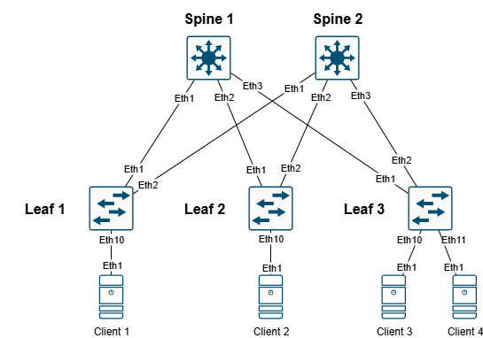

# ДЗ 1 - Проектирование адресного пространства

**Цель:**
Собрать схему CLOS;
Распределить адресное пространство.

**Описание/Пошаговая инструкция выполнения домашнего задания:**
В этой самостоятельной работе мы ожидаем, что вы самостоятельно:

1. Соберете топологию CLOS, как на схеме: 
2. Распределите адресное пространство для Underlay сети
3. Зафиксируете в документации план работ, адресное пространство, схему сети, настройки (если перенесли на оборудование)

# Выполение работы

Так как стадия планирования, предварительно отобразим все схематически, на оборудование будем делать перенос в последующем, так как предварительная настройка интерфейсов будет включена в план работ по конфигурации Underlay.

1. Сформируем топологию CLOS согласно схемы в редакторе draw.io
2. Распределим адресное пространство согласно таблицы и плана назначения адресов

## Схема подключения Spine/Leaf/Client

## План распределения адресов и сводная таблица

План распределения следующий
1. Берем за основу приватную подсеть 10.0.0.0/8 и из нее берем подсети согласно сзедущей схеме распределения.

10.Dn.Sn.Cn/24

**где:**

Dn - зарезервированные дипазоны для Дата-центра, Sn - номер Spine , Сn - порядковый номер

Резервируем значения Dn

0 - loopback 1 - понадобится нам для Underlay , маска /32

1 - loopback 2 - Заранее зарезервируем диапазон для Overlay , маска /32

2 - interconnect - используем подход по /31, чтобы не брать на себя риски unnambered подхода, ну и мне просто привычнее, так как все сессии у нас в Underlay будут p2p, для Примера: OSPF как для Underlay, мы избежим сходимости сети с распределением DR/BDR, все сессии у нас будут в состоняии Full

3-7 - на данный момент просто зарезервируем, пока не понятно для чего тратить, либо сервисы либо mgmt, пока не трогаем

Sn - нумеруем по лучшим правилам, начиная с "0" (для loopback нумрацию spine не используем, там просто резервируем первые 16 адрсов на Spine, а с 32 по 64 на Leaf) 

На портах, в виду того, что всх интерфейсы у нас L3-типа, берем единый влан, сразу зарезервируем парочку

911 - просто понравился, его возьмем для интерконнектов

903 - клиентский

***Итого - наш зарезрвированный диапозон для этого условного ЦОД будт 900-999***

**Клиентскую подсеть берем следующую:**

172.16.N.0/24

Где N - номер клиентского домена, пока у нас один, начнем с "0"

## Таблица распределения адресного пространства

|Device  |Port     |IPv4                               |VLAN|Link                           |Comment         |
|--------|---------|-----------------------------------|----|-------------------------------|----------------|
|Spine_1 |eth1     |  10.2.0.1/31                      |911  |Spine_1 eth1 – eth1 Leaf_1    |  Interconnect  |
|Spine_1 |eth2     |  10.2.0.3/31                      |911  |Spine_1 eth2 – eth1 Leaf_2    |  Interconnect  |
|Spine_1 |eth3     |  10.2.0.5/31                      |911  |Spine_1 eth3 – eth1 Leaf_3    |  Interconnect  |
|Spine_1 |loopback0|  10.0.0.0/31                      | --  | None                         |  Loopback      |
|Spine_1 |loopback1|  10.1.0.0/31                      | --  | None                         |  Loopback      |
|Spine_2 |eth1     |  10.2.1.1/31                      |911  |Spine_2 eth1 – eth2 Leaf_1    |  Interconnect  |
|Spine_2 |eth2     |  10.2.1.3/31                      |911  |Spine_2 eth2 – eth2 Leaf_2    |  Interconnect  |
|Spine_2 |eth3     |  10.2.1.5/31                      |911  |Spine_2 eth3 – eth2 Leaf_3    |  Interconnect  |
|Spine_2 |loopback0|  10.0.0.1/31                      | --  | None                         |  Loopback      |
|Spine_2 |loopback1|  10.1.0.1/31                      | --  | None                         |  Loopback      |
|Leaf_1  |eth1     |  10.2.0.2/31                      |911  |Leaf_1 eth1 – eth1 Spine_1    |  Interconnect  |
|Leaf_1  |eth2     |  10.2.1.2/31                      |911  |Leaf_1 eth2 – eth1 Spine_2    |  Interconnect  |
|Leaf_1  |eth10    |  None                             |903  |Leaf_1 eth10 – eth1 Client_1  |  Client        |
|Leaf_1  |loopback0|  10.0.0.33/31                     | --  | None                         |  Loopback      |
|Leaf_1  |loopback1|  10.1.0.33/31                     | --  | None                         |  Loopback      |
|Leaf_2  |eth1     |  10.2.0.4/31                      |911  |Leaf_2 eth1 – eth2 Spine_1    |  Interconnect  |
|Leaf_2  |eth2     |  10.2.1.4/31                      |911  |Leaf_2 eth2 – eth2 Spine_2    |  Interconnect  |
|Leaf_2  |eth10    |  None                             |903  |Leaf_2 eth10 – eth1 Client_2  |  Client        |
|Leaf_2  |loopback0|  10.0.0.34/31                     | --  | None                         |  Loopback      |
|Leaf_2  |loopback1|  10.1.0.34/31                     | --  | None                         |  Loopback      |
|Leaf_3  |eth1     |  10.2.0.6/31                      |911  |Leaf_3 eth1 – eth3 Spine_1    |  Interconnect  |
|Leaf_3  |eth2     |  10.2.1.6/31                      |911  |Leaf_3 eth2 – eth3 Spine_2    |  Interconnect  |
|Leaf_3  |loopback0|  10.0.0.35/31                     | --  | None                         |  Loopback      |
|Leaf_3  |loopback1|  10.1.0.35/31                     | --  | None                         |  Loopback      |
|Leaf_3  |eth10    |  None                             |903  |Leaf_3 eth10 – eth1 Client_3  |  Client        |
|Leaf_3  |eth11    |  None                             |903  |Leaf_3 eth11 – eth1 Client_4  |  Client        |
|Client_1  |eth1     |  172.16.0.1/24                  |903  |Client_1 eth1 – eth10 Leaf_1  |  Client        |
|Client_2  |eth1     |  172.16.0.2/24                  |903  |Client_2 eth1 – eth10 Leaf_2  |  Client        |
|Client_3  |eth1     |  172.16.0.3/24                  |903  |Client_3 eth1 – eth10 Leaf_3  |  Client        |
|Client_4  |eth1     |  172.16.0.4/24                  |903  |Client_4 eth1 – eth11 Leaf_3  |  Client        |

## План последующей конфигурации

1. Подключаемся к оборудованию
2. Настраиваем hostname
3. Конфигурируем интерфейсы согласно плана
4. Проверяем интерконнекты командой ping - убеждаемся в связности
5. Настраиваем loopbaсk на активном сетевом оборудовании
6. Конфигурируем адресацию на клиентском оборудовании(до конфигурации Underlay и Overlay связности не будет)

P.S. В последующих этапах будем делать тествые настройки для првоерки связности клиентских хостов, на каждом этапе.

На данный момент это все... 
