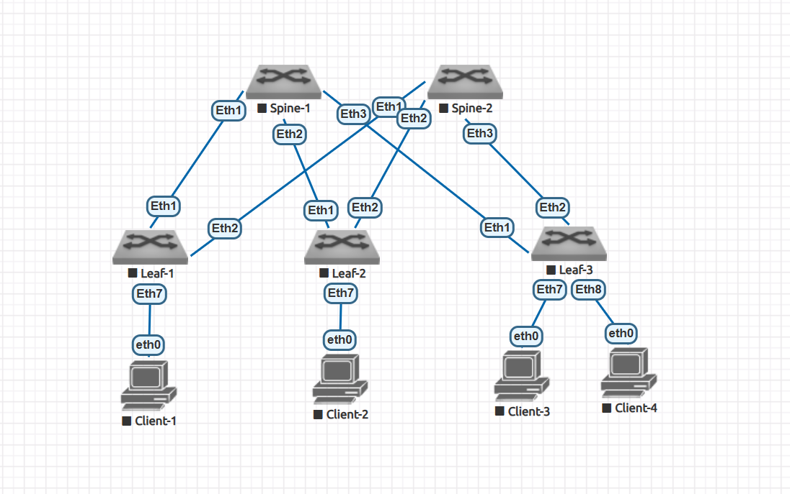
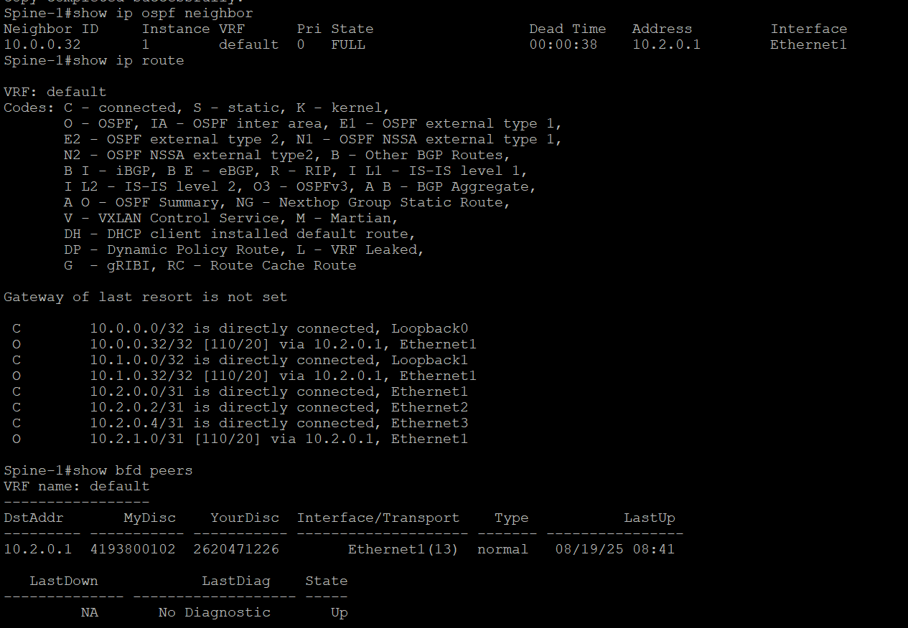

# Домашнее задание 2

**Underlay. OSPF**

Цель:
Настроить OSPF для Underlay сети.


Описание/Пошаговая инструкция выполнения домашнего задания:
В этой самостоятельной работе мы ожидаем, что вы самостоятельно:

1. Настроите OSPF в Underlay сети, для IP связанности между всеми сетевыми устройствами.
2. Зафиксируете в документации - план работы, адресное пространство, схему сети, конфигурацию устройств
3. Убедитесь в наличии IP связанности между устройствами в OSFP домене

# Выполнение Задания

При инициализации лабораторного стенда немного поменялись порты, актуализируем схему и табличку

## Новая схема сети



## Таблица распределения адресного пространства

|Device  |Port     |IPv4                               |VLAN|Link                           |Comment         |
|--------|---------|-----------------------------------|----|-------------------------------|----------------|
|Spine_1 |eth1     |  10.2.0.0/31                      |911  |Spine_1 eth1 – eth1 Leaf_1    |  Interconnect  |
|Spine_1 |eth2     |  10.2.0.2/31                      |911  |Spine_1 eth2 – eth1 Leaf_2    |  Interconnect  |
|Spine_1 |eth3     |  10.2.0.4/31                      |911  |Spine_1 eth3 – eth1 Leaf_3    |  Interconnect  |
|Spine_1 |loopback0|  10.0.0.0/32                      | --  | None                         |  Loopback      |
|Spine_1 |loopback1|  10.1.0.0/32                      | --  | None                         |  Loopback      |
|Spine_2 |eth1     |  10.2.1.0/31                      |911  |Spine_2 eth1 – eth2 Leaf_1    |  Interconnect  |
|Spine_2 |eth2     |  10.2.1.2/31                      |911  |Spine_2 eth2 – eth2 Leaf_2    |  Interconnect  |
|Spine_2 |eth3     |  10.2.1.4/31                      |911  |Spine_2 eth3 – eth2 Leaf_3    |  Interconnect  |
|Spine_2 |loopback0|  10.0.0.1/32                      | --  | None                         |  Loopback      |
|Spine_2 |loopback1|  10.1.0.1/32                      | --  | None                         |  Loopback      |
|Leaf_1  |eth1     |  10.2.0.1/31                      |911  |Leaf_1 eth1 – eth1 Spine_1    |  Interconnect  |
|Leaf_1  |eth2     |  10.2.1.1/31                      |911  |Leaf_1 eth2 – eth1 Spine_2    |  Interconnect  |
|Leaf_1  |eth7     |  None                             |903  |Leaf_1 eth7  – eth0 Client_1  |  Client        |
|Leaf_1  |loopback0|  10.0.0.32/32                     | --  | None                         |  Loopback      |
|Leaf_1  |loopback1|  10.1.0.32/32                     | --  | None                         |  Loopback      |
|Leaf_2  |eth1     |  10.2.0.3/31                      |911  |Leaf_2 eth1 – eth2 Spine_1    |  Interconnect  |
|Leaf_2  |eth2     |  10.2.1.3/31                      |911  |Leaf_2 eth2 – eth2 Spine_2    |  Interconnect  |
|Leaf_2  |eth7     |  None                             |903  |Leaf_2 eth7  – eth0 Client_2  |  Client        |
|Leaf_2  |loopback0|  10.0.0.33/32                     | --  | None                         |  Loopback      |
|Leaf_2  |loopback1|  10.1.0.33/32                     | --  | None                         |  Loopback      |
|Leaf_3  |eth1     |  10.2.0.5/31                      |911  |Leaf_3 eth1 – eth3 Spine_1    |  Interconnect  |
|Leaf_3  |eth2     |  10.2.1.5/31                      |911  |Leaf_3 eth2 – eth3 Spine_2    |  Interconnect  |
|Leaf_3  |loopback0|  10.0.0.34/32                     | --  | None                         |  Loopback      |
|Leaf_3  |loopback1|  10.1.0.34/32                     | --  | None                         |  Loopback      |
|Leaf_3  |eth7     |  None                             |903  |Leaf_3 eth7  – eth0 Client_3  |  Client        |
|Leaf_3  |eth8     |  None                             |903  |Leaf_3 eth8  – eth0 Client_4  |  Client        |
|Client_1  |eth0     |  172.16.0.1/24                  |903  |Client_1 eth0 – eth7  Leaf_1  |  Client        |
|Client_2  |eth0     |  172.16.0.2/24                  |903  |Client_2 eth0 – eth7  Leaf_2  |  Client        |
|Client_3  |eth0     |  172.16.0.3/24                  |903  |Client_3 eth0 – eth7  Leaf_3  |  Client        |
|Client_4  |eth0     |  172.16.0.4/24                  |903  |Client_4 eth0 – eth8  Leaf_3  |  Client        |

## План последующей конфигурации

1. Подключаемся к оборудованию
2. Настраиваем hostname
3. Так как у нас Arista - глобально включаем routing
4. Конфигурируем интерфейсы согласно плана(eth, loopback)
5. Проверяем интерконнекты командой ping - убеждаемся в связности
6. Добавляем все необходимыек нам интерфейсы в OSPF
7. Включаем процесс OSPF глобально
8. Проверяем лупбеки командой ping - убеждаемся в связности
9. Конфигурируем адресацию на клиентском оборудовании(до конфигурации Underlay и Overlay связности не будет)

## Приступаем к выполнению

**Сконфигурируем Spine-1** 

Возьмем Зону 1, чтобы сразу быть готовыми к переходу на super-spine, а вдруг

**Spine-1**
(влан увы не использовать, ругается, ну и черт с ним)
```
Ar1>enable
Ar1#conf t
Ar1(config)#hostname Spine-1
Spine-1(config)#ip routing

Spine-1(config)#int ethernet 1
Spine-1(config-if-Et1)#no switchport
Spine-1(config-if-Et1)#ip address 10.2.0.0/31
Spine-1(config-if-Et1)#ip ospf area 1
Spine-1(config-if-Et1)#ip ospf network point-to-point

Spine-1(config)#int ethernet 2
Spine-1(config-if-Et2)#no switchport
Spine-1(config-if-Et2)#ip address 10.2.0.2/31
Spine-1(config-if-Et2)#ip ospf network point-to-point
Spine-1(config-if-Et2)#ip ospf area 1
Spine-1(config-if-Et2)#int ethernet 3
Spine-1(config-if-Et3)#ip address 10.2.0.4/31

Spine-1(config-if-Et3)#no switchport
Spine-1(config-if-Et3)#ip address 10.2.0.4/31
Spine-1(config-if-Et3)#ip ospf network point-to-point
Spine-1(config-if-Et3)#ip ospf area 1
Spine-1(config-if-Et3)#exit

Spine-1(config)#int loopback 0
Spine-1(config-if-Lo0)#ip address 10.0.0.0/32
Spine-1(config-if-Lo0)#ip ospf area 1
Spine-1(config-if-Lo0)#int loopback 1

Spine-1(config-if-Lo1)#ip address 10.1.0.0/32
Spine-1(config-if-Lo1)#ip ospf area 1
Spine-1(config-if-Lo1)#exit
```
**Leaf-1**
```
Ar2(config)#ip routing
Ar2(config)#hostname Leaf-1
Leaf-1(config)#int ethernet 1
Leaf-1(config-if-Et1)#no switchport
Leaf-1(config-if-Et1)#ip address 10.2.0.1/31
Leaf-1(config-if-Et1)#ip ospf network point-to-point
Leaf-1(config-if-Et1)#ip ospf area 1
Leaf-1(config-if-Et1)#exit
Leaf-1(config)#interface ethernet 2
Leaf-1(config-if-Et2)#no switchport
Leaf-1(config-if-Et2)#ip address 10.2.1.1/31
Leaf-1(config-if-Et2)#ip ospf network point-to-point
Leaf-1(config-if-Et2)#ip ospf area 1
Leaf-1(config-if-Et2)#exit
Leaf-1(config)#int loopback 0
Leaf-1(config-if-Lo0)#ip address 10.0.0.32/32
Leaf-1(config-if-Lo0)#ip ospf area 1
Leaf-1(config-if-Lo0)#exit
Leaf-1(config)#int loopback 1
Leaf-1(config-if-Lo1)#ip address 10.1.0.32/32
Leaf-1(config-if-Lo1)#ip ospf area 1
Leaf-1(config-if-Lo1)#exit
```

Пока штиль, ничего не происходит

Включаем захват трафика на Spine-1 Interface Et1 и ставим фильтр на OSPF

Включаем глобально OSPF на Spine-1
*Ох, забыли BFD, аутентификацию, добавляем*
```
Spine-1(config-if-Et1)#ip ospf authentication message-digest
Spine-1(config-if-Et1)#ip ospf message-digest-key 10 md5 0 OtusOspf1
Spine-1(config-if-Et1)#bfd interval 100 min-rx 100 multiplier 3
Spine-1(config-if-Et1)#ip ospf neighbor bfd

Spine-1(config-if-Et2)#ip ospf authentication message-digest
Spine-1(config-if-Et2)#ip ospf message-digest-key 10 md5 0 OtusOspf1
Spine-1(config-if-Et2)#bfd interval 100 min-rx 100 multiplier 3
Spine-1(config-if-Et2)#ip ospf neighbor bfd

Spine-1(config-if-Et3)#ip ospf authentication message-digest
Spine-1(config-if-Et3)#ip ospf message-digest-key 10 md5 0 OtusOspf1
Spine-1(config-if-Et3)#bfd interval 100 min-rx 100 multiplier 3
Spine-1(config-if-Et3)#ip ospf neighbor bfd

Spine-1(config)#router ospf 1
Spine-1(config-router-ospf)#router-id 10.0.0.0
```


все так же тихо, пока идкт только Hello от Spine-1, поднимаем конфигурацию на Leaf-1

```
Leaf-1(config)#int ethernet 1
Leaf-1(config-if-Et1)#ip ospf authentication message-digest
Leaf-1(config-if-Et1)#ip ospf message-digest-key 10 md5 0 OtusOspf1
Leaf-1(config-if-Et1)#bfd interval 100 min-rx 100 multiplier 3
Leaf-1(config-if-Et1)#ip ospf neighbor bfd

Leaf-1(config-if-Et1)#int ethernet 2

Leaf-1(config-if-Et2)#ip ospf authentication message-digest
Leaf-1(config-if-Et2)#ip ospf message-digest-key 10 md5 0 OtusOspf1
Leaf-1(config-if-Et2)#bfd interval 100 min-rx 100 multiplier 3
Leaf-1(config-if-Et2)#ip ospf neighbor bfd

Leaf-1(config-if-Et2)#exit

Leaf-1(config)#router ospf 1
Leaf-1(config-router-ospf)#router-id 10.0.0.32
Leaf-1(config-router-ospf)#exit

```


Магия, видим в захвате обмен пакетами DBD LSR LSU LSAck, соседство установилось. 
Прикладываем скрин захвата трафика в момент установления соседства


## Смотрим состояние соседства на оборудовании и маршрутную таблицу

**Leaf-1**


**Spine-1**



Так, вроде все хорошо, проверим связность лупбеков 0 и 1


все работает. 


## Аналогично поднимаем настройки для всех Leaf и Spine и проверим связность

Конфигурация [общим файлом]()
*забыл совсем перевести интерфейсы, не участвующие в ospf в режим passive, поправил в итоговом конфиге*

Проверим связность, пинганем с Leaf-3 всех

Все отлично, всех видим, все хорошо


ну и посмотрим на этом же лифе состояние OSPF

Выглядит все визуально хорошо.
