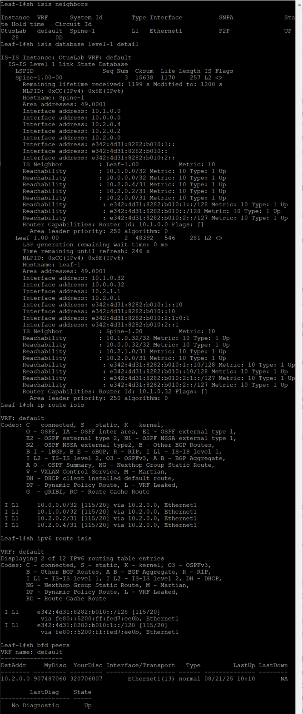

# Домашнее задание 3 Underlay. IS-IS

## Цель: Настроить IS-IS для Underlay сети.

**Описание/Пошаговая инструкция выполнения домашнего задания:**
В этой самостоятельной работе мы ожидаем, что вы самостоятельно:

1. Настроите ISIS в Underlay сети, для IP связанности между всеми сетевыми устройствами.
2. Зафиксируете в документации - план работы, адресное пространство, схему сети, конфигурацию устройств
3. Убедитесь в наличии IP связанности между устройствами в ISIS домене

# Выполнение Задания

При инициализации лабораторного стенда немного поменялись порты, актуализируем схему и табличку

## Новая схема сети(Все та же)


### План распределения следующий

***Берем за основу приватную подсеть 10.0.0.0/8 и из нее берем подсети согласно следущей схеме распределения.***

**10.Dn.Sn.Cn/24**

где:

Dn - зарезервированные дипазоны для Дата-центра, Sn - номер Spine , Сn - порядковый номер

Резервируем значения Dn

0 - loopback 1 - понадобится нам для Underlay , маска /32

1 - loopback 2 - Заранее зарезервируем диапазон для Overlay , маска /32

2 - interconnect - используем подход по /31, чтобы не брать на себя риски unnumbered подхода, ну и мне просто привычнее, так как все сессии у нас в Underlay будут p2p, для Примера: OSPF как для Underlay, мы избежим сходимости сети с распределением DR/BDR, все сессии у нас будут в состоняии Full

3-7 - на данный момент просто зарезервируем, пока не понятно для чего тратить, либо сервисы либо mgmt, пока не трогаем

Sn - нумеруем по лучшим правилам, начиная с "0" (для loopback нумрацию spine не используем, там просто резервируем первые 16 адрсов на Spine, а с 32 по 64 на Leaf)

На портах, в виду того, что всх интерфейсы у нас L3-типа, берем единый влан, сразу зарезервируем парочку

911 - просто понравился, его возьмем для интерконнектов

903 - клиентский

Итого - наш зарезрвированный диапозон для этого условного ЦОД будт 900-999


***Для IPv6 возьмем следующий принцип***

В обычно мире сети выдаются по /64, либо по /48, сделаем вид, что нам досталась такая
E342:4D31:8282:B010::/64 и попилим ее по /80

#### Необычная история

<details> 

<summary>Читать</summary>
Если пронумеровать английский алфавит с 0 по 15 (по 16тиричной системе) и потом еще раз

Получится следующий формат

| Буква | Номер |
|-------|-------|
|   A   |   0   | 
|   B   |   1   | 
|   C   |   2   | 
|   D   |   3   | 
|   E   |   4   | 
|   F   |   5   | 
|   G   |   6   | 
|   H   |   7   | 
|   I   |   8   | 
|   J   |   9   | 
|   K   |   A   | 
|   L   |   B   | 
|   M   |   C   | 
|   N   |   D   | 
|   O   |   E   | 
|   P   |   F   | 
|   Q   |   0   | 
|   R   |   1   | 
|   S   |   2   | 
|   T   |   3   | 
|   U   |   4   | 
|   V   |   5   | 
|   W   |   6   | 
|   X   |   7   | 
|   Y   |   8   | 
|   Z   |   9   | 

То в первых 4х октетах закодирована фраза 
  
</details>

**E342:4D31:8282:B010:Dn:Sn::Cn/80**

Dn - такие же как у IPv4

0 - loopback 1 - понадобится нам для Underlay , маска /128, резервируем первые 16 - с 0 до F адрсов на Spine, а с 10 по 2F на Leaf)

1 - loopback 2 - Заранее зарезервируем диапазон для Overlay , маска /128, резервируем первые 16 - с 0 до F адрсов на Spine, а с 10 по 3F на Leaf)

2 - interconnect - используем подход по /127, чтобы не брать на себя риски unnumbered подхода, ну и мне просто привычнее, так как все сессии у нас в Underlay будут p2p

3-6 - Reserved

7 - Client

Остальные пока оставим без внимания, Адресов у нас много, потом придумаем для чего использовать.

Sn - Номер Spine(только для интерконектов) нумеруем по лучшим правилам, начиная с "0" 
Cn -  Уникальный по порядку

***Клиентскую подсеть берем следующую:***

172.16.N.0/24

Где N - номер клиентского домена, пока у нас один, начнем с "0"

А для IPv6 возьмем как обозначили ранее, из архитектуры выше

E342:4D31:8282:B010:7:N::Cn/96

N - номер клиентского домена

Тут уже начнем нумерацию c 1 - т.к. в случае IPv6 у нас просто в записи срежутся нули, а нам надо понимать что у нас за клиентский домен изначально.


### Таблица распределения адресного пространства

|Device    |Port     |IPv4                               |IPv6                                       |VLAN|Link                           |Comment         |
|----------|---------|-----------------------------------|-------------------------------------------|----|-------------------------------|----------------|
|Spine_1   |eth1     |  10.2.0.0/31                      |E342:4D31:8282:B010:2::0/127---------------|911  |Spine_1 eth1 – eth1 Leaf_1    |  Interconnect  |
|Spine_1   |eth2     |  10.2.0.2/31                      |E342:4D31:8282:B010:2::2/127---------------|911  |Spine_1 eth2 – eth1 Leaf_2    |  Interconnect  |
|Spine_1   |eth3     |  10.2.0.4/31                      |E342:4D31:8282:B010:2::4/127---------------|911  |Spine_1 eth3 – eth1 Leaf_3    |  Interconnect  |
|Spine_1   |loopback0|  10.0.0.0/32                      |E342:4D31:8282:B010:0::0/128---------------| --  | None                         |  Loopback      |
|Spine_1   |loopback1|  10.1.0.0/32                      |E342:4D31:8282:B010:1::0/128---------------| --  | None                         |  Loopback      |
|Spine_2   |eth1     |  10.2.1.0/31                      |E342:4D31:8282:B010:2:1::0/127-------------|911  |Spine_2 eth1 – eth2 Leaf_1    |  Interconnect  |
|Spine_2   |eth2     |  10.2.1.2/31                      |E342:4D31:8282:B010:2:1::2/127-------------|911  |Spine_2 eth2 – eth2 Leaf_2    |  Interconnect  |
|Spine_2   |eth3     |  10.2.1.4/31                      |E342:4D31:8282:B010:2:1::4/127-------------|911  |Spine_2 eth3 – eth2 Leaf_3    |  Interconnect  |
|Spine_2   |loopback0|  10.0.0.1/32                      |E342:4D31:8282:B010:0::1/128---------------| --  | None                         |  Loopback      |
|Spine_2   |loopback1|  10.1.0.1/32                      |E342:4D31:8282:B010:1::1/128---------------| --  | None                         |  Loopback      |
|Leaf_1    |eth1     |  10.2.0.1/31                      |E342:4D31:8282:B010:2::1/127---------------|911  |Leaf_1 eth1 – eth1 Spine_1    |  Interconnect  |
|Leaf_1    |eth2     |  10.2.1.1/31                      |E342:4D31:8282:B010:2:1::1/127-------------|911  |Leaf_1 eth2 – eth1 Spine_2    |  Interconnect  |
|Leaf_1    |eth7     |  None                             |-------------------------------------------|903  |Leaf_1 eth7  – eth0 Client_1  |  Client        |
|Leaf_1    |loopback0|  10.0.0.32/32                     |E342:4D31:8282:B010:0::10/128--------------| --  | None                         |  Loopback      |
|Leaf_1    |loopback1|  10.1.0.32/32                     |E342:4D31:8282:B010:1::10/128--------------| --  | None                         |  Loopback      |
|Leaf_2    |eth1     |  10.2.0.3/31                      |E342:4D31:8282:B010:2::3/127---------------|911  |Leaf_2 eth1 – eth2 Spine_1    |  Interconnect  |
|Leaf_2    |eth2     |  10.2.1.3/31                      |E342:4D31:8282:B010:2:1::3/127-------------|911  |Leaf_2 eth2 – eth2 Spine_2    |  Interconnect  |
|Leaf_2    |eth7     |  None                             |-------------------------------------------|903  |Leaf_2 eth7  – eth0 Client_2  |  Client        |
|Leaf_2    |loopback0|  10.0.0.33/32                     |E342:4D31:8282:B010:0::11/128--------------| --  | None                         |  Loopback      |
|Leaf_2    |loopback1|  10.1.0.33/32                     |E342:4D31:8282:B010:1::11/128--------------| --  | None                         |  Loopback      |
|Leaf_3    |eth1     |  10.2.0.5/31                      |E342:4D31:8282:B010:2::5/127---------------|911  |Leaf_3 eth1 – eth3 Spine_1    |  Interconnect  |
|Leaf_3    |eth2     |  10.2.1.5/31                      |E342:4D31:8282:B010:2:1::5/127-------------|911  |Leaf_3 eth2 – eth3 Spine_2    |  Interconnect  |
|Leaf_3    |loopback0|  10.0.0.34/32                     |E342:4D31:8282:B010:0::12/128--------------| --  | None                         |  Loopback      |
|Leaf_3    |loopback1|  10.1.0.34/32                     |E342:4D31:8282:B010:1::12/128--------------| --  | None                         |  Loopback      |
|Leaf_3    |eth7     |  None                             |-------------------------------------------|903  |Leaf_3 eth7  – eth0 Client_3  |  Client        |
|Leaf_3    |eth8     |  None                             |-------------------------------------------|903  |Leaf_3 eth8  – eth0 Client_4  |  Client        |
|Client_1  |eth0     |  172.16.0.1/24                    |E342:4D31:8282:B010:7:1::1/96--------------|903  |Client_1 eth0 – eth7  Leaf_1  |  Client        |
|Client_2  |eth0     |  172.16.0.2/24                    |E342:4D31:8282:B010:7:1::2/96--------------|903  |Client_2 eth0 – eth7  Leaf_2  |  Client        |
|Client_3  |eth0     |  172.16.0.3/24                    |E342:4D31:8282:B010:7:1::3/96--------------|903  |Client_3 eth0 – eth7  Leaf_3  |  Client        |
|Client_4  |eth0     |  172.16.0.4/24                    |E342:4D31:8282:B010:7:1::4/96--------------|903  |Client_4 eth0 – eth8  Leaf_3  |  Client        |

Так же, в виду того, что у нас ISIS строит соседство с помощью Network Entity Title соотвествующего формата, вводим таблицу значений, шаблон следующий:

AFI - оставляем неизменным - 49

Area ID - так же как и в прошлой лабе, берем 1й - 0001

System ID - принцип следующий

1) 1й октет - 0001 - Номер Узла, мы начинающая организация, берем 1й - 0001
2) 2й октет - Номер POD - 0001
3) 3й октет - Уникальный - 0000 и так далее, но 1XXX - Spine, 2XXX - Leaf, 0XXX - на всякий закрепим за SuperSpine
 
Selector - оставляем неизменным - 00

### Таблица NET

|Device  |NET                               |Comment  |
|--------|----------------------------------|---------|
|Spine_1 |  49.0001.0001.0001.1000.00        |---------|
|Spine_2 |  49.0001.0001.0001.1001.00        |---------|
|Leaf_1  |  49.0001.0001.0001.2000.00        |---------|
|Leaf_2  |  49.0001.0001.0001.2001.00        |---------|
|Leaf_3  |  49.0001.0001.0001.2002.00        |---------|


## План последующей конфигурации

Вланы на L3 интерфейсах снова не используем, пишет что версия образа не поддерживает.
В этот раз собираем дуалстек, IPv4/IPv6

1. Подключаемся к оборудованию.
2. Настраиваем hostname.
3. Так как у нас Arista - глобально включаем routing.
4. Конфигурируем интерфейсы согласно плана(eth, loopback).
5. Проверяем интерконнекты командой ping - убеждаемся в связности.
6. Настраиваем BFD, Authorization.
7. Добавляем все необходимыек нам интерфейсы в ISIS, не забываем настроить passive-interface на оборудовании на неучаствующих интерфейсах.
8. Включаем процесс ISIS глобально.
10. Проверяем лупбеки командой ping - убеждаемся в связности.

## Приступаем к выполнению

Обнулились, чистое оборудование, никто ничего не настраивал, пустое железо.

**Сконфигурируем Spine-1** 

**Spine-1**
```

```
**Leaf-1**
```

```

Проверяем интерконекты по IPv4/IPv6


Пинги есть, но ISIS пока не работает(мы специально не поднимали до конца)

Пока штиль, ничего не происходит

Включаем захват трафика на Spine-1 Interface Et1 и ставим фильтр на ISIS

***Включаем глобально ISIS на Spine-1***

```

```


***Все так же тихо, пока идет только Hello от Spine-1, поднимаем конфигурацию на Leaf-1***

```

```


Магия, видим в захвате обмен пакетами LSP, соседство установилось. 
Прикладываем скрин захвата трафика в момент установления соседства


### Смотрим состояние соседства на оборудовании и маршрутную таблицу

**Leaf-1**



**Spine-1**


Так, вроде все хорошо, проверим связность лупбеков 0 и 1


все работает. 


### Аналогично поднимаем настройки для всех Leaf и Spine и проверим связность

Конфигурация [общим файлом](https://github.com/igorvoroshkevich-93/Network-course/blob/main/Lab02_Underlay_ISIS/ISIS_full_conf.md)

Проверим связность, пинганем с Spine-2 всех

**Loopback's 0**

**Loopback's 1**


Все отлично, всех видим, все хорошо, ну и посмотрим на этом же Spine состояние ISIS


Выглядит все визуально хорошо.
