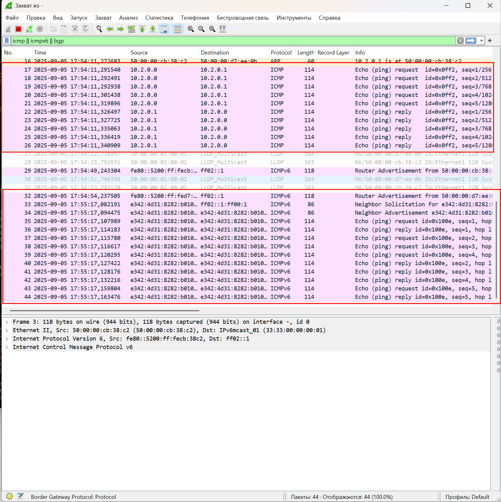
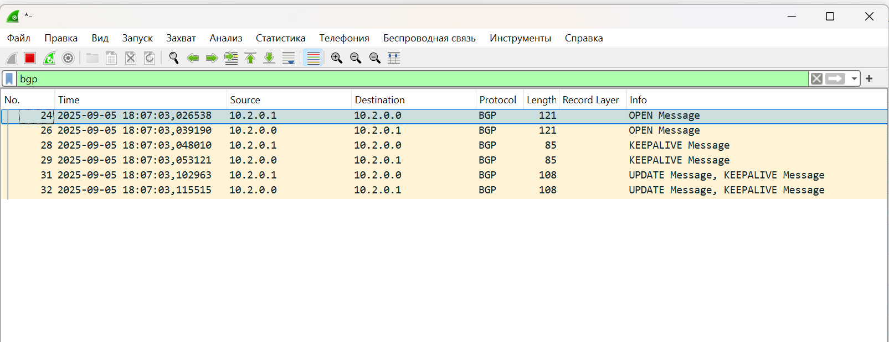
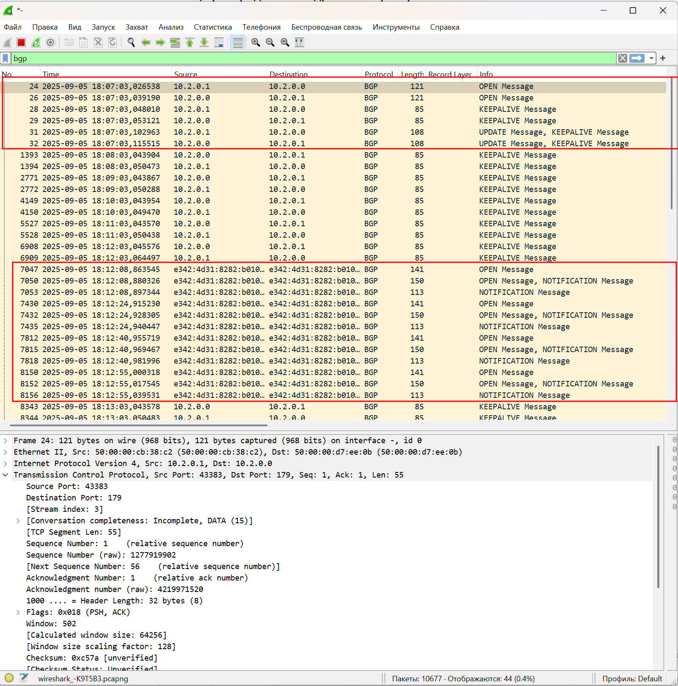
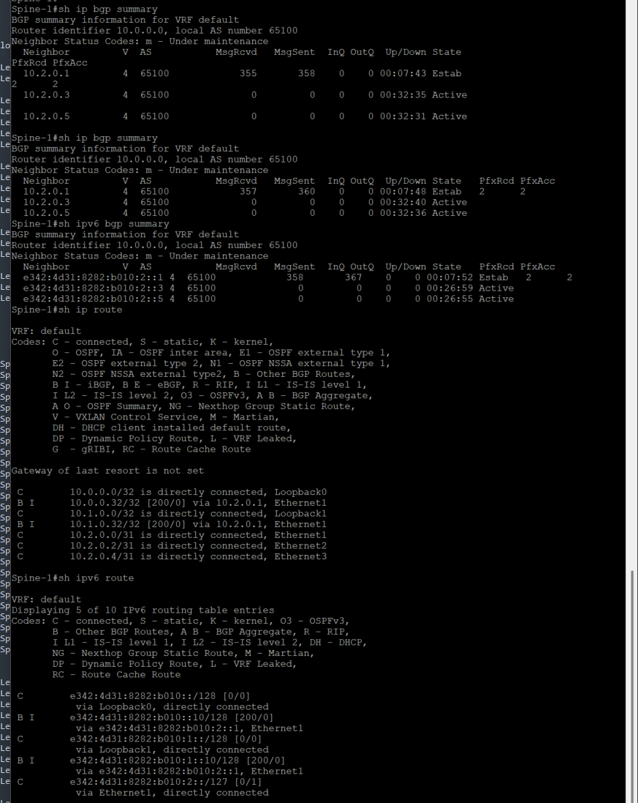
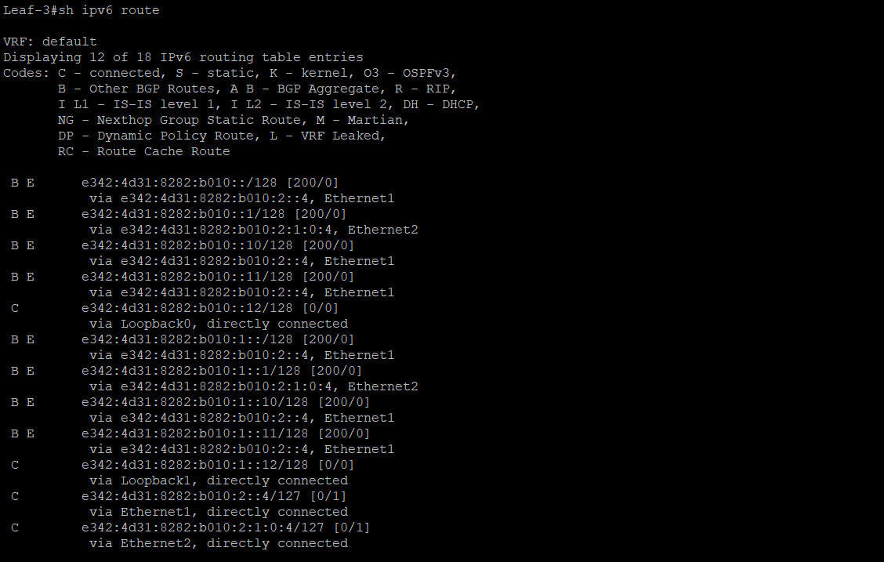

# Домашнее задание 4 Underlay. iBGP-eBGP

## Цель: Настроить iBGP-eBGP для Underlay сети.

**Описание/Пошаговая инструкция выполнения домашнего задания:**
В этой самостоятельной работе мы ожидаем, что вы самостоятельно:

1. Настроите BGP в Underlay сети, для IP связанности между всеми сетевыми устройствами. iBGP или eBGP - решать вам!
2. Зафиксируете в документации - план работы, адресное пространство, схему сети, конфигурацию устройств
3. Убедитесь в наличии IP связанности между устройствами в BGP домене

# Выполнение Задания

От курса берем все, настроим оба варианта, и iBGP и eBGP, в дуалстеке

## Новая схема сети(Все та же)


### План распределения следующий

***Берем за основу приватную подсеть 10.0.0.0/8 и из нее берем подсети согласно следущей схеме распределения.***

**10.Dn.Sn.Cn/24**

где:

Dn - зарезервированные дипазоны для Дата-центра, Sn - номер Spine , Сn - порядковый номер

Резервируем значения Dn

0 - loopback 1 - понадобится нам для Underlay , маска /32

1 - loopback 2 - Заранее зарезервируем диапазон для Overlay , маска /32

2 - interconnect - используем подход по /31, чтобы не брать на себя риски unnumbered подхода, ну и мне просто привычнее, так как все сессии у нас в Underlay будут p2p, для Примера: OSPF как для Underlay, мы избежим сходимости сети с распределением DR/BDR, все сессии у нас будут в состоняии Full

3-7 - на данный момент просто зарезервируем, пока не понятно для чего тратить, либо сервисы либо mgmt, пока не трогаем

Sn - нумеруем по лучшим правилам, начиная с "0" (для loopback нумрацию spine не используем, там просто резервируем первые 16 адрсов на Spine, а с 32 по 64 на Leaf)

На портах, в виду того, что всх интерфейсы у нас L3-типа, берем единый влан, сразу зарезервируем парочку

911 - просто понравился, его возьмем для интерконнектов

903 - клиентский

Итого - наш зарезрвированный диапозон для этого условного ЦОД будт 900-999


***Для IPv6 возьмем следующий принцип***

В обычно мире сети выдаются по /64, либо по /48, сделаем вид, что нам досталась такая
E342:4D31:8282:B010::/64 и попилим ее по /80

#### Необычная история

<details> 

<summary>Читать</summary>
Если пронумеровать английский алфавит с 0 по 15 (по 16тиричной системе) и потом еще раз

Получится следующий формат

| Буква | Номер |
|-------|-------|
|   A   |   0   | 
|   B   |   1   | 
|   C   |   2   | 
|   D   |   3   | 
|   E   |   4   | 
|   F   |   5   | 
|   G   |   6   | 
|   H   |   7   | 
|   I   |   8   | 
|   J   |   9   | 
|   K   |   A   | 
|   L   |   B   | 
|   M   |   C   | 
|   N   |   D   | 
|   O   |   E   | 
|   P   |   F   | 
|   Q   |   0   | 
|   R   |   1   | 
|   S   |   2   | 
|   T   |   3   | 
|   U   |   4   | 
|   V   |   5   | 
|   W   |   6   | 
|   X   |   7   | 
|   Y   |   8   | 
|   Z   |   9   | 

То в первых 4х октетах закодирована фраза 
  
</details>

**E342:4D31:8282:B010:Dn:Sn::Cn/80**

Dn - такие же как у IPv4

0 - loopback 1 - понадобится нам для Underlay , маска /128, резервируем первые 16 - с 0 до F адрсов на Spine, а с 10 по 2F на Leaf)

1 - loopback 2 - Заранее зарезервируем диапазон для Overlay , маска /128, резервируем первые 16 - с 0 до F адрсов на Spine, а с 10 по 3F на Leaf)

2 - interconnect - используем подход по /127, чтобы не брать на себя риски unnumbered подхода, ну и мне просто привычнее, так как все сессии у нас в Underlay будут p2p

3-6 - Reserved

7 - Client

Остальные пока оставим без внимания, Адресов у нас много, потом придумаем для чего использовать.

Sn - Номер Spine(только для интерконектов) нумеруем по лучшим правилам, начиная с "0" 
Cn -  Уникальный по порядку

***Клиентскую подсеть берем следующую:***

172.16.N.0/24

Где N - номер клиентского домена, пока у нас один, начнем с "0"

А для IPv6 возьмем как обозначили ранее, из архитектуры выше

E342:4D31:8282:B010:7:N::Cn/96

N - номер клиентского домена

Тут уже начнем нумерацию c 1 - т.к. в случае IPv6 у нас просто в записи срежутся нули, а нам надо понимать что у нас за клиентский домен изначально.


### Таблица распределения адресного пространства

|Device    |Port     |IPv4                               |IPv6                                       |VLAN|Link                           |Comment         |
|----------|---------|-----------------------------------|-------------------------------------------|----|-------------------------------|----------------|
|Spine_1   |eth1     |  10.2.0.0/31                      |E342:4D31:8282:B010:2::0/127               |911  |Spine_1 eth1 – eth1 Leaf_1    |  Interconnect  |
|Spine_1   |eth2     |  10.2.0.2/31                      |E342:4D31:8282:B010:2::2/127               |911  |Spine_1 eth2 – eth1 Leaf_2    |  Interconnect  |
|Spine_1   |eth3     |  10.2.0.4/31                      |E342:4D31:8282:B010:2::4/127               |911  |Spine_1 eth3 – eth1 Leaf_3    |  Interconnect  |
|Spine_1   |loopback0|  10.0.0.0/32                      |E342:4D31:8282:B010:0::0/128               | --  | None                         |  Loopback      |
|Spine_1   |loopback1|  10.1.0.0/32                      |E342:4D31:8282:B010:1::0/128               | --  | None                         |  Loopback      |
|Spine_2   |eth1     |  10.2.1.0/31                      |E342:4D31:8282:B010:2:1::0/127             |911  |Spine_2 eth1 – eth2 Leaf_1    |  Interconnect  |
|Spine_2   |eth2     |  10.2.1.2/31                      |E342:4D31:8282:B010:2:1::2/127             |911  |Spine_2 eth2 – eth2 Leaf_2    |  Interconnect  |
|Spine_2   |eth3     |  10.2.1.4/31                      |E342:4D31:8282:B010:2:1::4/127             |911  |Spine_2 eth3 – eth2 Leaf_3    |  Interconnect  |
|Spine_2   |loopback0|  10.0.0.1/32                      |E342:4D31:8282:B010:0::1/128               | --  | None                         |  Loopback      |
|Spine_2   |loopback1|  10.1.0.1/32                      |E342:4D31:8282:B010:1::1/128               | --  | None                         |  Loopback      |
|Leaf_1    |eth1     |  10.2.0.1/31                      |E342:4D31:8282:B010:2::1/127               |911  |Leaf_1 eth1 – eth1 Spine_1    |  Interconnect  |
|Leaf_1    |eth2     |  10.2.1.1/31                      |E342:4D31:8282:B010:2:1::1/127             |911  |Leaf_1 eth2 – eth1 Spine_2    |  Interconnect  |
|Leaf_1    |eth7     |  None                             |-------------------------------------------|903  |Leaf_1 eth7  – eth0 Client_1  |  Client        |
|Leaf_1    |loopback0|  10.0.0.32/32                     |E342:4D31:8282:B010:0::10/128              | --  | None                         |  Loopback      |
|Leaf_1    |loopback1|  10.1.0.32/32                     |E342:4D31:8282:B010:1::10/128              | --  | None                         |  Loopback      |
|Leaf_2    |eth1     |  10.2.0.3/31                      |E342:4D31:8282:B010:2::3/127               |911  |Leaf_2 eth1 – eth2 Spine_1    |  Interconnect  |
|Leaf_2    |eth2     |  10.2.1.3/31                      |E342:4D31:8282:B010:2:1::3/127             |911  |Leaf_2 eth2 – eth2 Spine_2    |  Interconnect  |
|Leaf_2    |eth7     |  None                             |-------------------------------------------|903  |Leaf_2 eth7  – eth0 Client_2  |  Client        |
|Leaf_2    |loopback0|  10.0.0.33/32                     |E342:4D31:8282:B010:0::11/128              | --  | None                         |  Loopback      |
|Leaf_2    |loopback1|  10.1.0.33/32                     |E342:4D31:8282:B010:1::11/128              | --  | None                         |  Loopback      |
|Leaf_3    |eth1     |  10.2.0.5/31                      |E342:4D31:8282:B010:2::5/127               |911  |Leaf_3 eth1 – eth3 Spine_1    |  Interconnect  |
|Leaf_3    |eth2     |  10.2.1.5/31                      |E342:4D31:8282:B010:2:1::5/127             |911  |Leaf_3 eth2 – eth3 Spine_2    |  Interconnect  |
|Leaf_3    |loopback0|  10.0.0.34/32                     |E342:4D31:8282:B010:0::12/128              | --  | None                         |  Loopback      |
|Leaf_3    |loopback1|  10.1.0.34/32                     |E342:4D31:8282:B010:1::12/128              | --  | None                         |  Loopback      |
|Leaf_3    |eth7     |  None                             |-------------------------------------------|903  |Leaf_3 eth7  – eth0 Client_3  |  Client        |
|Leaf_3    |eth8     |  None                             |-------------------------------------------|903  |Leaf_3 eth8  – eth0 Client_4  |  Client        |
|Client_1  |eth0     |  172.16.0.1/24                    |E342:4D31:8282:B010:7:1::1/96              |903  |Client_1 eth0 – eth7  Leaf_1  |  Client        |
|Client_2  |eth0     |  172.16.0.2/24                    |E342:4D31:8282:B010:7:1::2/96              |903  |Client_2 eth0 – eth7  Leaf_2  |  Client        |
|Client_3  |eth0     |  172.16.0.3/24                    |E342:4D31:8282:B010:7:1::3/96              |903  |Client_3 eth0 – eth7  Leaf_3  |  Client        |
|Client_4  |eth0     |  172.16.0.4/24                    |E342:4D31:8282:B010:7:1::4/96              |903  |Client_4 eth0 – eth8  Leaf_3  |  Client        |

## AS-Number

Так как мы касаемся уже этой части, берем сделующие значения

**iBGP**

Тут единая AS, не выдумываем ничего просто берем 65000

**eBGP**

Начинаем Распределять, в виду того, что сессии у нас должны быть уникальны.
Spine's - берем по следующему плану

65XAA
Где
X - номер POD, делаем вид, что у нас будет не более 8 подов, так как "0" мы резервируем для Super-Spine, а 1-9 для Spine
AA - уникальный номер, для Spine резервируем значение "00", для Leaf's берем порядковый номер Leaf-а, к примеру
Leaf-1 будет иметь номер 65101, а Spine-ы - 65100 


## План последующей конфигурации

План будет единый для обоих вариантов, пишем общий, детали распишем уже в конфиге и покажем на скриншотах

Вланы на L3 интерфейсах снова не используем, пишет что версия образа не поддерживает.
В этот раз собираем дуалстек, IPv4/IPv6

1. Подключаемся к оборудованию.
2. Настраиваем hostname.
3. Так как у нас Arista - глобально включаем routing(в том числе для ipv6).
4. Конфигурируем интерфейсы согласно плана(eth, loopback).
5. Проверяем интерконнекты командой ping - убеждаемся в связности.
6. Настраиваем BFD.
7. Включаем процесс BGP глобально и конфигурируем его(Authorization, timers, peer-group, ecmp)
8. Проеряем маршрутные таблицы, трассировки, связность лупбеков.

# Приступаем к выполнению

Обнулились, чистое оборудование, никто ничего не настраивал, пустое железо.

## iBGP

<details> 

<summary>Читать</summary>

**Сконфигурируем Spine-1** 

**Spine-1**
```
localhost(config)#hostname Spine-1

Spine-1(config)#ip routing
Spine-1(config)#ipv6 unicast-routing 


Spine-1(config)#int ethernet 1
Spine-1(config-if-Et1)#no switchport
Spine-1(config-if-Et1)#   ip address 10.2.0.0/31
Spine-1(config-if-Et1)#   bfd interval 100 min-rx 100 multiplier 3
Spine-1(config-if-Et1)#   ipv6 address e342:4d31:8282:b010:2::/127


Spine-1(config)#interface Ethernet2
Spine-1(config-if-Et2)#   no switchport
Spine-1(config-if-Et2)#   ip address 10.2.0.2/31
Spine-1(config-if-Et2)#   bfd interval 100 min-rx 100 multiplier 3
Spine-1(config-if-Et2)#   ipv6 address e342:4d31:8282:b010:2::2/127

Spine-1(config)#interface Ethernet3
Spine-1(config-if-Et3)#   no switchport
Spine-1(config-if-Et3)#   ip address 10.2.0.4/31
Spine-1(config-if-Et3)#   bfd interval 100 min-rx 100 multiplier 3
Spine-1(config-if-Et3)#   ipv6 address e342:4d31:8282:b010:2::4/127


Spine-1(config)#interface Loopback0
Spine-1(config-if-Lo0)#   ip address 10.0.0.0/32
Spine-1(config-if-Lo0)#   ipv6 address e342:4d31:8282:b010::/128

Spine-1(config)#interface Loopback1
Spine-1(config-if-Lo1)#   ip address 10.1.0.0/32
Spine-1(config-if-Lo1)#   ipv6 address e342:4d31:8282:b010:1::/128

Spine-1(config)#ip prefix-list Spine_LB permit 10.0.0.0 255.255.255.255
Spine-1(config)#ip prefix-list Spine_LB permit 10.0.0.32 255.255.255.255
Spine-1(config)#ip prefix-list Spine_LB permit 10.0.0.33 255.255.255.255
Spine-1(config)#ip prefix-list Spine_LB permit 10.0.0.34 255.255.255.255
Spine-1(config)#ip prefix-list Spine_LB permit 10.1.0.0 255.255.255.255
Spine-1(config)#ip prefix-list Spine_LB permit 10.1.0.32 255.255.255.255
Spine-1(config)#ip prefix-list Spine_LB permit 10.1.0.33 255.255.255.255
Spine-1(config)#ip prefix-list Spine_LB permit 10.1.0.34 255.255.255.255

Spine-1(config)#ipv6 prefix-list Spine_v6LB
Spine-1(config-ipv6-pfx)#permit e342:4d31:8282:b010::/128
Spine-1(config-ipv6-pfx)#permit e342:4d31:8282:b010::10/128
Spine-1(config-ipv6-pfx)#permit e342:4d31:8282:b010::11/128
Spine-1(config-ipv6-pfx)#permit e342:4d31:8282:b010::12/128
Spine-1(config-ipv6-pfx)#permit e342:4d31:8282:b010:1::/128
Spine-1(config-ipv6-pfx)#permit e342:4d31:8282:b010:1::10/128
Spine-1(config-ipv6-pfx)#permit e342:4d31:8282:b010:1::11/128
Spine-1(config-ipv6-pfx)#permit e342:4d31:8282:b010:1::12/128
```

**Leaf-1**
```
localhost(config)#hostname Leaf-1

Leaf-1(config)#ip routing
Leaf-1(config)#ipv6 unicast-routing

Leaf-1(config)#interface Ethernet1
Leaf-1(config-if-Et1)#   no switchport
Leaf-1(config-if-Et1)#   ip address 10.2.0.1/31
Leaf-1(config-if-Et1)#   bfd interval 100 min-rx 100 multiplier 3
Leaf-1(config-if-Et1)#   ipv6 address e342:4d31:8282:b010:2::1/127

Leaf-1(config)#interface Ethernet2
Leaf-1(config-if-Et2)#   no switchport
Leaf-1(config-if-Et2)#   ip address 10.2.1.1/31
Leaf-1(config-if-Et2)#   bfd interval 100 min-rx 100 multiplier 3
Leaf-1(config-if-Et2)#   ipv6 address e342:4d31:8282:b010:2:1:0:1/127

Leaf-1(config)#interface Loopback0
Leaf-1(config-if-Lo0)#   ip address 10.0.0.32/32
Leaf-1(config-if-Lo0)#   ipv6 address e342:4d31:8282:b010::10/128

Leaf-1(config-if-Lo0)#interface Loopback1
Leaf-1(config-if-Lo1)#   ip address 10.1.0.32/32
Leaf-1(config-if-Lo1)#   ipv6 address e342:4d31:8282:b010:1::10/128
```

Проверяем интерконекты по IPv4/IPv6



Пинги есть, но iBGP пока не работает(мы специально не поднимали до конца)

Пока штиль, ничего не происходит

Включаем захват трафика на Spine-1 Interface Et1 и ставим фильтр на BGP

***Включаем глобально BGP на Spine-1 и преднастраиваем соседство/сессии***

```
Spine-1(config)#router bgp 65100
Spine-1(config-router-bgp)#router-id 10.0.0.0
Spine-1(config-router-bgp)#neighbor iBGP_Underlay peer group
Spine-1(config-router-bgp)#neighbor iBGP_Underlay remote-as 65100
Spine-1(config-router-bgp)#neighbor iBGP_Underlay next-hop-self
Spine-1(config-router-bgp)#neighbor iBGP_Underlay bfd
Spine-1(config-router-bgp)#neighbor iBGP_Underlay route-reflector-client
Spine-1(config-router-bgp)#neighbor iBGP_Underlay route-map Loopback out
Spine-1(config-router-bgp)#neighbor 10.2.0.1 peer group iBGP_Underlay
Spine-1(config-router-bgp)#neighbor 10.2.0.3 peer group iBGP_Underlay
Spine-1(config-router-bgp)#neighbor 10.2.0.5 peer group iBGP_Underlay
Spine-1(config-router-bgp)#neighbor e342:4d31:8282:b010:2::1 peer group iBGP_Underlay
Spine-1(config-router-bgp)#neighbor e342:4d31:8282:b010:2::3 peer group iBGP_Underlay
Spine-1(config-router-bgp)#neighbor e342:4d31:8282:b010:2::5 peer group iBGP_Underlay
Spine-1(config-router-bgp)#neighbor iBGP_Underlay password Otus_Lab_iBGP_65100
Spine-1(config-router-bgp)#redistribute connected route-map Loopback
Spine-1(config-router-bgp)#address-family ipv4
Spine-1(config-router-bgp-af)#neighbor 10.2.0.1 activate
Spine-1(config-router-bgp-af)#neighbor 10.2.0.3 activate
Spine-1(config-router-bgp-af)#neighbor 10.2.0.5 activate
Spine-1(config-router-bgp)#address-family ipv6
Spine-1(config-router-bgp-af)#neighbor e342:4d31:8282:b010:2::1 activate
Spine-1(config-router-bgp-af)#neighbor e342:4d31:8282:b010:2::3 activate
Spine-1(config-router-bgp-af)#neighbor e342:4d31:8282:b010:2::5 activate

```

***Все так же тихо, поднимаем конфигурацию на Leaf-1***

```
Leaf-1(config)#router bgp 65100
Leaf-1(config-router-bgp)#router-id 10.0.0.32
Leaf-1(config-router-bgp)#neighbor iBGP_Underlay peer group
Leaf-1(config-router-bgp)#neighbor iBGP_Underlay remote-as 65100
Leaf-1(config-router-bgp)#neighbor iBGP_Underlay next-hop-self
Leaf-1(config-router-bgp)#neighbor iBGP_Underlay bfd
Leaf-1(config-router-bgp)#neighbor 10.2.0.0 peer group iBGP_Underlay
Leaf-1(config-router-bgp)#neighbor 10.2.1.0 peer group iBGP_Underlay
Leaf-1(config-router-bgp)#neighbor e342:4d31:8282:b010:2:: peer group iBGP_Underlay
Leaf-1(config-router-bgp)#neighbor e342:4d31:8282:b010:2:1:: peer group iBGP_Underlay

Leaf-1(config-router-bgp)#address-family ipv4
Leaf-1(config-router-bgp-af)#neighbor 10.2.0.0 activate
Leaf-1(config-router-bgp-af)#neighbor 10.2.1.0 activate
Leaf-1(config-router-bgp-af)#network 10.0.0.32/32
Leaf-1(config-router-bgp-af)#network 10.1.0.32/32


Leaf-1(config-router-bgp)#address-family ipv6
Leaf-1(config-router-bgp-af)#neighbor e342:4d31:8282:b010:2:: activate
Leaf-1(config-router-bgp-af)#neighbor e342:4d31:8282:b010:2:1:: activate
Leaf-1(config-router-bgp-af)#network e342:4d31:8282:b010::10/128
Leaf-1(config-router-bgp-af)#network e342:4d31:8282:b010:1::10/128

```


ВСе получилось, видим в захвате обмен пакетами, соседство установилось. 
Прикладываем скрин захвата трафика в момент установления соседства






### Смотрим состояние соседства на оборудовании и маршрутную таблицу

**Leaf-1**


**Spine-1**



Так, вроде все хорошо, проверим связность лупбеков 0 и 1


все работает. 


### Аналогично поднимаем настройки для всех Leaf и Spine и проверим связность

Конфигурация [общим файлом](https://github.com/igorvoroshkevich-93/Network-course/blob/main/Lab04_Underlay_iBGP/iBGP_full_conf.md)

### Проверим связность, пинганем с Leaf-3 всех

**Loopback's 0**


**Loopback's 1**


Все отлично, всех видим, все хорошо, ну и посмотрим на этом же Leaf состояние iBGP


### Так же просмотрим и проверим все со Spine-2

**Loopback's 0**


**Loopback's 1**


Все отлично, но
Spine-2 не пингует Spine-1 - это нормально, мы же не рефлектим роуты от Leaf's, так и должно быть, они не RR
ну и посмотрим на этом же Spine состояние iBGP


</details>

## eBGP

<details> 

<summary>Читать</summary>

Берем чистую лабу, соберем все с нуля, AS берем согласно плану.

**Сконфигурируем Spine-1** 

**Spine-1**
```
localhost(config)#hostname Spine-1

Spine-1(config)#interface Ethernet1
Spine-1(config-if-Et1)#   no switchport
Spine-1(config-if-Et1)#   ip address 10.2.0.0/31
Spine-1(config-if-Et1)#   bfd interval 100 min-rx 100 multiplier 3
Spine-1(config-if-Et1)#   ipv6 address e342:4d31:8282:b010:2::/127

Spine-1(config-if-Et1)#interface Ethernet2
Spine-1(config-if-Et2)#   no switchport
Spine-1(config-if-Et2)#   ip address 10.2.0.2/31
Spine-1(config-if-Et2)#   bfd interval 100 min-rx 100 multiplier 3
Spine-1(config-if-Et2)#   ipv6 address e342:4d31:8282:b010:2::2/127

Spine-1(config-if-Et2)#interface Ethernet3
Spine-1(config-if-Et3)#   no switchport
Spine-1(config-if-Et3)#   ip address 10.2.0.4/31
Spine-1(config-if-Et3)#   bfd interval 100 min-rx 100 multiplier 3
Spine-1(config-if-Et3)#   ipv6 address e342:4d31:8282:b010:2::4/127

Spine-1(config-if-Et3)#interface Loopback0
Spine-1(config-if-Lo0)#   ip address 10.0.0.0/32
Spine-1(config-if-Lo0)#   ipv6 address e342:4d31:8282:b010::/128

Spine-1(config-if-Lo0)#interface Loopback1
Spine-1(config-if-Lo1)#   ip address 10.1.0.0/32
Spine-1(config-if-Lo1)#   ipv6 address e342:4d31:8282:b010:1::/128

Spine-1(config-if-Lo1)#ip routing

Spine-1(config)#ip prefix-list Spine_LB seq 10 permit 10.0.0.0/32
Spine-1(config)#ip prefix-list Spine_LB seq 20 permit 10.1.0.0/32
Spine-1(config)#ip prefix-list Leaf_LB seq 10 permit 10.0.0.32/32
Spine-1(config)#ip prefix-list Leaf_LB seq 20 permit 10.0.0.33/32
Spine-1(config)#ip prefix-list Leaf_LB seq 30 permit 10.0.0.34/32
Spine-1(config)#ip prefix-list Leaf_LB seq 40 permit 10.1.0.32/32
Spine-1(config)#ip prefix-list Leaf_LB seq 50 permit 10.1.0.33/32
Spine-1(config)#ip prefix-list Leaf_LB seq 60 permit 10.1.0.34/32

Spine-1(config)#ipv6 prefix-list Spine_v6LB
Spine-1(config-ipv6-pfx)#   seq 10 permit e342:4d31:8282:b010::/128
Spine-1(config-ipv6-pfx)#   seq 20 permit e342:4d31:8282:b010:1::/128
Spine-1(config-ipv6-pfx)#ipv6 prefix-list Leaf_v6LB
Spine-1(config-ipv6-pfx)#   seq 10 permit e342:4d31:8282:b010::10/128
Spine-1(config-ipv6-pfx)#   seq 20 permit e342:4d31:8282:b010::11/128
Spine-1(config-ipv6-pfx)#   seq 30 permit e342:4d31:8282:b010::12/128
Spine-1(config-ipv6-pfx)#   seq 40 permit e342:4d31:8282:b010:1::10/128
Spine-1(config-ipv6-pfx)#   seq 50 permit e342:4d31:8282:b010:1::11/128
Spine-1(config-ipv6-pfx)#   seq 60 permit e342:4d31:8282:b010:1::12/128
Spine-1(config-ipv6-pfx)#!
Spine-1(config-ipv6-pfx)#ipv6 unicast-routing

Spine-1(config)#route-map Loopback permit 10
Spine-1(config-route-map-Loopback_Spine)#   match ip address prefix-list Spine_LB 
Spine-1(config-route-map-Loopback_Spine)#!
Spine-1(config-route-map-Loopback_Spine)#route-map Loopback permit 20
Spine-1(config-route-map-Loopback_Spine)#   match ipv6 address prefix-list Spine_v6LB
Spine-1(config-route-map-Loopback_Spine)#!
Spine-1(config-route-map-Loopback_Spine)#route-map Loopback permit 30
Spine-1(config-route-map-Loopback_Leaf)#   match ip address prefix-list Leaf_LB
Spine-1(config-route-map-Loopback_Leaf)#!
Spine-1(config-route-map-Loopback_Leaf)#route-map Loopbackpermit 40
Spine-1(config-route-map-Loopback_Leaf)#   match ipv6 address prefix-list Leaf_v6LB
Spine-1(config-route-map-Loopback_Leaf)#!
Spine-1(config-route-map-Loopback_Leaf)#peer-filter ASN_Leafs
Spine-1(config-peer-filter-ASN_Leafs)#10 match as-range 65101-65199 result accet
Spine-1(config-peer-filter-ASN_Leafs)#end
```

**Leaf-1**
```
localhost(config)#hostname Leaf-1

Leaf-1(config)#interface Ethernet1
Leaf-1(config-if-Et1)#   no switchport
Leaf-1(config-if-Et1)#   ip address 10.2.0.1/31
Leaf-1(config-if-Et1)#   bfd interval 100 min-rx 100 multiplier 3
Leaf-1(config-if-Et1)#   ipv6 address e342:4d31:8282:b010:2::1/127

Leaf-1(config-if-Et1)#interface Ethernet2
Leaf-1(config-if-Et2)#   no switchport
Leaf-1(config-if-Et2)#   ip address 10.2.1.1/31
Leaf-1(config-if-Et2)#   bfd interval 100 min-rx 100 multiplier 3
Leaf-1(config-if-Et2)#   ipv6 address e342:4d31:8282:b010:2:1:0:1/127

Leaf-1(config-if-Et2)#interface Loopback0
Leaf-1(config-if-Lo0)#   ip address 10.0.0.32/32
Leaf-1(config-if-Lo0)#   ipv6 address e342:4d31:8282:b010::10/128

Leaf-1(config-if-Lo0)#interface Loopback1
Leaf-1(config-if-Lo1)#   ip address 10.1.0.32/32
Leaf-1(config-if-Lo1)#   ipv6 address e342:4d31:8282:b010:1::10/128

Leaf-1(config-if-Lo1)#ip routing

Leaf-1(config)#ipv6 unicast-routing
```

Проверяем интерконекты по IPv4/IPv6


Пинги есть, но eBGP пока не работает(мы специально не поднимали до конца)

Пока штиль, ничего не происходит

Включаем захват трафика на Spine-1 Interface Et1 и ставим фильтр на BGP

***Включаем глобально BGP на Spine-1 и преднастраиваем соседство/сессии***

```
Spine-1(config)#router bgp 65100
Spine-1(config-router-bgp)#   router-id 10.0.0.0
Spine-1(config-router-bgp)#   bgp listen range 10.2.0.0/29 peer-group eBGP_Underlay peer-filter ASN_Leafs
Spine-1(config-router-bgp)#   neighbor eBGP_Underlay peer group
Spine-1(config-router-bgp)#   neighbor eBGP_Underlay bfd
Spine-1(config-router-bgp)#   neighbor eBGP_Underlay timers 3 9
Spine-1(config-router-bgp)#   neighbor eBGP_Underlay route-map Loopback out
Spine-1(config-router-bgp)#   neighbor eBGP_Underlay password Otus_Lab_eBGP
Spine-1(config-router-bgp)#   neighbor e342:4d31:8282:b010:2::1 peer group eBGP_Underlay
Spine-1(config-router-bgp)#   neighbor e342:4d31:8282:b010:2::1 remote-as 65101
Spine-1(config-router-bgp)#   neighbor e342:4d31:8282:b010:2::3 peer group eBGP_Underlay
Spine-1(config-router-bgp)#   neighbor e342:4d31:8282:b010:2::3 remote-as 65102
Spine-1(config-router-bgp)#   neighbor e342:4d31:8282:b010:2::5 peer group eBGP_Underlay
Spine-1(config-router-bgp)#   neighbor e342:4d31:8282:b010:2::5 remote-as 65103
Spine-1(config-router-bgp)#   redistribute connected route-map Loopback

Spine-1(config-router-bgp)#   address-family ipv4
Spine-1(config-router-bgp-af)#      neighbor 10.2.0.1 activate
Spine-1(config-router-bgp-af)#      neighbor 10.2.0.3 activate
Spine-1(config-router-bgp-af)#      neighbor 10.2.0.5 activate
Spine-1(config-router-bgp-af)#   !
Spine-1(config-router-bgp-af)#   address-family ipv6
Spine-1(config-router-bgp-af)#      neighbor e342:4d31:8282:b010:2::1 activate
Spine-1(config-router-bgp-af)#      neighbor e342:4d31:8282:b010:2::3 activate
Spine-1(config-router-bgp-af)#      neighbor e342:4d31:8282:b010:2::5 activate


```

***Все так же тихо, поднимаем конфигурацию на Leaf-1***

```
Leaf-1(config)#router bgp 65101
Leaf-1(config-router-bgp)#   router-id 10.0.0.32
Leaf-1(config-router-bgp)#   maximum-paths 2
Leaf-1(config-router-bgp)#   neighbor eBGP_Underlay peer group
Leaf-1(config-router-bgp)#   neighbor eBGP_Underlay remote-as 65100
Leaf-1(config-router-bgp)#   neighbor eBGP_Underlay bfd
Leaf-1(config-router-bgp)#   neighbor eBGP_Underlay timers 3 9
Leaf-1(config-router-bgp)#   neighbor eBGP_Underlay password Otus_Lab_eBGP
Leaf-1(config-router-bgp)#   neighbor 10.2.0.0 peer group eBGP_Underlay
Leaf-1(config-router-bgp)#   neighbor 10.2.1.0 peer group eBGP_Underlay
Leaf-1(config-router-bgp)#   neighbor e342:4d31:8282:b010:2:: peer group eBGP_Underlay
Leaf-1(config-router-bgp)#   neighbor e342:4d31:8282:b010:2:1:: peer group eBGP_Underlay
Leaf-1(config-router-bgp)#   !
Leaf-1(config-router-bgp)#   address-family ipv4
Leaf-1(config-router-bgp-af)#      neighbor 10.2.0.0 activate
Leaf-1(config-router-bgp-af)#      neighbor 10.2.1.0 activate
Leaf-1(config-router-bgp-af)#      network 10.0.0.32/32
Leaf-1(config-router-bgp-af)#      network 10.1.0.32/32
Leaf-1(config-router-bgp-af)#   !
Leaf-1(config-router-bgp-af)#   address-family ipv6
Leaf-1(config-router-bgp-af)#      neighbor e342:4d31:8282:b010:2:: activate
Leaf-1(config-router-bgp-af)#      neighbor e342:4d31:8282:b010:2:1:: activate
Leaf-1(config-router-bgp-af)#      network e342:4d31:8282:b010::10/128
Leaf-1(config-router-bgp-af)#      network e342:4d31:8282:b010:1::10/128


```


Вcе получилось, видим в захвате обмен пакетами, соседство установилось. 
Прикладываем скрин захвата трафика в момент установления соседства


### Смотрим состояние соседства на оборудовании и маршрутную таблицу

**Leaf-1**


**Spine-1**


Так, вроде все хорошо, проверим связность лупбеков 0 и 1


все работает. 


### Аналогично поднимаем настройки для всех Leaf и Spine и проверим связность

Конфигурация [общим файлом](https://github.com/igorvoroshkevich-93/Network-course/blob/main/Lab04_Underlay_eBGP/eBGP_full_conf.md)

Проверим связность, пинганем с Leaf-3 всех

**Loopback's 0**


**Loopback's 1**


Все отлично, всех видим, все хорошо, ну и посмотрим на этом же Leaf состояние eBGP




### Так же просмотрим и проверим все со Spine-2

**Loopback's 0**


**Loopback's 1**


Все отлично, но
Spine-2 не пингует Spine-1 - это нормально, мы же не передаем роуты Spine-ов от Leaf's к ним же
ну и посмотрим на этом же Spine состояние eBGP


</details>
