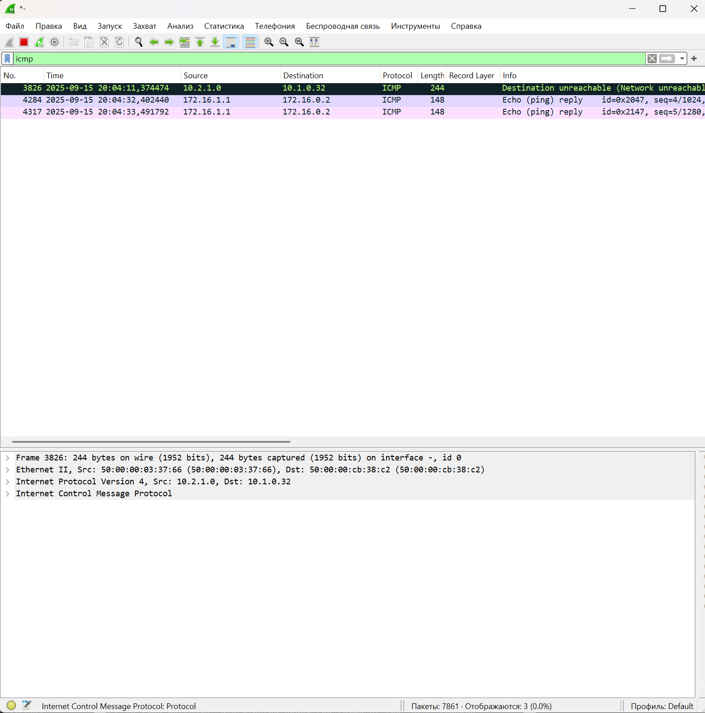

# Домашнее задание 6 Overlay. eBGP-OSPF

## Цель: Настроить eBGP-OSPF для Overlay сети.

**Описание/Пошаговая инструкция выполнения домашнего задания:**
В этой самостоятельной работе мы ожидаем, что вы самостоятельно:

1. Настроите BGP peering между Leaf и Spine в AF l2vpn evpn
2. Настроите связанность между клиентами в первой зоне и убедитесь в её наличии
3. Зафиксируете в документации - план работы, адресное пространство, схему сети, конфигурацию устройств

# Выполнение Задания

Настраиваем на базе Underlay ISIS.
Конфигурация [тут](https://github.com/igorvoroshkevich-93/Network-course/blob/main/Lab05_Overlay_EVPN_L2/OSPF_full_conf.md)
Работоспособность подтверждена [тут](https://github.com/igorvoroshkevich-93/Network-course/blob/main/Lab02_Underlay_OSPF/README.md)

## Новая схема сети(Все та же)


### План распределения следующий

***Берем за основу приватную подсеть 10.0.0.0/8 и из нее берем подсети согласно следущей схеме распределения.***

**10.Dn.Sn.Cn/24**

где:

Dn - зарезервированные дипазоны для Дата-центра, Sn - номер Spine , Сn - порядковый номер

Резервируем значения Dn

0 - loopback 1 - понадобится нам для Underlay , маска /32

1 - loopback 2 - Заранее зарезервируем диапазон для Overlay , маска /32

2 - interconnect - используем подход по /31, чтобы не брать на себя риски unnumbered подхода, ну и мне просто привычнее, так как все сессии у нас в Underlay будут p2p, для Примера: OSPF как для Underlay, мы избежим сходимости сети с распределением DR/BDR, все сессии у нас будут в состоняии Full

3-7 - на данный момент просто зарезервируем, пока не понятно для чего тратить, либо сервисы либо mgmt, пока не трогаем

Sn - нумеруем по лучшим правилам, начиная с "0" (для loopback нумрацию spine не используем, там просто резервируем первые 16 адрсов на Spine, а с 32 по 64 на Leaf)

На портах, в виду того, что всх интерфейсы у нас L3-типа, берем единый влан, сразу зарезервируем парочку

911 - просто понравился, его возьмем для интерконнектов

**903, 904 - клиентские - начнем делить, пригодится потом для проверки L3** 

Итого - наш зарезрвированный диапозон для этого условного ЦОД будт 900-999


***Для IPv6 возьмем следующий принцип***

***З.Ы. Не факт что пригодится, но оставим***
В обычно мире сети выдаются по /64, либо по /48, сделаем вид, что нам досталась такая
E342:4D31:8282:B010::/64 и попилим ее по /80

**E342:4D31:8282:B010:Dn:Sn::Cn/80**

Dn - такие же как у IPv4

0 - loopback 1 - понадобится нам для Underlay , маска /128, резервируем первые 16 - с 0 до F адрсов на Spine, а с 10 по 2F на Leaf)

1 - loopback 2 - Заранее зарезервируем диапазон для Overlay , маска /128, резервируем первые 16 - с 0 до F адрсов на Spine, а с 10 по 3F на Leaf)

2 - interconnect - используем подход по /127, чтобы не брать на себя риски unnumbered подхода, ну и мне просто привычнее, так как все сессии у нас в Underlay будут p2p

3-6 - Reserved

7 - Client

Остальные пока оставим без внимания, Адресов у нас много, потом придумаем для чего использовать.

Sn - Номер Spine(только для интерконектов) нумеруем по лучшим правилам, начиная с "0" 
Cn -  Уникальный по порядку

***Клиентскую подсеть берем следующую:***

172.16.N.0/24

Где N - номер клиентского домена, по заданию надо чтобы был не один, начинаем нумеровать, начиная с "0"

А для IPv6 возьмем как обозначили ранее, из архитектуры выше

E342:4D31:8282:B010:7:N::Cn/96

N - номер клиентского домена

Тут уже начнем нумерацию c 1 - т.к. в случае IPv6 у нас просто в записи срежутся нули, а нам надо понимать что у нас за клиентский домен изначально.


### Таблица распределения адресного пространства

|Device    |Port     |IPv4                               |IPv6                                       |VLAN|Link                           |Comment         |
|----------|---------|-----------------------------------|-------------------------------------------|----|-------------------------------|----------------|
|Spine_1   |eth1     |  10.2.0.0/31                      |E342:4D31:8282:B010:2::0/127               |911  |Spine_1 eth1 – eth1 Leaf_1    |  Interconnect  |
|Spine_1   |eth2     |  10.2.0.2/31                      |E342:4D31:8282:B010:2::2/127               |911  |Spine_1 eth2 – eth1 Leaf_2    |  Interconnect  |
|Spine_1   |eth3     |  10.2.0.4/31                      |E342:4D31:8282:B010:2::4/127               |911  |Spine_1 eth3 – eth1 Leaf_3    |  Interconnect  |
|Spine_1   |loopback0|  10.0.0.0/32                      |E342:4D31:8282:B010:0::0/128               | --  | None                         |  Loopback      |
|Spine_1   |loopback1|  10.1.0.0/32                      |E342:4D31:8282:B010:1::0/128               | --  | None                         |  Loopback      |
|Spine_2   |eth1     |  10.2.1.0/31                      |E342:4D31:8282:B010:2:1::0/127             |911  |Spine_2 eth1 – eth2 Leaf_1    |  Interconnect  |
|Spine_2   |eth2     |  10.2.1.2/31                      |E342:4D31:8282:B010:2:1::2/127             |911  |Spine_2 eth2 – eth2 Leaf_2    |  Interconnect  |
|Spine_2   |eth3     |  10.2.1.4/31                      |E342:4D31:8282:B010:2:1::4/127             |911  |Spine_2 eth3 – eth2 Leaf_3    |  Interconnect  |
|Spine_2   |loopback0|  10.0.0.1/32                      |E342:4D31:8282:B010:0::1/128               | --  | None                         |  Loopback      |
|Spine_2   |loopback1|  10.1.0.1/32                      |E342:4D31:8282:B010:1::1/128               | --  | None                         |  Loopback      |
|Leaf_1    |eth1     |  10.2.0.1/31                      |E342:4D31:8282:B010:2::1/127               |911  |Leaf_1 eth1 – eth1 Spine_1    |  Interconnect  |
|Leaf_1    |eth2     |  10.2.1.1/31                      |E342:4D31:8282:B010:2:1::1/127             |911  |Leaf_1 eth2 – eth1 Spine_2    |  Interconnect  |
|Leaf_1    |eth7     |  None                             |-------------------------------------------|903  |Leaf_1 eth7  – eth0 Client_1  |  Client        |
|Leaf_1    |loopback0|  10.0.0.32/32                     |E342:4D31:8282:B010:0::10/128              | --  | None                         |  Loopback      |
|Leaf_1    |loopback1|  10.1.0.32/32                     |E342:4D31:8282:B010:1::10/128              | --  | None                         |  Loopback      |
|Leaf_2    |eth1     |  10.2.0.3/31                      |E342:4D31:8282:B010:2::3/127               |911  |Leaf_2 eth1 – eth2 Spine_1    |  Interconnect  |
|Leaf_2    |eth2     |  10.2.1.3/31                      |E342:4D31:8282:B010:2:1::3/127             |911  |Leaf_2 eth2 – eth2 Spine_2    |  Interconnect  |
|Leaf_2    |eth7     |  None                             |-------------------------------------------|904  |Leaf_2 eth7  – eth0 Client_2  |  Client        |
|Leaf_2    |loopback0|  10.0.0.33/32                     |E342:4D31:8282:B010:0::11/128              | --  | None                         |  Loopback      |
|Leaf_2    |loopback1|  10.1.0.33/32                     |E342:4D31:8282:B010:1::11/128              | --  | None                         |  Loopback      |
|Leaf_3    |eth1     |  10.2.0.5/31                      |E342:4D31:8282:B010:2::5/127               |911  |Leaf_3 eth1 – eth3 Spine_1    |  Interconnect  |
|Leaf_3    |eth2     |  10.2.1.5/31                      |E342:4D31:8282:B010:2:1::5/127             |911  |Leaf_3 eth2 – eth3 Spine_2    |  Interconnect  |
|Leaf_3    |loopback0|  10.0.0.34/32                     |E342:4D31:8282:B010:0::12/128              | --  | None                         |  Loopback      |
|Leaf_3    |loopback1|  10.1.0.34/32                     |E342:4D31:8282:B010:1::12/128              | --  | None                         |  Loopback      |
|Leaf_3    |eth7     |  None                             |-------------------------------------------|903  |Leaf_3 eth7  – eth0 Client_3  |  Client        |
|Leaf_3    |eth8     |  None                             |-------------------------------------------|904  |Leaf_3 eth8  – eth0 Client_4  |  Client        |
|Client_1  |eth0     |  172.16.0.2/24                    |E342:4D31:8282:B010:7:1::1/96              |903  |Client_1 eth0 – eth7  Leaf_1  |  Client        |
|Client_2  |eth0     |  172.16.1.2/24                    |E342:4D31:8282:B010:7:1::2/96              |904  |Client_2 eth0 – eth7  Leaf_2  |  Client        |
|Client_3  |eth0     |  172.16.0.3/24                    |E342:4D31:8282:B010:7:1::3/96              |903  |Client_3 eth0 – eth7  Leaf_3  |  Client        |
|Client_4  |eth0     |  172.16.1.3/24                    |E342:4D31:8282:B010:7:1::4/96              |904  |Client_4 eth0 – eth8  Leaf_3  |  Client        |

## AS-Number

**iBGP**

Тут единая AS, не выдумываем ничего просто берем 65100

## План последующей конфигурации


Вланы на L3 интерфейсах снова не используем, пишет что версия образа не поддерживает, но, в клиентов access-ом подаем уже вланы, нам же нужно проверить связность.

Шаги 1-X пропускаем, делаем вид, что Underlay у нас рабочий, конфиг приложен.

1. Подключаемся к оборудованию.
2. Настраиваем hostname.
3. Так как у нас Arista - глобально включаем routing.
4. Конфигурируем интерфейсы согласно плана(eth, loopback).
5. Проверяем интерконнекты командой ping - убеждаемся в связности.
6. Настраиваем BFD.
7. Включаем процесс ISIS глобально и конфигурируем его(Authorization, zones, etc.)
8. Проеряем маршрутные таблицы, трассировки, связность лупбеков.
9. Поднимаем Vlan, подаем их в сторону клиентов
10. Настраиваем EVPN BGP, соседи, рассширенное комьюнити, авторизация.
11. Проверяем соседство, маршруты.
12. Инициализируем binding vlan to vxlan, предварительно создав интерфейс для инкапсуляции/деинкапсуляции
13. Создаем VRF для Symmetric IRB на всех Leaf
14. Проверяем связность клиентских хостов, прикладываем везде где можно дампы трафика.

# Приступаем к выполнению

Обнулились, чистое оборудование, никто ничего не настраивал, пустое железо, просто прокатываем конфиг Underlay

## Конфигурация VxLAN EVPN для L3 связанности

Вот тут начинается самое интересное.
BFD в этот раз не используем, разваливается вся лаба, надо таймеры задирать, крутил вплоть до 1000 ms - все равно рассыпалась, пусть будет только на Underlay

### Прольем сначала конфиг на Spine-1

```
Spine-1(config)#ip prefix-list Leaf_LB seq 10 permit 10.0.0.32/32
Spine-1(config)#ip prefix-list Leaf_LB seq 20 permit 10.0.0.33/32
Spine-1(config)#ip prefix-list Leaf_LB seq 30 permit 10.0.0.34/32
Spine-1(config)#ip prefix-list Leaf_LB seq 40 permit 10.1.0.32/32
Spine-1(config)#ip prefix-list Leaf_LB seq 50 permit 10.1.0.33/32
Spine-1(config)#ip prefix-list Leaf_LB seq 60 permit 10.1.0.34/32
Spine-1(config)#ip prefix-list Spine_LB seq 10 permit 10.0.0.0/32
Spine-1(config)#ip prefix-list Spine_LB seq 20 permit 10.1.0.0/32
Spine-1(config)#!
Spine-1(config)#route-map Loopback permit 10
Spine-1(config-route-map-Loopback)#   match ip address prefix-list Spine_LB
Spine-1(config-route-map-Loopback)#route-map Loopback permit 20
Spine-1(config-route-map-Loopback)#   match ip address prefix-list Leaf_LB
Spine-1(config-route-map-Loopback)#peer-filter ASN_Leafs
Spine-1(config-peer-filter-ASN_Leafs)#   10 match as-range 65101-65199 result accept
Spine-1(config-peer-filter-ASN_Leafs)#!
Spine-1(config-peer-filter-ASN_Leafs)#router bgp 65100
Spine-1(config-router-bgp)#   router-id 10.1.0.0
Spine-1(config-router-bgp)#   maximum-paths 2 ecmp 2
Spine-1(config-router-bgp)#   bgp listen range 10.1.0.0/24 peer-group EVPN_Overlay peer-filter ASN_Leafs
Spine-1(config-router-bgp)#   neighbor EVPN_Overlay peer group
Spine-1(config-router-bgp)#   neighbor EVPN_Overlay remote-as 65100
Spine-1(config-router-bgp)#   neighbor EVPN_Overlay update-source Loopback1
Spine-1(config-router-bgp)#   neighbor EVPN_Overlay route-reflector-client
Spine-1(config-router-bgp)#   neighbor EVPN_Overlay send-community extended
Spine-1(config-router-bgp)#   neighbor EVPN_Overlay ebgp-multihop 10
Spine-1(config-router-bgp)#   neighbor EVPN_Overlay timers 3 9
Spine-1(config-router-bgp)#   neighbor EVPN_Overlay password Otus_Overlay
Spine-1(config-router-bgp)#   redistribute connected route-map Loopback
Spine-1(config-router-bgp)#   address-family evpn
Spine-1(config-router-bgp-af)#      neighbor EVPN_Overlay activate
Spine-1(config-router-bgp-af)#end

```

### Включим захват трафика на интерфесах лифов в сторону этого Spine

Проливаем конфиг на Leaf's и смотрим что там у нас творится.

**Leaf-1**
```
Leaf-1(config)#router bgp 65101
Leaf-1(config-router-bgp)#   router-id 10.1.0.32
Leaf-1(config-router-bgp)#   maximum-paths 2 ecmp 2
Leaf-1(config-router-bgp)#   neighbor EVPN_Overlay peer group
Leaf-1(config-router-bgp)#   neighbor EVPN_Overlay remote-as 65100
Leaf-1(config-router-bgp)#   neighbor EVPN_Overlay update-source Loopback1
Leaf-1(config-router-bgp)#   neighbor EVPN_Overlay send-community extended
Leaf-1(config-router-bgp)#   neighbor EVPN_Overlay ebgp-multihop 10
Leaf-1(config-router-bgp)#   neighbor EVPN_Overlay timers 3 9
Leaf-1(config-router-bgp)#   neighbor EVPN_Overlay password Otus_Overlay
Leaf-1(config-router-bgp)#   neighbor 10.1.0.0 peer group EVPN_Overlay
Leaf-1(config-router-bgp)#   neighbor 10.1.0.1 peer group EVPN_Overlay
Leaf-1(config-router-bgp)#   redistribute connected route-map Loopback
Leaf-1(config-router-bgp)#   !
Leaf-1(config-router-bgp)#   address-family evpn
Leaf-1(config-router-bgp-af)#      neighbor EVPN_Overlay activate
Leaf-1(config-router-bgp-af)#end

```

**Leaf-2**
```
Leaf-2(config)#router bgp 65102
Leaf-2(config-router-bgp)#   router-id 10.1.0.33
Leaf-2(config-router-bgp)#   maximum-paths 2 ecmp 2
Leaf-2(config-router-bgp)#   neighbor EVPN_Overlay peer group
Leaf-2(config-router-bgp)#   neighbor EVPN_Overlay remote-as 65100
Leaf-2(config-router-bgp)#   neighbor EVPN_Overlay update-source Loopback1
Leaf-2(config-router-bgp)#   neighbor EVPN_Overlay send-community extended
Leaf-2(config-router-bgp)#   neighbor EVPN_Overlay ebgp-multihop 10
Leaf-2(config-router-bgp)#   neighbor EVPN_Overlay timers 3 9
Leaf-2(config-router-bgp)#   neighbor EVPN_Overlay password Otus_Overlay
Leaf-2(config-router-bgp)#   neighbor 10.1.0.0 peer group EVPN_Overlay
Leaf-2(config-router-bgp)#   neighbor 10.1.0.1 peer group EVPN_Overlay
Leaf-2(config-router-bgp)#   redistribute connected route-map Loopback
Leaf-2(config-router-bgp)#   !
Leaf-2(config-router-bgp)#   address-family evpn
Leaf-2(config-router-bgp-af)#      neighbor EVPN_Overlay activate
Leaf-2(config-router-bgp-af)#end

```

**Leaf-3**
```
Leaf-3(config)#router bgp 65102
Leaf-3(config-router-bgp)#   router-id 10.1.0.34
Leaf-3(config-router-bgp)#   maximum-paths 2 ecmp 2
Leaf-3(config-router-bgp)#   neighbor EVPN_Overlay peer group
Leaf-3(config-router-bgp)#   neighbor EVPN_Overlay remote-as 65100
Leaf-3(config-router-bgp)#   neighbor EVPN_Overlay update-source Loopback1
Leaf-3(config-router-bgp)#   neighbor EVPN_Overlay send-community extended
Leaf-3(config-router-bgp)#   neighbor EVPN_Overlay ebgp-multihop 10
Leaf-3(config-router-bgp)#   neighbor EVPN_Overlay timers 3 9
Leaf-3(config-router-bgp)#   neighbor EVPN_Overlay password Otus_Overlay
Leaf-3(config-router-bgp)#   neighbor 10.1.0.0 peer group EVPN_Overlay
Leaf-3(config-router-bgp)#   neighbor 10.1.0.1 peer group EVPN_Overlay
Leaf-3(config-router-bgp)#   redistribute connected route-map Loopback
Leaf-3(config-router-bgp)#   !
Leaf-3(config-router-bgp)#   address-family evpn
Leaf-3(config-router-bgp-af)#      neighbor EVPN_Overlay activate
Leaf-3(config-router-bgp-af)#
Leaf-3(config-router-bgp-af)#
Leaf-3(config-router-bgp-af)#end

```

Видим, как побежали пакеты, устанавливается соседство

**Leaf-1 to Spine-1**


**Leaf-2 to Spine-1**


**Leaf-3 to Spine-1**


Смотрим таблицу соседства и что у нас по роутам

**Leaf-1**


**Leaf-2**


**Leaf-3**


**Spine-1**


***Cоседство установилось, но роутов нет, проливаем Spine-2***

**Spine-2**

```
Spine-2(config)#ip prefix-list Leaf_LB seq 20 permit 10.0.0.33/32
Spine-2(config)#ip prefix-list Leaf_LB seq 30 permit 10.0.0.34/32
Spine-2(config)#ip prefix-list Leaf_LB seq 40 permit 10.1.0.32/32
Spine-2(config)#ip prefix-list Leaf_LB seq 50 permit 10.1.0.33/32
Spine-2(config)#ip prefix-list Leaf_LB seq 60 permit 10.1.0.34/32
Spine-2(config)#ip prefix-list Spine_LB seq 10 permit 10.0.0.0/32
Spine-2(config)#ip prefix-list Spine_LB seq 20 permit 10.1.0.0/32
Spine-2(config)#!
Spine-2(config)#route-map Loopback permit 10
Spine-2(config-route-map-Loopback)#   match ip address prefix-list Spine_LB
Spine-2(config-route-map-Loopback)#!
Spine-2(config-route-map-Loopback)#route-map Loopback permit 20
Spine-2(config-route-map-Loopback)#   match ip address prefix-list Leaf_LB
Spine-2(config-route-map-Loopback)#!
Spine-2(config-route-map-Loopback)#peer-filter ASN_Leafs
Spine-2(config-peer-filter-ASN_Leafs)#   10 match as-range 65101-65199 result accept
Spine-2(config-peer-filter-ASN_Leafs)#!
Spine-2(config-peer-filter-ASN_Leafs)#router bgp 65100
Spine-2(config-router-bgp)#   router-id 10.1.0.1
Spine-2(config-router-bgp)#   maximum-paths 2 ecmp 2
Spine-2(config-router-bgp)#   bgp listen range 10.1.0.0/24 peer-group EVPN_Overlay peer-filter ASN_Leafs
Spine-2(config-router-bgp)#   neighbor EVPN_Overlay peer group
Spine-2(config-router-bgp)#   neighbor EVPN_Overlay remote-as 65100
Spine-2(config-router-bgp)#   neighbor EVPN_Overlay update-source Loopback1
Spine-2(config-router-bgp)#   neighbor EVPN_Overlay route-reflector-client
Spine-2(config-router-bgp)#   neighbor EVPN_Overlay send-community extended
Spine-2(config-router-bgp)#   neighbor EVPN_Overlay ebgp-multihop 10
Spine-2(config-router-bgp)#   neighbor EVPN_Overlay timers 3 9
Spine-2(config-router-bgp)#   neighbor EVPN_Overlay password Otus_Overlay
Spine-2(config-router-bgp)#   redistribute connected route-map Loopback
Spine-2(config-router-bgp)#   !
Spine-2(config-router-bgp)#   address-family evpn
Spine-2(config-router-bgp-af)#      neighbor EVPN_Overlay activate
Spine-2(config-router-bgp-af)#   !
Spine-2(config-router-bgp-af)#!
Spine-2(config-router-bgp-af)#end

```

Ну и смотрим как тут дела


***Создаем Vxlan, поднимаем VRF смотрим роуты и состедство***

Проливаем конфиг

**Leaf-1**
```
Leaf-1(config)#vlan 903
Leaf-1(config-vlan-903)#   name Clients_903
Leaf-1(config-vlan-903)#!
Leaf-1(config-vlan-903)#vrf instance Otus_Symmetric_L3
Leaf-1(config-vrf-Otus_Symmetric_L3)#!
Leaf-1(config-vrf-Otus_Symmetric_L3)#ip routing vrf Otus_Symmetric_L3
Leaf-1(config)#!
Leaf-1(config)#int vlan 903
Leaf-1(config-if-Vl903)#   vrf Otus_Symmetric_L3
Leaf-1(config-if-Vl903)#   ip address virtual 172.16.0.1/24
Leaf-1(config-if-Vl903)#!
Leaf-1(config-if-Vl903)#Interface Ethernet7
Leaf-1(config-if-Et7)#   switchport mode access
Leaf-1(config-if-Et7)#   switchport access vlan 903
Leaf-1(config)#int vxlan1
Leaf-1(config-if-Vx1)#  vxlan source-int lo1
Leaf-1(config-if-Vx1)#  vxlan udp-port 4789
Leaf-1(config-if-Vx1)#  vxlan learn-restrict any
Leaf-1(config-if-Vx1)#  vxlan vlan 903 vni 10903
Leaf-1(config-if-Vx1)#  vxlan vrf Otus_Symmetric_L3 vni 10999

Leaf-1(config)#router bgp 65101
Leaf-1(config-router-bgp)#vlan 903
Leaf-1(config-macvrf-903)#      rd 10.1.0.32:10903
Leaf-1(config-macvrf-903)#      route-target both 65100:10903
Leaf-1(config-macvrf-903)#      redistribute learned
Leaf-1(config-macvrf-903)#   vrf Otus_Symmetric_L3
Leaf-1(config-router-bgp-vrf-Otus_Symmetric_L3)#      rd 10.1.0.32:10999
Leaf-1(config-router-bgp-vrf-Otus_Symmetric_L3)#      route-target import evpn 65100:10999
Leaf-1(config-router-bgp-vrf-Otus_Symmetric_L3)#      route-target export evpn 65100:10999
Leaf-1(config-router-bgp-vrf-Otus_Symmetric_L3)#      redistribute learned
Leaf-1(config-router-bgp-vrf-Otus_Symmetric_L3)#      redistribute connected

```

**Leaf-2**
```
Leaf-2(config)#vlan 904
Leaf-2(config-vlan-904)#   name Clients_904
Leaf-2(config-vlan-904)#!
Leaf-2(config-vlan-904)#vrf instance Otus_Symmetric_L3
Leaf-2(config-vrf-Otus_Symmetric_L3)#!
Leaf-2(config-vrf-Otus_Symmetric_L3)#ip routing vrf Otus_Symmetric_L3
Leaf-2(config)#!
Leaf-2(config)#int vlan 904
Leaf-2(config-if-Vl904)#   vrf Otus_Symmetric_L3
Leaf-2(config-if-Vl904)#   ip address virtual 172.16.1.1/24
Leaf-2(config-if-Vl904)#Interface Ethernet7
Leaf-2(config-if-Et7)#   switchport mode access
Leaf-2(config-if-Et7)#   switchport access vlan 904
Leaf-2(config-if-Et7)#int vxlan1
Leaf-2(config-if-Vx1)#  vxlan source-int lo1
Leaf-2(config-if-Vx1)#  vxlan udp-port 4789
Leaf-2(config-if-Vx1)#  vxlan learn-restrict any
Leaf-2(config-if-Vx1)#  vxlan vlan 904 vni 10904
Leaf-2(config)#router bgp 65102
Leaf-2(config-router-bgp)#vlan 904
Leaf-2(config-macvrf-904)#      rd 10.1.0.33:10904
Leaf-2(config-macvrf-904)#      route-target both 65100:10904
Leaf-2(config-macvrf-904)#      redistribute learned
Leaf-2(config-macvrf-904)#   vrf Otus_Symmetric_L3
Leaf-2(config-router-bgp-vrf-Otus_Symmetric_L3)#      rd 10.1.0.33:10999
Leaf-2(config-router-bgp-vrf-Otus_Symmetric_L3)#      route-target import evpn 65100:10999
Leaf-2(config-router-bgp-vrf-Otus_Symmetric_L3)#      route-target export evpn 65100:10999
Leaf-2(config-router-bgp-vrf-Otus_Symmetric_L3)#      redistribute connected
```

**Leaf-3**
```
Leaf-3(config)#vlan 905
Leaf-3(config-vlan-905)#   name Clients_905
Leaf-3(config-vlan-905)#!
Leaf-3(config-vlan-905)#vlan 906
Leaf-3(config-vlan-906)#   name Clients_906
Leaf-3(config-vlan-906)#!
Leaf-3(config-vlan-906)#vrf instance Otus_Symmetric_L3
Leaf-3(config-vrf-Otus_Symmetric_L3)#ip routing vrf Otus_Symmetric_L3
Leaf-3(config)#int vlan 905
Leaf-3(config-if-Vl905)#   vrf Otus_Symmetric_L3
Leaf-3(config-if-Vl905)#   ip address virtual 172.16.2.1/24
Leaf-3(config-if-Vl905)#!
Leaf-3(config-if-Vl905)#int vlan 906
Leaf-3(config-if-Vl906)#   vrf Otus_Symmetric_L3
Leaf-3(config-if-Vl906)#   ip address virtual 172.16.3.1/24
Leaf-3(config-if-Vl906)#!
Leaf-3(config-if-Vl906)#Interface Ethernet7
Leaf-3(config-if-Et7)#   switchport mode access
Leaf-3(config-if-Et7)#   switchport access vlan 905
Leaf-3(config-if-Et7)#!
Leaf-3(config-if-Et7)#Interface Ethernet8
Leaf-3(config-if-Et8)#   switchport mode access
Leaf-3(config-if-Et8)#   switchport access vlan 906
Leaf-3(config-if-Et8)#
Leaf-3(config-if-Et8)#int vxlan1
Leaf-3(config-if-Vx1)#  vxlan source-int lo1
Leaf-3(config-if-Vx1)#  vxlan udp-port 4789
Leaf-3(config-if-Vx1)#  vxlan learn-restrict any
Leaf-3(config-if-Vx1)#  vxlan vlan 905 vni 10905
Leaf-3(config-if-Vx1)#  vxlan vlan 906 vni 10906
Leaf-3(config-if-Vx1)#  vxlan vrf Otus_Symmetric_L3 vni 10999
Leaf-3(config-if-Vx1)#exit
Leaf-3(config)#router bgp 65103
Leaf-3(config-router-bgp)#vlan 905
Leaf-3(config-macvrf-905)#      rd 10.1.0.34:10905
Leaf-3(config-macvrf-905)#      route-target both 65100:10905
Leaf-3(config-macvrf-905)#      redistribute learned
Leaf-3(config-macvrf-905)#   vlan 906
Leaf-3(config-macvrf-906)#      rd 10.1.0.34:10906
Leaf-3(config-macvrf-906)#      route-target both 65100:10906
Leaf-3(config-macvrf-906)#      redistribute learned
Leaf-3(config-macvrf-906)#   vrf Otus_Symmetric_L3
Leaf-3(config-router-bgp-vrf-Otus_Symmetric_L3)#      rd 10.1.0.34:10999
Leaf-3(config-router-bgp-vrf-Otus_Symmetric_L3)#      route-target import evpn 65100:10999
Leaf-3(config-router-bgp-vrf-Otus_Symmetric_L3)#      route-target export evpn 65100:10999
Leaf-3(config-router-bgp-vrf-Otus_Symmetric_L3)#      redistribute connected
Leaf-3(config-router-bgp-vrf-Otus_Symmetric_L3)#end

```

Смотрим роуты и соседство

**Spine-1**

CLI


**Spine-2**

CLI


**Leaf-1**

Dump


CLI


**Leaf-2**

Dump


CLI


**Leaf-3**

Dump


CLI


### Поднимаем конфигурацию на клиентах, проверяем связность.

Конфигурацию писать не вижу смысла, она будет в общем файле, просто пингуем и смотрим в дамп трафика

**Client-1 PING+DUMP**

*Ping*


*Dump*


**Неожиданно отработал ecmp в лабе**



**Client-2 PING+DUMP**

*Ping*


*Dump*


**Client-3 PING+DUMP**

***Тут начинается интересная вещь, в дампе нет пингов между 3 и 4 клиентами, просто потому, что они на одном лифе, ловить нужно в другом месте, но мы уже убедились, что по фабрике связность есть выше***

*Ping*


*Dump*


**Client-4 PING+DUMP**

*Ping*


*Dump*


### Все работает, связность есть

#### Скрины соседства роутов BFD, VxLan(на Leaf)

**Spine-1**


**Spine-2**


**Leaf-1**


**Leaf-2**


**Leaf-3**


Конфигурация [общим файлом](https://github.com/igorvoroshkevich-93/Network-course/blob/main/Lab06_Overlay_EVPN_L3/EVPN_L3_full_conf.md)
