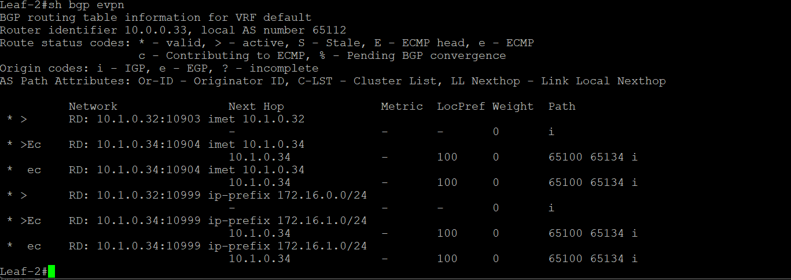
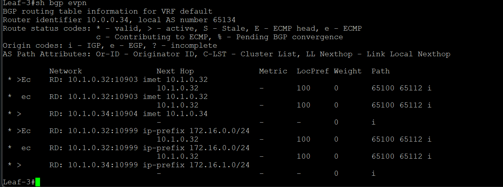
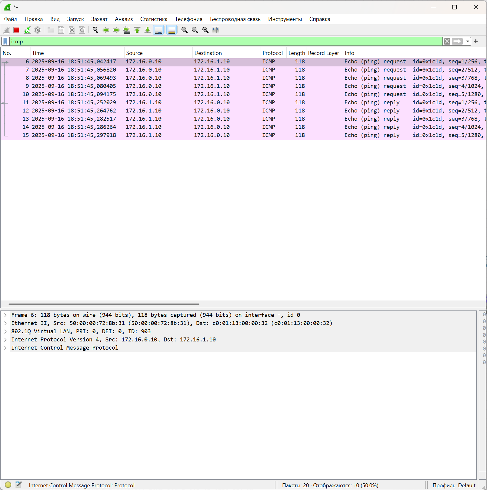
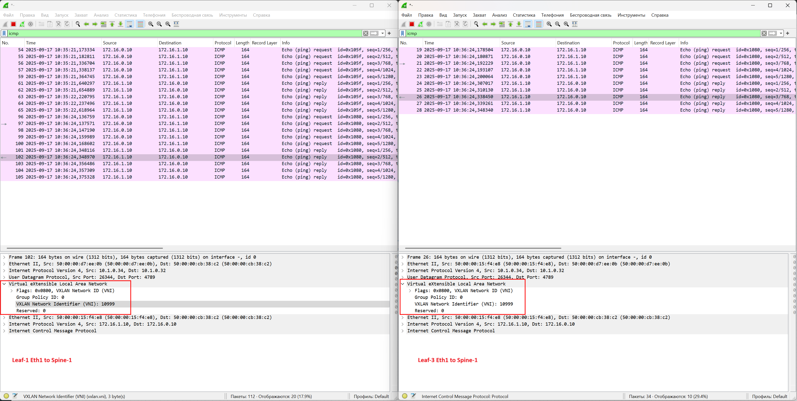
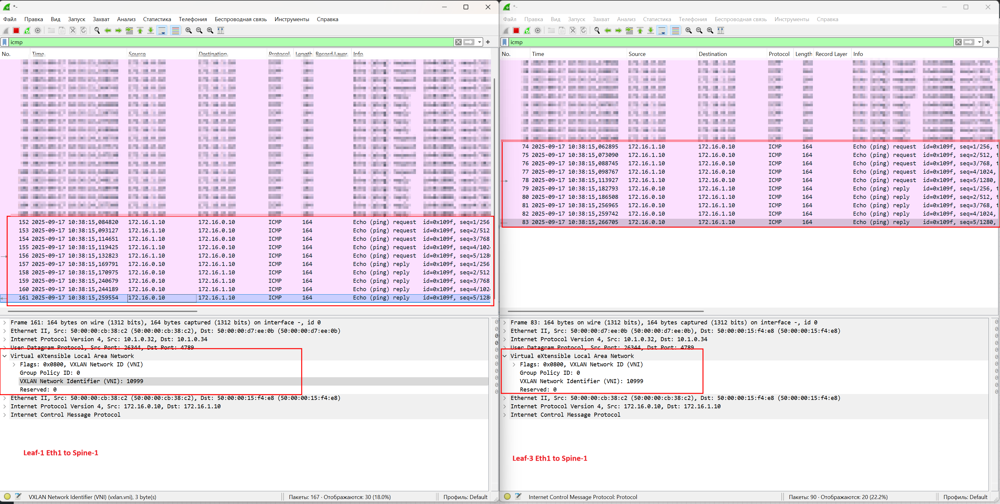
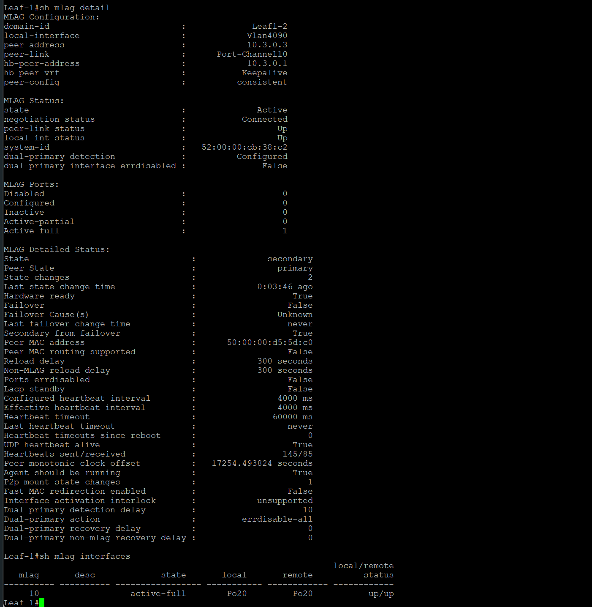

# Домашнее задание 6 Overlay. VXLAN. Multihoming

## Цель: Настроить отказоустойчивое подключение клиентов с использованием EVPN Multihoming.


**Описание/Пошаговая инструкция выполнения домашнего задания:**
В этой самостоятельной работе мы ожидаем, что вы самостоятельно:

1. Подключите клиентов 2-я линками к различным Leaf
2. Настроите агрегированный канал со стороны клиента.
3. Настроите multihoming для работы в Overlay сети. Если используете Cisco NXOS - vPC, если иной вендор - то ESI LAG (либо MC-LAG с поддержкой VXLAN)
4. Зафиксируете в документации - план работы, адресное пространство, схему сети, конфигурацию устройств
5. Опционально - протестировать отказоустойчивость - убедиться, что связнность не теряется при отключении одного из линков

# Выполнение Задания

Настраиваем на базе Underlay OSPF. Overlay - eBGP

## Новая схема сети

Добавился Leaf, 4х должно хватить.


### План распределения следующий

***Берем за основу приватную подсеть 10.0.0.0/8 и из нее берем подсети согласно следущей схеме распределения.***

**10.Dn.Sn.Cn/24**

***немного меняем план***

где:

Dn - зарезервированные дипазоны для Дата-центра, Sn - номер Spine , Сn - порядковый номер

Резервируем значения Dn

0 - loopback 1 - понадобится нам для Underlay, как router-id, маска /32, его же Используем для сессий в Overlay

1 - loopback 2 - Заранее зарезервируем диапазон для VxLan VTEP для MLAG(одинаковый для Leaf-pair, берем в последнем октете значение наименьшего Leaf от Loopback0 ) , маска /32

2 - interconnect - используем подход по /31, чтобы не брать на себя риски unnumbered подхода, ну и мне просто привычнее, так как все сессии у нас в Underlay будут p2p, для Примера: OSPF как для Underlay, мы избежим сходимости сети с распределением DR/BDR, все сессии у нас будут в состоняии Full

***3 - peerlink interconnect - для построение связности для пирлинков, третий и 4й октет возьмем по следующему принципу - 10.3.L.0-1 - для heartbeat, 10.3.L.2-3 - peer-to-peer OSPF, где L - номер Leaf-pair начиная с "0"***

4-7 - на данный момент просто зарезервируем, пока не понятно для чего тратить, либо сервисы либо mgmt, пока не трогаем

Sn - нумеруем по лучшим правилам, начиная с "0" (для loopback нумрацию spine не используем, там просто резервируем в Cn первые 16 адрсов на Spine, а с 32 по 64 на Leaf)

На портах, в виду того, что всх интерфейсы у нас L3-типа, берем единый влан, сразу зарезервируем парочку

**4090 - используем, берем для peer-link**

**903, 904 - клиентские - делим, совместим Symmetric IRB с пердыдущей лабораторной работы, пригодится потом для проверки L3** 

Итого - наш зарезрвированный диапозон для этого условного ЦОД будт 900-999


***Клиентскую подсеть берем следующую:***

172.16.N.0/24

Где N - номер клиентского домена, по заданию надо чтобы был не один, начинаем нумеровать, начиная с "0"


### Таблица распределения адресного пространства

|Device    |Port      |IPv4                               |VLAN|Link                             |Comment         |
|----------|----------|-----------------------------------|----|---------------------------------|----------------|
|Spine_1   |eth1      |  10.2.0.0/31                      | --  |Spine_1 eth1 – eth1 Leaf_1      |  Interconnect  |
|Spine_1   |eth2      |  10.2.0.2/31                      | --  |Spine_1 eth2 – eth1 Leaf_2      |  Interconnect  |
|Spine_1   |eth3      |  10.2.0.4/31                      | --  |Spine_1 eth3 – eth1 Leaf_3      |  Interconnect  |
|Spine_1   |eth4      |  10.2.0.6/31                      | --  |Spine_2 eth4 – eth1 Leaf_4      |  Interconnect  |
|Spine_1   |loopback0 |  10.0.0.0/32                      | --  | None                           |  Loopback      |
|Spine_2   |eth1      |  10.2.1.0/31                      | --  |Spine_2 eth1 – eth2 Leaf_1      |  Interconnect  |
|Spine_2   |eth2      |  10.2.1.2/31                      | --  |Spine_2 eth2 – eth2 Leaf_2      |  Interconnect  |
|Spine_2   |eth3      |  10.2.1.4/31                      | --  |Spine_2 eth3 – eth2 Leaf_3      |  Interconnect  |
|Spine_2   |eth4      |  10.2.1.6/31                      | --  |Spine_2 eth4 – eth2 Leaf_4      |  Interconnect  |
|Spine_2   |loopback0 |  10.0.0.1/32                      | --  | None                           |  Loopback      |
|----------|----------|-----------------------------------|-----|--------------------------------|----------------|
|Leaf_1    |eth1      |  10.2.0.1/31                      | --  |Leaf_1 eth1 – eth1 Spine_1      |  Interconnect  |
|Leaf_1    |eth2      |  10.2.1.1/31                      | --  |Leaf_1 eth2 – eth1 Spine_2      |  Interconnect  |
|Leaf_1    |eth3      |  10.3.0.0/31                      | --  |Leaf_1 eth3 – eth3  Leaf_2      |  Keepalive     |
|Leaf_1    |eth4      |  None                             |4090 |Leaf_1 po10 – po10  Leaf_2      |  Peer-link     |
|Leaf_1    |eth5      |  None                             |4090 |Leaf_1 po10 – po10  Leaf_2      |  Peer-link     |
|Leaf_1    |vlanIf903 |  172.16.0.1/24                    |903  | Po20                           |  VRF-VRRP      |
|Leaf_1    |vlanIf903 |  172.16.0.2/24                    |903  | Po20                           |  VRF-IP Leaf   |
|Leaf_1    |vlanIf4090|  10.3.0.2/31                      |4090 | Leaf_1 po10 Leaf_2 po10        |  Peer-link     |
|Leaf_1    |eth7      |  None                             |903  |Leaf_1 po20  – po10 Client_1    |  Client        |
|Leaf_1    |loopback0 |  10.0.0.32/32                     | --  | None                           |  Loopback      |
|Leaf_1    |loopback1 |  10.1.0.32/32                     | --  | None                           |  Loopback      |
|Leaf_2    |eth1      |  10.2.0.3/31                      | --  |Leaf_2 eth1 – eth2 Spine_1      |  Interconnect  |
|Leaf_2    |eth2      |  10.2.1.3/31                      | --  |Leaf_2 eth2 – eth2 Spine_2      |  Interconnect  |
|Leaf_2    |eth3      |  10.3.0.1/31                      | --  |Leaf_2 eth3 – eth3  Leaf_1      |  Keepalive     |
|Leaf_2    |eth4      |  None                             |4090 |Leaf_2 po10 – po10  Leaf_1      |  Peer-link     |
|Leaf_2    |eth5      |  None                             |4090 |Leaf_2 po10 – po10  Leaf_1      |  Peer-link     |
|Leaf_2    |vlanIf903 |  172.16.0.1/24                    |903  | Po20                           |  VRF-VRRP      |
|Leaf_2    |vlanIf903 |  172.16.0.3/24                    |903  | Po20                           |  VRF-IP Leaf   |
|Leaf_2    |vlanIf4090|  10.3.0.3/31                      |4090 | Leaf_2 po10 Leaf_1 po10        |  Peer-link     |
|Leaf_2    |eth7      |  None                             |903  |Leaf_2 po20  – po10 Client_1    |  Client        |
|Leaf_2    |loopback0 |  10.0.0.33/32                     | --  | None                           |  Loopback      |
|Leaf_2    |loopback1 |  10.1.0.32/32                     | --  | None                           |  Loopback      |
|----------|----------|-----------------------------------|-----|--------------------------------|----------------|
|Leaf_3    |eth1      |  10.2.0.5/31                      | --  |Leaf_1 eth1 – eth1 Spine_1      |  Interconnect  |
|Leaf_3    |eth2      |  10.2.1.5/31                      | --  |Leaf_1 eth2 – eth1 Spine_2      |  Interconnect  |
|Leaf_3    |eth3      |  10.3.1.0/31                      | --  |Leaf_1 eth3 – eth3  Leaf_2      |  Keepalive     |
|Leaf_3    |eth4      |  None                             |4090 |Leaf_1 po10 – po10  Leaf_2      |  Peer-link     |
|Leaf_3    |eth5      |  None                             |4090 |Leaf_1 po10 – po10  Leaf_2      |  Peer-link     |
|Leaf_3    |vlanIf903 |  172.16.1.1/24                    |904  | Po20                           |  VRF-VRRP      |
|Leaf_3    |vlanIf903 |  172.16.1.2/24                    |904  | Po20                           |  VRF-IP Leaf   |
|Leaf_3    |vlanIf4090|  10.3.1.2/31                      |4090 | Leaf_1 po10 Leaf_2 po10        |  Peer-link     |
|Leaf_3    |eth7      |  None                             |903  |Leaf_1 po20  – po10 Client_1    |  Client        |
|Leaf_3    |loopback0 |  10.0.0.34/32                     | --  | None                           |  Loopback      |
|Leaf_3    |loopback1 |  10.1.0.34/32                     | --  | None                           |  Loopback      |
|Leaf_4    |eth1      |  10.2.0.7/31                      | --  |Leaf_2 eth1 – eth2 Spine_1      |  Interconnect  |
|Leaf_4    |eth2      |  10.2.1.7/31                      | --  |Leaf_2 eth2 – eth2 Spine_2      |  Interconnect  |
|Leaf_4    |eth3      |  10.3.1.1/31                      | --  |Leaf_2 eth3 – eth3  Leaf_1      |  Keepalive     |
|Leaf_4    |eth4      |  None                             |4090 |Leaf_2 po10 – po10  Leaf_1      |  Peer-link     |
|Leaf_4    |eth5      |  None                             |4090 |Leaf_2 po10 – po10  Leaf_1      |  Peer-link     |
|Leaf_4    |vlanIf903 |  172.16.1.1/24                    |904  | Po20                           |  VRF-VRRP      |
|Leaf_4    |vlanIf903 |  172.16.1.3/24                    |904  | Po20                           |  VRF-IP Leaf   |
|Leaf_4    |vlanIf4090|  10.3.1.3/31                      |4090 | Leaf_2 po10 Leaf_1 po10        |  Peer-link     |
|Leaf_4    |eth7      |  None                             |903  |Leaf_2 po20  – po10 Client_1    |  Client        |
|Leaf_4    |loopback0 |  10.0.0.35/32                     | --  | None                           |  Loopback      |
|Leaf_4    |loopback1 |  10.1.0.34/32                     | --  | None                           |  Loopback      |
|----------|----------|-----------------------------------|-----|--------------------------------|----------------|
|Client_1  |vlanIf903 |  172.16.0.10/24                   |903  |Client_1 po10 – po20  Leaf_1_2  |  Client        |
|Client_2  |vlanIf903 |  172.16.1.10/24                   |904  |Client_2 po10 – po20  Leaf_3_4  |  Client        |

## AS-Number

**eBGP**

Начинаем Распределять, в виду того, что сессии у нас должны быть уникальны. Spine's - берем по следующему плану

65XAA Где X - номер POD, делаем вид, что у нас будет не более 8 подов, так как "0" мы резервируем для Super-Spine, а 1-9 для Spine AA - уникальный номер, для Spine резервируем значение "00", для Leaf's берем порядковый номер Leaf-а, 

к примеру Leaf-1+Leaf-2 будет иметь номер 65112, а Spine-ы - 65100

## План последующей конфигурации


Вланы на L3 интерфейсах снова не используем, пишет что версия образа не поддерживает, но, в клиентов access-ом подаем уже вланы, нам же нужно проверить связность.

Шаги 1-8 пропускаем, делаем вид, что Underlay у нас рабочий, конфиг приложен.

1. Подключаемся к оборудованию.
2. Настраиваем hostname.
3. Так как у нас Arista - глобально включаем routing.
4. Конфигурируем интерфейсы согласно плана(eth, loopback).
5. Проверяем интерконнекты командой ping - убеждаемся в связности.
6. Настраиваем BFD, MLAG - проверяем его.
7. Включаем процесс OSPF глобально и конфигурируем его(Authorization, bfd, etc.)
8. Проеряем маршрутные таблицы, трассировки, связность лупбеков.
9. Поднимаем Vlan, подаем их в сторону клиентов
10. Настраиваем EVPN BGP, соседи, рассширенное комьюнити, авторизация.
11. Проверяем соседство, маршруты.
12. Инициализируем binding vlan to vxlan, предварительно создав интерфейс для инкапсуляции/деинкапсуляции
13. Создаем VRF для Symmetric IRB на всех Leaf-pair(с помощью VRRP)
14. Проверяем связность клиентских хостов, прикладываем везде где можно дампы трафика.

# Приступаем к выполнению

Обнулились, чистое оборудование, никто ничего не настраивал, пустое железо, просто прокатываем конфиг Underlay
Будем настраивать протоколы снизу вверх.

## Конфигурация MLAG на Leaf's

Поднимаем заранее на Client-1 и Client-2 LAG и IP

**Client-1**
```
localhost(config)#hostname Server-1
Server-1(config)#ip routing
Server-1(config)#vlan 903
Server-1(config-vlan-903)#name Clients-1_to_Leaf1-2
Server-1(config)#interface vlan 903
Server-1(config-if-Vl903)#ip address 172.16.0.10/24
Server-1(config-if-Vl903)#no shutdown
Server-1(config-if-Vl903)#exit
Server-1(config)#interface port-Channel 10
Server-1(config-if-Po10)#switchport mode trunk
Server-1(config-if-Po10)#switchport trunk allowed vlan 903
Server-1(config)#Interface ethernet 1
Server-1(config-if-Et1)#channel-group 10 mode active
Server-1(config-if-Et1)#Interface ethernet 2
Server-1(config-if-Et2)#channel-group 10 mode active
Server-1(config-if-Et2)#exit
Server-1(config-vlan-903)#exit
```

**Client-2**
```
localhost(config)#hostname Server-2
Server-2(config)#!
Server-2(config)#vlan 904
Server-2(config-vlan-904)#   name Clients-2_to_Leaf3-4
Server-2(config-vlan-904)#!
Server-2(config-vlan-904)#interface Port-Channel10
Server-2(config-if-Po10)#   switchport trunk allowed vlan 904
Server-2(config-if-Po10)#   switchport mode trunk
Server-2(config-if-Po10)#!
Server-2(config-if-Po10)#interface Ethernet1
Server-2(config-if-Et1)#   channel-group 10 mode active
Server-2(config-if-Et1)#!
Server-2(config-if-Et1)#interface Ethernet2
Server-2(config-if-Et2)#   channel-group 10 mode active
Server-2(config-if-Et2)#interface Vlan904
Server-2(config-if-Vl904)#   ip address 172.16.1.10/24
Server-2(config-if-Vl904)#!
Server-2(config-if-Vl904)#ip routing
```

### Проливаем конфиг на Leaf's и смотрим что там у нас творится.

Становимся на дамп трафика между Leaf 1 и 2 (в Линках Keepalive и Peer-link)

**Leaf-1**
```
localhost(config)#hostname Leaf-1
Leaf-1(config)#ip routing
Leaf-1(config)#vrf instance Keepalive
Leaf-1(config-vrf-Keepalive)#exit
Leaf-1(config)#ip routing vrf Keepalive
Leaf-1(config)#interface ethernet 3
Leaf-1(config-if-Et3)#vrf Keepalive
Leaf-1(config-if-Et3)#no switchport
Leaf-1(config-if-Et3)#ip address 10.3.0.0/31
Leaf-1(config-if-Et3)#exit
Leaf-1(config)#vlan 4090
Leaf-1(config-vlan-4090)#name MLAG-peer-Leaf1-2
Leaf-1(config-vlan-4090)#trunk group MLAG-peer_Server-1
Leaf-1(config-vlan-4090)#exit
Leaf-1(config)#int vlan 4090
Leaf-1(config-if-Vl4090)# ip add 10.3.0.2/31
Leaf-1(config-if-Vl4090)# ip ospf area 0.0.0.1
Leaf-1(config-if-Vl4090)# no autostate
Leaf-1(config-if-Vl4090)# no shut
Leaf-1(config-if-Vl4090)#int Ethernet4
Leaf-1(config-if-Et4)#description MLAG_Eth4_Leaf-2
Leaf-1(config-if-Et4)#channel-group 10 mode active
Leaf-1(config-if-Et4)#int Ethernet5
Leaf-1(config-if-Et5)#description MLAG_Eth5_Leaf-2
Leaf-1(config-if-Et5)#channel-group 10 mode active
Leaf-1(config-if-Et5)#exit
Leaf-1(config)#interface port-Channel 10
Leaf-1(config-if-Po10)#description MLAG_Leaf-2
Leaf-1(config-if-Po10)#switchport mode trunk
Leaf-1(config-if-Po10)#spanning-tree link-type point-to-point
Leaf-1(config-if-Po10)#switchport trunk group MLAG-peer_Server-1
Leaf-1(config-if-Po10)#exit
Leaf-1(config)#no spanning-tree vlan-id 4090
Leaf-1(config)#mlag configuration
Leaf-1(config-mlag)#domain-id Leaf1-2
Leaf-1(config-mlag)#peer-link port-Channel 10
Leaf-1(config-mlag)#local-interface vlan 4090
Leaf-1(config-mlag)#peer-address 10.3.0.3
Leaf-1(config-mlag)#peer-address heartbeat 10.3.0.1 vrf Keepalive
aces 1(config-mlag)#dual-primary detection delay 10 action errdisable all-inter
Leaf-1(config-mlag)#no shutdown
Leaf-1(config-mlag)#exit
Leaf-1(config)#ip virtual-router mac-address c001.1300.0032
Leaf-1(config)#vrf instance Otus_Symmetric_L3
Leaf-1(config-vrf-Otus_Symmetric_L3)#exit
Leaf-1(config)#ip routing vrf Otus_Symmetric_L3
Leaf-1(config)#int vlan 903
Leaf-1(config-if-Vl903)#vrf Otus_Symmetric_L3
Leaf-1(config-if-Vl903)#ip address 172.16.0.2/24
Leaf-1(config-if-Vl903)#ip virtual-router address 172.16.0.1
Leaf-1(config-if-Vl903)#exit
Leaf-1(config)#interface ethernet 7
Leaf-1(config-if-Et7)#channel-group 20 mode active
Leaf-1(config-if-Et7)#exit
Leaf-1(config)#interface port-Channel 20
Leaf-1(config-if-Po20)#mlag 10
Leaf-1(config-if-Po20)#switchport mode trunk
Leaf-1(config-if-Po20)#switchport trunk allowed vlan 903
Leaf-1(config-if-Po20)#end


```

**Leaf-2**
```
localhost(config)#hostname Leaf-2
Leaf-2(config)#!
Leaf-2(config)#no spanning-tree vlan-id 4090
Leaf-2(config)#!
Leaf-2(config)#vlan 903
Leaf-2(config-vlan-903)#   name Server-1
Leaf-2(config-vlan-903)#!
Leaf-2(config-vlan-903)#vlan 4090
Leaf-2(config-vlan-4090)#   name MLAG-peer-Leaf2-1
Leaf-2(config-vlan-4090)#   trunk group MLAG-peer_Server-1
Leaf-2(config-vlan-4090)#!
Leaf-2(config-vlan-4090)#vrf instance Keepalive
Leaf-2(config-vrf-Keepalive)#!
Leaf-2(config-vrf-Keepalive)#vrf instance Otus_Symmetric_L3
Leaf-2(config-vrf-Otus_Symmetric_L3)#!
Leaf-2(config-vrf-Otus_Symmetric_L3)#interface Port-Channel10
Leaf-2(config-if-Po10)#   description MLAG_Leaf-1
Leaf-2(config-if-Po10)#   switchport mode trunk
Leaf-2(config-if-Po10)#   switchport trunk group MLAG-peer_Server-1
Leaf-2(config-if-Po10)#   spanning-tree link-type point-to-point
Leaf-2(config-if-Po10)#!
Leaf-2(config-if-Po10)#interface Port-Channel20
Leaf-2(config-if-Po20)#   switchport trunk allowed vlan 903
Leaf-2(config-if-Po20)#   switchport mode trunk
Leaf-2(config-if-Po20)#   mlag 10
Leaf-2(config-if-Po20)#!
Leaf-2(config-if-Po20)#interface Ethernet1
Leaf-2(config-if-Et1)#!
Leaf-2(config-if-Et1)#interface Ethernet2
Leaf-2(config-if-Et2)#!
Leaf-2(config-if-Et2)#interface Ethernet3
Leaf-2(config-if-Et3)#   no switchport
Leaf-2(config-if-Et3)#   vrf Keepalive
Leaf-2(config-if-Et3)#   ip address 10.3.0.1/31
Leaf-2(config-if-Et3)#!
Leaf-2(config-if-Et3)#interface Ethernet4
Leaf-2(config-if-Et4)#   description MLAG_Eth4_Leaf-1
Leaf-2(config-if-Et4)#   channel-group 10 mode active
Leaf-2(config-if-Et4)#!
Leaf-2(config-if-Et4)#interface Ethernet5
Leaf-2(config-if-Et5)#   description MLAG_Eth5_Leaf-1
Leaf-2(config-if-Et5)#   channel-group 10 mode active
Leaf-2(config-if-Et5)#!
Leaf-2(config-if-Et5)#interface Ethernet6
Leaf-2(config-if-Et6)#!
Leaf-2(config-if-Et6)#interface Ethernet7
Leaf-2(config-if-Et7)#   channel-group 20 mode active
Leaf-2(config-if-Et7)#!
Leaf-2(config-if-Et7)#interface Ethernet8
Leaf-2(config-if-Et8)#!
Leaf-2(config-if-Et8)#interface Management1
Leaf-2(config-if-Ma1)#!
Leaf-2(config-if-Ma1)#interface Vlan903
Leaf-2(config-if-Vl903)#   vrf Otus_Symmetric_L3
Leaf-2(config-if-Vl903)#   ip address 172.16.0.3/24
Leaf-2(config-if-Vl903)#   ip virtual-router address 172.16.0.1
Leaf-2(config-if-Vl903)#!
Leaf-2(config-if-Vl903)#interface Vlan4090
Leaf-2(config-if-Vl4090)#   no autostate
Leaf-2(config-if-Vl4090)#   ip address 10.3.0.3/31
Leaf-2(config-if-Vl4090)#   ip ospf area 0.0.0.1
Leaf-2(config-if-Vl4090)#!
Leaf-2(config-if-Vl4090)#ip virtual-router mac-address c0:01:13:00:00:32
Leaf-2(config)#!
Leaf-2(config)#ip routing
Leaf-2(config)#ip routing vrf Keepalive
Leaf-2(config)#ip routing vrf Otus_Symmetric_L3
Leaf-2(config)#!
Leaf-2(config)#mlag configuration
Leaf-2(config-mlag)#   domain-id Leaf1-2
Leaf-2(config-mlag)#   local-interface Vlan4090
Leaf-2(config-mlag)#   peer-address 10.3.0.2
Leaf-2(config-mlag)#   peer-address heartbeat 10.3.0.0 vrf Keepalive
Leaf-2(config-mlag)#   peer-link Port-Channel10
Leaf-2(config-mlag)#   dual-primary detection delay 10 action errdisable all-interfaces
Leaf-2(config-mlag)#!
Leaf-2(config-mlag)#end


```
Видим обмен пакетами, установку соединения.

Keepalive


Peer-link


Смотрим состояние MLAG на Leaf 

**Leaf-1**


**Leaf-2**


И проверим связность c Сервером.

PING


DUMP


### Повторяем для Leaf 3 и 4 и смотрим только итог

Состояние MLAG

**Leaf-3**


**Leaf-4**


И проверим связность.

PING


DUMP


Конфигурация [общим файлом](https://github.com/igorvoroshkevich-93/Network-course/blob/main/Lab07_Overlay_EVPN_MLAG/Peer-link_full_conf.md)

## Конфигурация VxLAN EVPN для L3 связанности

Underlay показывать не будем, лежит в отдельном файле [тут](https://github.com/igorvoroshkevich-93/Network-course/blob/main/Lab07_Overlay_EVPN_MLAG/Ospf_MLAG_full_conf.md)

*В конфиге BFD есть, но пришлось его прибить, лаба не выдерживает и складывается.*

Вот тут начинается самое интересное.

### Прольем сначала конфиг на Spine-1

```
Spine-1(config)#ip prefix-list Leaf_LB seq 10 permit 10.0.0.32/32
Spine-1(config)#ip prefix-list Leaf_LB seq 20 permit 10.0.0.33/32
Spine-1(config)#ip prefix-list Leaf_LB seq 30 permit 10.0.0.34/32
Spine-1(config)#ip prefix-list Leaf_LB seq 40 permit 10.0.0.35/32
Spine-1(config)#ip prefix-list Leaf_LB seq 50 permit 10.1.0.32/32
Spine-1(config)#ip prefix-list Leaf_LB seq 60 permit 10.1.0.34/32
Spine-1(config)#ip prefix-list Spine_LB seq 10 permit 10.0.0.0/32
Spine-1(config)#ip prefix-list Spine_LB seq 20 permit 10.1.0.0/32
Spine-1(config)#!
Spine-1(config)#route-map Loopback permit 10
Spine-1(config-route-map-Loopback)#   match ip address prefix-list Spine_LB
Spine-1(config-route-map-Loopback)#!
Spine-1(config-route-map-Loopback)#route-map Loopback permit 20
Spine-1(config-route-map-Loopback)#   match ip address prefix-list Leaf_LB
Spine-1(config-route-map-Loopback)#!
Spine-1(config-route-map-Loopback)#peer-filter ASN_Leafs
Spine-1(config-peer-filter-ASN_Leafs)#   10 match as-range 65101-65199 result accept
Spine-1(config-peer-filter-ASN_Leafs)#!
Spine-1(config-peer-filter-ASN_Leafs)#router bgp 65100
Spine-1(config-router-bgp)#   router-id 10.0.0.0
Spine-1(config-router-bgp)#   maximum-paths 4 ecmp 64
Spine-1(config-router-bgp)#   bgp listen range 10.0.0.0/24 peer-group EVPN_Overlay peer-filter ASN_Leafs
Spine-1(config-router-bgp)#   neighbor EVPN_Overlay peer group
Spine-1(config-router-bgp)#   neighbor EVPN_Overlay remote-as 65100
Spine-1(config-router-bgp)#   neighbor EVPN_Overlay update-source Loopback0
Spine-1(config-router-bgp)#   neighbor EVPN_Overlay send-community extended
Spine-1(config-router-bgp)#   neighbor EVPN_Overlay next-hop-unchanged
Spine-1(config-router-bgp)#   neighbor EVPN_Overlay ebgp-multihop 10
Spine-1(config-router-bgp)#   neighbor EVPN_Overlay timers 30 90
Spine-1(config-router-bgp)#   neighbor EVPN_Overlay password Otus_Overlay
Spine-1(config-router-bgp)#   redistribute connected route-map Loopback
Spine-1(config-router-bgp)#   !
Spine-1(config-router-bgp)#   address-family evpn
Spine-1(config-router-bgp-af)#      neighbor EVPN_Overlay activate
Spine-1(config-router-bgp-af)#   !
Spine-1(config-router-bgp-af)#!
Spine-1(config-router-bgp-af)#end

```

### Включим захват трафика на интерфесах лифов в сторону этого Spine

Проливаем конфиг на Leaf's и смотрим что там у нас творится.

**Leaf-1**
```
Leaf-1(config)#router bgp 65112
Leaf-1(config-router-bgp)#   router-id 10.0.0.32
Leaf-1(config-router-bgp)#   maximum-paths 4 ecmp 64
Leaf-1(config-router-bgp)#   neighbor EVPN_Overlay peer group
Leaf-1(config-router-bgp)#   neighbor EVPN_Overlay remote-as 65100
Leaf-1(config-router-bgp)#   neighbor EVPN_Overlay update-source Loopback0
Leaf-1(config-router-bgp)#   neighbor EVPN_Overlay send-community extended
Leaf-1(config-router-bgp)#   neighbor EVPN_Overlay ebgp-multihop 10
Leaf-1(config-router-bgp)#   neighbor EVPN_Overlay timers 30 90
Leaf-1(config-router-bgp)#   neighbor EVPN_Overlay password Otus_Overlay
Leaf-1(config-router-bgp)#   neighbor 10.0.0.0 peer group EVPN_Overlay
Leaf-1(config-router-bgp)#   neighbor 10.0.0.1 peer group EVPN_Overlay
Leaf-1(config-router-bgp)#   redistribute connected route-map Loopback
Leaf-1(config-router-bgp)#   !
Leaf-1(config-router-bgp)#   address-family evpn
Leaf-1(config-router-bgp-af)#      neighbor EVPN_Overlay activate
Leaf-1(config-router-bgp-af)#   !


```

**Leaf-2**
```
Leaf-2(config)#router bgp 65112
Leaf-2(config-router-bgp)#   router-id 10.0.0.33
Leaf-2(config-router-bgp)#   maximum-paths 4 ecmp 64
Leaf-2(config-router-bgp)#   neighbor EVPN_Overlay peer group
Leaf-2(config-router-bgp)#   neighbor EVPN_Overlay remote-as 65100
Leaf-2(config-router-bgp)#   neighbor EVPN_Overlay update-source Loopback0
Leaf-2(config-router-bgp)#   neighbor EVPN_Overlay send-community extended
Leaf-2(config-router-bgp)#   neighbor EVPN_Overlay ebgp-multihop 10
Leaf-2(config-router-bgp)#   neighbor EVPN_Overlay timers 30 90
Leaf-2(config-router-bgp)#   neighbor EVPN_Overlay password Otus_Overlay
Leaf-2(config-router-bgp)#   neighbor 10.0.0.0 peer group EVPN_Overlay
Leaf-2(config-router-bgp)#   neighbor 10.0.0.1 peer group EVPN_Overlay
Leaf-2(config-router-bgp)#   redistribute connected route-map Loopback
Leaf-2(config-router-bgp)#   !
Leaf-2(config-router-bgp)#   address-family evpn
Leaf-2(config-router-bgp-af)#      neighbor EVPN_Overlay activate

```

**Leaf-3**
```
Leaf-3(config)#router bgp 65134
Leaf-3(config-router-bgp)#   router-id 10.0.0.34
Leaf-3(config-router-bgp)#   maximum-paths 4 ecmp 64
Leaf-3(config-router-bgp)#   neighbor EVPN_Overlay peer group
Leaf-3(config-router-bgp)#   neighbor EVPN_Overlay remote-as 65100
Leaf-3(config-router-bgp)#   neighbor EVPN_Overlay update-source Loopback0
Leaf-3(config-router-bgp)#   neighbor EVPN_Overlay send-community extended
Leaf-3(config-router-bgp)#   neighbor EVPN_Overlay ebgp-multihop 10
Leaf-3(config-router-bgp)#   neighbor EVPN_Overlay timers 30 90
Leaf-3(config-router-bgp)#   neighbor EVPN_Overlay password Otus_Overlay
Leaf-3(config-router-bgp)#   neighbor 10.0.0.0 peer group EVPN_Overlay
Leaf-3(config-router-bgp)#   neighbor 10.0.0.1 peer group EVPN_Overlay
Leaf-3(config-router-bgp)#   redistribute connected route-map Loopback
Leaf-3(config-router-bgp)#   !
Leaf-3(config-router-bgp)#   address-family evpn
Leaf-3(config-router-bgp-af)#      neighbor EVPN_Overlay activate
Leaf-3(config-router-bgp-af)#   !


```

**Leaf-4**
```
Leaf-4(config)#router bgp 65134
Leaf-4(config-router-bgp)#   router-id 10.0.0.35
Leaf-4(config-router-bgp)#   maximum-paths 4 ecmp 64
Leaf-4(config-router-bgp)#   neighbor EVPN_Overlay peer group
Leaf-4(config-router-bgp)#   neighbor EVPN_Overlay remote-as 65100
Leaf-4(config-router-bgp)#   neighbor EVPN_Overlay update-source Loopback0
Leaf-4(config-router-bgp)#   neighbor EVPN_Overlay send-community extended
Leaf-4(config-router-bgp)#   neighbor EVPN_Overlay ebgp-multihop 10
Leaf-4(config-router-bgp)#   neighbor EVPN_Overlay timers 30 90
Leaf-4(config-router-bgp)#   neighbor EVPN_Overlay password Otus_Overlay
Leaf-4(config-router-bgp)#   neighbor 10.0.0.0 peer group EVPN_Overlay
Leaf-4(config-router-bgp)#   neighbor 10.0.0.1 peer group EVPN_Overlay
Leaf-4(config-router-bgp)#   redistribute connected route-map Loopback
Leaf-4(config-router-bgp)#   !
Leaf-4(config-router-bgp)#   address-family evpn
Leaf-4(config-router-bgp-af)#      neighbor EVPN_Overlay activate
Leaf-4(config-router-bgp-af)#   !

```

Видим, как побежали пакеты, устанавливается соседство

**Leaf-1 to Spine-1**


**Leaf-2 to Spine-1**


**Leaf-3 to Spine-1**


**Leaf-4 to Spine-1**


Смотрим таблицу соседства и что у нас по роутам

**Leaf-1**


**Leaf-2**


**Leaf-3**


**Leaf-4**


**Spine-1**


***Cоседство установилось, но роутов нет, проливаем Spine-2***

**Spine-2**

```

Spine-2(config)#ip prefix-list Leaf_LB seq 10 permit 10.0.0.32/32
Spine-2(config)#ip prefix-list Leaf_LB seq 20 permit 10.0.0.33/32
Spine-2(config)#ip prefix-list Leaf_LB seq 30 permit 10.0.0.34/32
Spine-2(config)#ip prefix-list Leaf_LB seq 40 permit 10.0.0.35/32
Spine-2(config)#ip prefix-list Leaf_LB seq 50 permit 10.1.0.32/32
Spine-2(config)#ip prefix-list Leaf_LB seq 60 permit 10.1.0.34/32
Spine-2(config)#ip prefix-list Spine_LB seq 10 permit 10.0.0.0/32
Spine-2(config)#ip prefix-list Spine_LB seq 20 permit 10.1.0.0/32
Spine-2(config)#!
Spine-2(config)#route-map Loopback permit 10
Spine-2(config-route-map-Loopback)#   match ip address prefix-list Spine_LB
Spine-2(config-route-map-Loopback)#!
Spine-2(config-route-map-Loopback)#route-map Loopback permit 20
Spine-2(config-route-map-Loopback)#   match ip address prefix-list Leaf_LB
Spine-2(config-route-map-Loopback)#!
Spine-2(config-route-map-Loopback)#peer-filter ASN_Leafs
Spine-2(config-peer-filter-ASN_Leafs)#   10 match as-range 65101-65199 result accept
Spine-2(config-peer-filter-ASN_Leafs)#!
Spine-2(config-peer-filter-ASN_Leafs)#router bgp 65100
Spine-2(config-router-bgp)#   router-id 10.0.0.1
Spine-2(config-router-bgp)#   maximum-paths 4 ecmp 64
Spine-2(config-router-bgp)#   bgp listen range 10.0.0.0/24 peer-group EVPN_Overlay peer-filter ASN_Leafs
Spine-2(config-router-bgp)#   neighbor EVPN_Overlay peer group
Spine-2(config-router-bgp)#   neighbor EVPN_Overlay remote-as 65100
Spine-2(config-router-bgp)#   neighbor EVPN_Overlay update-source Loopback0
Spine-2(config-router-bgp)#   neighbor EVPN_Overlay route-reflector-client
Spine-2(config-router-bgp)#   neighbor EVPN_Overlay send-community extended
Spine-2(config-router-bgp)#   neighbor EVPN_Overlay ebgp-multihop 10
Spine-2(config-router-bgp)#   neighbor EVPN_Overlay timers 30 90
Spine-2(config-router-bgp)#   neighbor EVPN_Overlay password Otus_Overlay
Spine-2(config-router-bgp)#   redistribute connected route-map Loopback
Spine-2(config-router-bgp)#   !
Spine-2(config-router-bgp)#   address-family evpn
Spine-2(config-router-bgp-af)#      neighbor EVPN_Overlay activate
Spine-2(config-router-bgp-af)#   !
Spine-2(config-router-bgp-af)#!
Spine-2(config-router-bgp-af)#end


```

Ну и смотрим как тут дела


***Создаем Vxlan и смотрим анонсы, поднимаем VRF в BGP, смотрим роуты и состедство***

Проливаем конфиг

**Leaf-1**
```
Leaf-1(config)#router bgp 65112
Leaf-1(config-router-bgp)#vlan 903
Leaf-1(config-macvrf-903)#      rd 10.1.0.32:10903
Leaf-1(config-macvrf-903)#      route-target both 65100:10903
Leaf-1(config-macvrf-903)#      redistribute learned
Leaf-1(config-macvrf-903)#   vrf Otus_Symmetric_L3
Leaf-1(config-router-bgp-vrf-Otus_Symmetric_L3)#      rd 10.1.0.32:10999
Leaf-1(config-router-bgp-vrf-Otus_Symmetric_L3)#      route-target import evpn 65100:10999
Leaf-1(config-router-bgp-vrf-Otus_Symmetric_L3)#      route-target export evpn 65100:10999
Leaf-1(config-router-bgp-vrf-Otus_Symmetric_L3)#      redistribute connected
Leaf-1(config-router-bgp-vrf-Otus_Symmetric_L3)#exit
Leaf-1(config-router-bgp)#exit
Leaf-1(config)#int vxlan1
Leaf-1(config-if-Vx1)#  vxlan source-int lo1
Leaf-1(config-if-Vx1)#  vxlan udp-port 4789
Leaf-1(config-if-Vx1)#  vxlan learn-restrict any
Leaf-1(config-if-Vx1)#  vxlan vlan 903 vni 10903
Leaf-1(config-if-Vx1)#  vxlan vrf Otus_Symmetric_L3 vni 10999
Leaf-1(config-if-Vx1)#!
```

**Leaf-2**
```
Leaf-2(config)#router bgp 65112
Leaf-2(config-router-bgp)#vlan 903
Leaf-2(config-macvrf-903)#      rd 10.1.0.32:10903
Leaf-2(config-macvrf-903)#      route-target both 65100:10903
Leaf-2(config-macvrf-903)#      redistribute learned
Leaf-2(config-macvrf-903)#   vrf Otus_Symmetric_L3
Leaf-2(config-router-bgp-vrf-Otus_Symmetric_L3)#      rd 10.1.0.32:10999
Leaf-2(config-router-bgp-vrf-Otus_Symmetric_L3)#      route-target import evpn 65100:10999
Leaf-2(config-router-bgp-vrf-Otus_Symmetric_L3)#      route-target export evpn 65100:10999
Leaf-2(config-router-bgp-vrf-Otus_Symmetric_L3)#      redistribute connected
Leaf-2(config-router-bgp-vrf-Otus_Symmetric_L3)#exit
Leaf-2(config-router-bgp)#exit
Leaf-2(config)#int vxlan1
Leaf-2(config-if-Vx1)#  vxlan source-int lo1
Leaf-2(config-if-Vx1)#  vxlan udp-port 4789
Leaf-2(config-if-Vx1)#  vxlan learn-restrict any
Leaf-2(config-if-Vx1)#  vxlan vlan 903 vni 10903
Leaf-2(config-if-Vx1)#  vxlan vrf Otus_Symmetric_L3 vni 10999
Leaf-2(config-if-Vx1)#!

```

**Leaf-3**
```
Leaf-3(config)#router bgp 65134
Leaf-3(config-router-bgp)#vlan 904
Leaf-3(config-macvrf-904)#      rd 10.1.0.34:10904
Leaf-3(config-macvrf-904)#      route-target both 65100:10904
Leaf-3(config-macvrf-904)#      redistribute learned
Leaf-3(config-macvrf-904)#   vrf Otus_Symmetric_L3
Leaf-3(config-router-bgp-vrf-Otus_Symmetric_L3)#      rd 10.1.0.34:10999
Leaf-3(config-router-bgp-vrf-Otus_Symmetric_L3)#      route-target import evpn 65100:10999
Leaf-3(config-router-bgp-vrf-Otus_Symmetric_L3)#      route-target export evpn 65100:10999
Leaf-3(config-router-bgp-vrf-Otus_Symmetric_L3)#      redistribute connected
Leaf-3(config-router-bgp-vrf-Otus_Symmetric_L3)#exit
Leaf-3(config-router-bgp)#exit
Leaf-3(config)#int vxlan1
Leaf-3(config-if-Vx1)#  vxlan source-int lo1
Leaf-3(config-if-Vx1)#  vxlan udp-port 4789
Leaf-3(config-if-Vx1)#  vxlan learn-restrict any
Leaf-3(config-if-Vx1)#  vxlan vlan 904 vni 10904
Leaf-3(config-if-Vx1)#  vxlan vrf Otus_Symmetric_L3 vni 10999
Leaf-3(config-if-Vx1)#!


```

**Leaf-4**
```
Leaf-4(config)#router bgp 65134
Leaf-4(config-router-bgp)#vlan 904
Leaf-4(config-macvrf-904)#      rd 10.1.0.34:10904
Leaf-4(config-macvrf-904)#      route-target both 65100:10904
Leaf-4(config-macvrf-904)#      redistribute learned
Leaf-4(config-macvrf-904)#   vrf Otus_Symmetric_L3
Leaf-4(config-router-bgp-vrf-Otus_Symmetric_L3)#      rd 10.1.0.34:10999
Leaf-4(config-router-bgp-vrf-Otus_Symmetric_L3)#      route-target import evpn 65100:10999
Leaf-4(config-router-bgp-vrf-Otus_Symmetric_L3)#      route-target export evpn 65100:10999
Leaf-4(config-router-bgp-vrf-Otus_Symmetric_L3)#      redistribute connected
Leaf-4(config-router-bgp-vrf-Otus_Symmetric_L3)#exit
Leaf-4(config-router-bgp)#exit
Leaf-4(config)#int vxlan1
Leaf-4(config-if-Vx1)#  vxlan source-int lo1
Leaf-4(config-if-Vx1)#  vxlan udp-port 4789
Leaf-4(config-if-Vx1)#  vxlan learn-restrict any
Leaf-4(config-if-Vx1)#  vxlan vlan 904 vni 10904
Leaf-4(config-if-Vx1)#  vxlan vrf Otus_Symmetric_L3 vni 10999

```

Смотрим роуты и соседство

**Spine-1**

CLI


**Spine-2**

CLI


**Leaf-1**

Dump


CLI


**Leaf-2**

Dump


CLI



**Leaf-3**

Dump


CLI



**Leaf-4**

Dump


CLI


### Поднимаем конфигурацию на клиентах, проверяем связность.

Уже поднята, просто проверяем

**Client-1 PING+DUMP**

*Ping*


*Dump*



Так же загляем в дамп на выходе с лифа, чтобы увидеть заголовки VxLAN




**Client-2 PING+DUMP**

*Ping*


*Dump*


Так же загляем в дамп на выходе с лифа, чтобы увидеть заголовки VxLAN




### Запускаем бесконечный пинг от Server-2 к Server-1 и складываем Leaf-1

По скрину видно, что трафик перетек с Leaf-1 на Leaf-2


Ждем, пока MLAG соберется обратно



собрался, пробуем еще раз

### Запускаем бесконечный пинг от Server-2 к Server-1 и складываем Leaf-2

По скрину видно, что трафик перетек с Leaf-2 на Leaf-1


Ждем, пока MLAG соберется обратно


собрался


Ну и давайте посмотрим, что происходит в Peer-Link и Keepalive при падении MLAG

**Keepalive**


**Peer-link**

Пытается слать согласование


Ловим резеты, он понимается что чтото не так, даже пытался пихнуть реквесты пинга в пирлинк


Сложился окончательно


### Все работает, связность есть

Проверяем


А вот и ECMP отработал, вход через Leaf-1, выход через Leaf-2


причем вылетело все через Peer-link


Посмотрим в заголовки


а все потому что


#### Скрины соседства роутов, BFD, VxLan и MLAG(на Leaf)


**Spine-1**


**Spine-2**


**Leaf-1**


**Leaf-2**


**Leaf-3**


**Leaf-4**


Конфигурация [общим файлом](https://github.com/igorvoroshkevich-93/Network-course/blob/main/Lab07_Overlay_EVPN_MLAG/EVPN_MLAG_full_conf.md)
