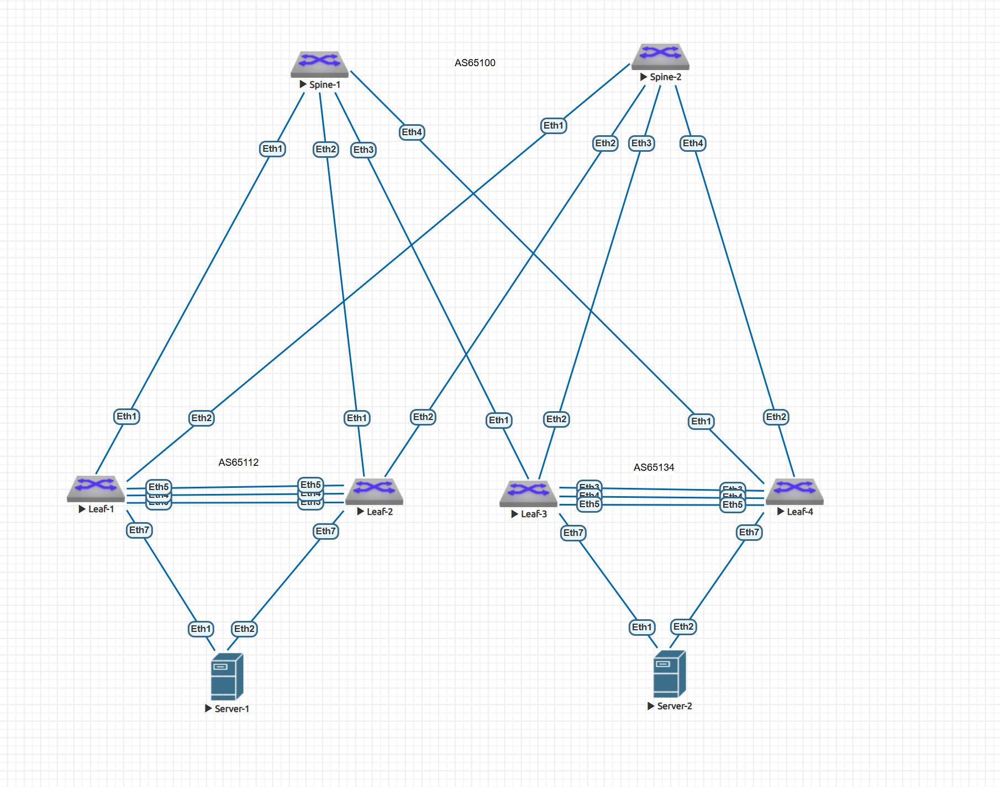

# Домашнее задание 6 Overlay. VXLAN. Multihoming

## Цель: Настроить отказоустойчивое подключение клиентов с использованием EVPN Multihoming.


**Описание/Пошаговая инструкция выполнения домашнего задания:**
В этой самостоятельной работе мы ожидаем, что вы самостоятельно:

1. Подключите клиентов 2-я линками к различным Leaf
2. Настроите агрегированный канал со стороны клиента.
3. Настроите multihoming для работы в Overlay сети. Если используете Cisco NXOS - vPC, если иной вендор - то ESI LAG (либо MC-LAG с поддержкой VXLAN)
4. Зафиксируете в документации - план работы, адресное пространство, схему сети, конфигурацию устройств
5. Опционально - протестировать отказоустойчивость - убедиться, что связнность не теряется при отключении одного из линков

# Выполнение Задания

Настраиваем на базе Underlay OSPF. Overlay - eBGP

## Новая схема сети

Добавился Leaf, 4х должно хватить.



### План распределения следующий

***Берем за основу приватную подсеть 10.0.0.0/8 и из нее берем подсети согласно следущей схеме распределения.***

**10.Dn.Sn.Cn/24**

***немного меняем план***

где:

Dn - зарезервированные дипазоны для Дата-центра, Sn - номер Spine , Сn - порядковый номер

Резервируем значения Dn

0 - loopback 1 - понадобится нам для Underlay, как router-id, маска /32, его же Используем для сессий в Overlay

1 - loopback 2 - Заранее зарезервируем диапазон для VxLan VTEP для MLAG(одинаковый для Leaf-pair, берем в последнем октете значение наименьшего Leaf от Loopback0 ) , маска /32

2 - interconnect - используем подход по /31, чтобы не брать на себя риски unnumbered подхода, ну и мне просто привычнее, так как все сессии у нас в Underlay будут p2p, для Примера: OSPF как для Underlay, мы избежим сходимости сети с распределением DR/BDR, все сессии у нас будут в состоняии Full

***3 - peerlink interconnect - для построение связности для пирлинков, третий и 4й октет возьмем по следующему принципу - 10.3.L.0-1 - для heartbeat, 10.3.L.2-3 - peer-to-peer OSPF, где L - номер Leaf-pair начиная с "0"***

4-7 - на данный момент просто зарезервируем, пока не понятно для чего тратить, либо сервисы либо mgmt, пока не трогаем

Sn - нумеруем по лучшим правилам, начиная с "0" (для loopback нумрацию spine не используем, там просто резервируем в Cn первые 16 адрсов на Spine, а с 32 по 64 на Leaf)

На портах, в виду того, что всх интерфейсы у нас L3-типа, берем единый влан, сразу зарезервируем парочку

**4090 - используем, берем для peer-link**

**903, 904 - клиентские - делим, совместим Symmetric IRB с пердыдущей лабораторной работы, пригодится потом для проверки L3** 

Итого - наш зарезрвированный диапозон для этого условного ЦОД будт 900-999


***Клиентскую подсеть берем следующую:***

172.16.N.0/24

Где N - номер клиентского домена, по заданию надо чтобы был не один, начинаем нумеровать, начиная с "0"


### Таблица распределения адресного пространства

|Device    |Port      |IPv4                               |VLAN|Link                             |Comment         |
|----------|----------|-----------------------------------|----|---------------------------------|----------------|
|Spine_1   |eth1      |  10.2.0.0/31                      | --  |Spine_1 eth1 – eth1 Leaf_1      |  Interconnect  |
|Spine_1   |eth2      |  10.2.0.2/31                      | --  |Spine_1 eth2 – eth1 Leaf_2      |  Interconnect  |
|Spine_1   |eth3      |  10.2.0.4/31                      | --  |Spine_1 eth3 – eth1 Leaf_3      |  Interconnect  |
|Spine_1   |eth4      |  10.2.0.6/31                      | --  |Spine_2 eth4 – eth1 Leaf_4      |  Interconnect  |
|Spine_1   |loopback0 |  10.0.0.0/32                      | --  | None                           |  Loopback      |
|Spine_2   |eth1      |  10.2.1.0/31                      | --  |Spine_2 eth1 – eth2 Leaf_1      |  Interconnect  |
|Spine_2   |eth2      |  10.2.1.2/31                      | --  |Spine_2 eth2 – eth2 Leaf_2      |  Interconnect  |
|Spine_2   |eth3      |  10.2.1.4/31                      | --  |Spine_2 eth3 – eth2 Leaf_3      |  Interconnect  |
|Spine_2   |eth4      |  10.2.1.6/31                      | --  |Spine_2 eth4 – eth2 Leaf_4      |  Interconnect  |
|Spine_2   |loopback0 |  10.0.0.1/32                      | --  | None                           |  Loopback      |
|----------|----------|-----------------------------------|----|---------------------------------|----------------|
|Leaf_1    |eth1      |  10.2.0.1/31                      | --  |Leaf_1 eth1 – eth1 Spine_1      |  Interconnect  |
|Leaf_1    |eth2      |  10.2.1.1/31                      | --  |Leaf_1 eth2 – eth1 Spine_2      |  Interconnect  |
|Leaf_1    |eth3      |  10.3.0.0/31                      | --  |Leaf_1 eth3 – eth3  Leaf_2      |  Keepalive     |
|Leaf_1    |eth4      |  None                             |4090 |Leaf_1 po10 – po10  Leaf_2      |  Peer-link     |
|Leaf_1    |eth5      |  None                             |4090 |Leaf_1 po10 – po10  Leaf_2      |  Peer-link     |
|Leaf_1    |vlanIf903 |  172.16.0.1/24                    |903  | Po20                           |  VRF-VRRP      |
|Leaf_1    |vlanIf903 |  172.16.0.2/24                    |903  | Po20                           |  VRF-IP Leaf   |
|Leaf_1    |vlanIf4090|  10.3.0.2/31                      |4090 | Leaf_1 po10 Leaf_2 po10        |  Peer-link     |
|Leaf_1    |eth7      |  None                             |903  |Leaf_1 po20  – po10 Client_1    |  Client        |
|Leaf_1    |loopback0 |  10.0.0.32/32                     | --  | None                           |  Loopback      |
|Leaf_1    |loopback1 |  10.1.0.32/32                     | --  | None                           |  Loopback      |
|Leaf_2    |eth1      |  10.2.0.3/31                      | --  |Leaf_2 eth1 – eth2 Spine_1      |  Interconnect  |
|Leaf_2    |eth2      |  10.2.1.3/31                      | --  |Leaf_2 eth2 – eth2 Spine_2      |  Interconnect  |
|Leaf_2    |eth3      |  10.3.0.1/31                      | --  |Leaf_2 eth3 – eth3  Leaf_1      |  Keepalive     |
|Leaf_2    |eth4      |  None                             |4090 |Leaf_2 po10 – po10  Leaf_1      |  Peer-link     |
|Leaf_2    |eth5      |  None                             |4090 |Leaf_2 po10 – po10  Leaf_1      |  Peer-link     |
|Leaf_2    |vlanIf903 |  172.16.0.1/24                    |903  | Po20                           |  VRF-VRRP      |
|Leaf_2    |vlanIf903 |  172.16.0.3/24                    |903  | Po20                           |  VRF-IP Leaf   |
|Leaf_2    |vlanIf4090|  10.3.0.3/31                      |4090 | Leaf_2 po10 Leaf_1 po10        |  Peer-link     |
|Leaf_2    |eth7      |  None                             |903  |Leaf_2 po20  – po10 Client_1    |  Client        |
|Leaf_2    |loopback0 |  10.0.0.33/32                     | --  | None                           |  Loopback      |
|Leaf_2    |loopback1 |  10.1.0.32/32                     | --  | None                           |  Loopback      |
|----------|----------|-----------------------------------|----|---------------------------------|----------------|
|Leaf_3    |eth1      |  10.2.0.5/31                      | --  |Leaf_1 eth1 – eth1 Spine_1      |  Interconnect  |
|Leaf_3    |eth2      |  10.2.1.5/31                      | --  |Leaf_1 eth2 – eth1 Spine_2      |  Interconnect  |
|Leaf_3    |eth3      |  10.3.1.0/31                      | --  |Leaf_1 eth3 – eth3  Leaf_2      |  Keepalive     |
|Leaf_3    |eth4      |  None                             |4090 |Leaf_1 po10 – po10  Leaf_2      |  Peer-link     |
|Leaf_3    |eth5      |  None                             |4090 |Leaf_1 po10 – po10  Leaf_2      |  Peer-link     |
|Leaf_3    |vlanIf903 |  172.16.1.1/24                    |904  | Po20                           |  VRF-VRRP      |
|Leaf_3    |vlanIf903 |  172.16.1.2/24                    |904  | Po20                           |  VRF-IP Leaf   |
|Leaf_3    |vlanIf4090|  10.3.1.2/31                      |4090 | Leaf_1 po10 Leaf_2 po10        |  Peer-link     |
|Leaf_3    |eth7      |  None                             |903  |Leaf_1 po20  – po10 Client_1    |  Client        |
|Leaf_3    |loopback0 |  10.0.0.34/32                     | --  | None                           |  Loopback      |
|Leaf_3    |loopback1 |  10.1.0.34/32                     | --  | None                           |  Loopback      |
|Leaf_4    |eth1      |  10.2.0.7/31                      | --  |Leaf_2 eth1 – eth2 Spine_1      |  Interconnect  |
|Leaf_4    |eth2      |  10.2.1.7/31                      | --  |Leaf_2 eth2 – eth2 Spine_2      |  Interconnect  |
|Leaf_4    |eth3      |  10.3.1.1/31                      | --  |Leaf_2 eth3 – eth3  Leaf_1      |  Keepalive     |
|Leaf_4    |eth4      |  None                             |4090 |Leaf_2 po10 – po10  Leaf_1      |  Peer-link     |
|Leaf_4    |eth5      |  None                             |4090 |Leaf_2 po10 – po10  Leaf_1      |  Peer-link     |
|Leaf_4    |vlanIf903 |  172.16.1.1/24                    |904  | Po20                           |  VRF-VRRP      |
|Leaf_4    |vlanIf903 |  172.16.1.3/24                    |904  | Po20                           |  VRF-IP Leaf   |
|Leaf_4    |vlanIf4090|  10.3.1.3/31                      |4090 | Leaf_2 po10 Leaf_1 po10        |  Peer-link     |
|Leaf_4    |eth7      |  None                             |903  |Leaf_2 po20  – po10 Client_1    |  Client        |
|Leaf_4    |loopback0 |  10.0.0.35/32                     | --  | None                           |  Loopback      |
|Leaf_4    |loopback1 |  10.1.0.34/32                     | --  | None                           |  Loopback      |
|----------|----------|-----------------------------------|----|---------------------------------|----------------|
|Client_1  |eth0     |  172.16.0.10/24                    |903  |Client_1 po10 – po20  Leaf_1_2  |  Client        |
|Client_2  |eth0     |  172.16.1.10/24                    |904  |Client_2 po10 – po20  Leaf_3_4  |  Client        |

## AS-Number

**eBGP**

Начинаем Распределять, в виду того, что сессии у нас должны быть уникальны. Spine's - берем по следующему плану

65XAA Где X - номер POD, делаем вид, что у нас будет не более 8 подов, так как "0" мы резервируем для Super-Spine, а 1-9 для Spine AA - уникальный номер, для Spine резервируем значение "00", для Leaf's берем порядковый номер Leaf-а, 

к примеру Leaf-1+Leaf-2 будет иметь номер 65112, а Spine-ы - 65100

## План последующей конфигурации


Вланы на L3 интерфейсах снова не используем, пишет что версия образа не поддерживает, но, в клиентов access-ом подаем уже вланы, нам же нужно проверить связность.

Шаги 1-8 пропускаем, делаем вид, что Underlay у нас рабочий, конфиг приложен.

1. Подключаемся к оборудованию.
2. Настраиваем hostname.
3. Так как у нас Arista - глобально включаем routing.
4. Конфигурируем интерфейсы согласно плана(eth, loopback).
5. Проверяем интерконнекты командой ping - убеждаемся в связности.
6. Настраиваем BFD, MLAG - проверяем его.
7. Включаем процесс OSPF глобально и конфигурируем его(Authorization, bfd, etc.)
8. Проеряем маршрутные таблицы, трассировки, связность лупбеков.
9. Поднимаем Vlan, подаем их в сторону клиентов
10. Настраиваем EVPN BGP, соседи, рассширенное комьюнити, авторизация.
11. Проверяем соседство, маршруты.
12. Инициализируем binding vlan to vxlan, предварительно создав интерфейс для инкапсуляции/деинкапсуляции
13. Создаем VRF для Symmetric IRB на всех Leaf-pair(с помощью VRRP)
14. Проверяем связность клиентских хостов, прикладываем везде где можно дампы трафика.

# Приступаем к выполнению

Обнулились, чистое оборудование, никто ничего не настраивал, пустое железо, просто прокатываем конфиг Underlay
Будем настраивать протоколы снизу вверх.

## Конфигурация MLAG на Leaf's

Поднимаем заранее на Client-1 и Client-2 LAG и IP

**Client-1**
```


```

**Client-2**
```


```

Проливаем конфиг на Leaf's и смотрим что там у нас творится.

Становимся на дамп трафика между Leaf 1 и 2 (в Линках Keepalive и Peer-link)

**Leaf-1**
```


```

**Leaf-2**
```


```
Видим обмен пакетами, установку соединения.

Keepalive


Peer-link


Смотрим состояние MLAG на Leaf 

**Leaf-1**


**Leaf-2**


Поднимем VRF с VRRP - чтобы проверить связность Client и Leaf-pair

**Leaf-1**
```


```

**Leaf-2**
```


```

И проверим связность.

PING


DUMP


### Повторяем для Leaf 3 и 4 и смотрим только итог

Состояние MLAG

**Leaf-3**


**Leaf-4**


И проверим связность.

PING


DUMP


Конфигурация [общим файлом](https://github.com/igorvoroshkevich-93/Network-course/blob/main/Lab07_Overlay_EVPN_MLAG/Peer-link_full_conf.md)

## Конфигурация VxLAN EVPN для L3 связанности

Underlay показывать не будем, лежит в отдельном файле [тут](https://github.com/igorvoroshkevich-93/Network-course/blob/main/Lab07_Overlay_EVPN_MLAG/Ospf_MLAG_full_conf.md)

Вот тут начинается самое интересное.

### Прольем сначала конфиг на Spine-1

```


```

### Включим захват трафика на интерфесах лифов в сторону этого Spine

Проливаем конфиг на Leaf's и смотрим что там у нас творится.

**Leaf-1**
```


```

**Leaf-2**
```


```

**Leaf-3**
```


```

Видим, как побежали пакеты, устанавливается соседство

**Leaf-1 to Spine-1**


**Leaf-2 to Spine-1**


**Leaf-3 to Spine-1**


**Leaf-4 to Spine-1**


Смотрим таблицу соседства и что у нас по роутам

**Leaf-1**


**Leaf-2**


**Leaf-3**


**Leaf-4**


**Spine-1**


***Cоседство установилось, но роутов нет, проливаем Spine-2***

**Spine-2**

```

```

Ну и смотрим как тут дела


***Создаем Vxlan, поднимаем VRF смотрим роуты и состедство***

Проливаем конфиг

**Leaf-1**
```


```

**Leaf-2**
```

```

**Leaf-3**
```


```

**Leaf-4**
```


```

Смотрим роуты и соседство

**Spine-1**

CLI


**Spine-2**

CLI


**Leaf-1**

Dump


CLI


**Leaf-2**

Dump


CLI


**Leaf-3**

Dump


CLI


**Leaf-4**

Dump


CLI


### Поднимаем конфигурацию на клиентах, проверяем связность.

Конфигурацию писать не вижу смысла, она будет в общем файле, просто пингуем и смотрим в дамп трафика

**Client-1 PING+DUMP**

*Ping*


*Dump*


**Client-2 PING+DUMP**

*Ping*


*Dump*


### Все работает, связность есть

#### Скрины соседства роутов, BFD, VxLan и MLAG(на Leaf)

**Spine-1**


**Spine-2**


**Leaf-1**


**Leaf-2**


**Leaf-3**


**Leaf-4**


Конфигурация [общим файлом](https://github.com/igorvoroshkevich-93/Network-course/blob/main/Lab07_Overlay_EVPN_MLAG/EVPN_MLAG_full_conf.md)
