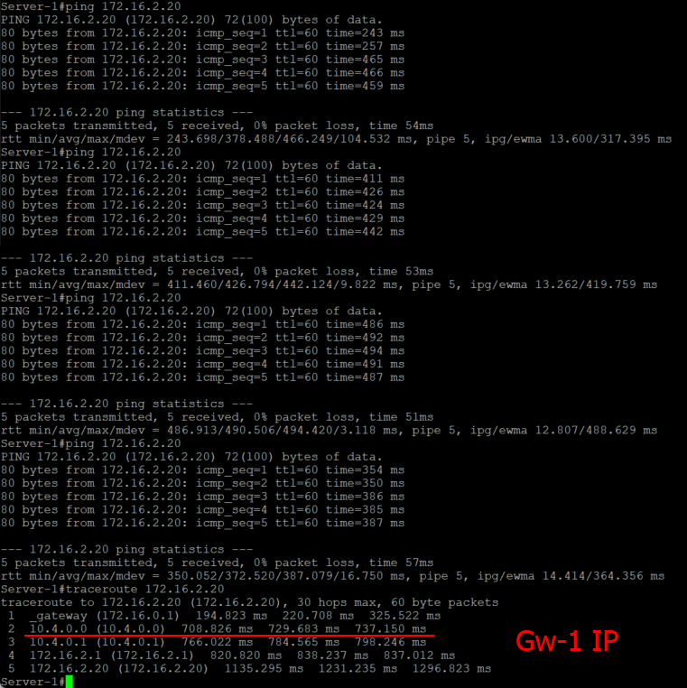

# Домашнее задание 8 Overlay. VxLAN. Routing.

## Цель: Реализовать передачу суммарных префиксов через EVPN route-type 5.


**Описание/Пошаговая инструкция выполнения домашнего задания:**
В этой самостоятельной работе мы ожидаем, что вы самостоятельно:

1. Разместите двух "клиентов" в разных VRF в рамках одной фабрики.
2. Настроите маршрутизацию между клиентами через внешнее устройство (граничный роутер\фаерволл\etc)
3. Зафиксируете в документации - план работы, адресное пространство, схему сети, настройки сетевого оборудования

# Выполнение Задания

Настраиваем на базе Underlay OSPF. Overlay - eBGP

## Новая схема сети

Берем все Leaf, что были в прошлой лабораторной, в этот раз включим Leaf-3 и Leaf-4, они у нас выступям border-leaf и выполнят роль centralized-gateway для VRF


### План распределения адресов следующий

***Берем за основу приватную подсеть 10.0.0.0/8 и из нее берем подсети согласно следущей схеме распределения.***

**10.Dn.Sn.Cn/24**

***немного меняем план***

где:

Dn - зарезервированные дипазоны для Дата-центра, Sn - номер Spine , Сn - порядковый номер

Резервируем значения Dn

0 - loopback 1 - понадобится нам для Underlay, как router-id, маска /32, его же Используем для сессий в Overlay

1 - loopback 2 - Заранее зарезервируем диапазон для VxLan VTEP для MLAG(одинаковый для Leaf-pair, берем в последнем октете значение наименьшего Leaf от Loopback0 ) , маска /32

2 - interconnect - используем подход по /31, чтобы не брать на себя риски unnumbered подхода, ну и мне просто привычнее, так как все сессии у нас в Underlay будут p2p, для Примера: OSPF как для Underlay, мы избежим сходимости сети с распределением DR/BDR, все сессии у нас будут в состоняии Full

***3 - peerlink interconnect - для построение связности для пирлинков, третий и 4й октет возьмем по следующему принципу - 10.3.L.0-1 - для heartbeat, 10.3.L.2-3 - peer-to-peer OSPF, где L - номер Leaf-pair начиная с "0"***

*** 4 - Interconnect to GW - для установки сессий с внешним шлюзом для маршрутизации

5-7 - на данный момент просто зарезервируем, пока не понятно для чего тратить, либо сервисы либо mgmt, пока не трогаем

Sn - нумеруем по лучшим правилам, начиная с "0" (для loopback нумрацию spine не используем, там просто резервируем в Cn первые 16 адрсов на Spine, а с 32 по 64 на Leaf)

На портах, в виду того, что всх интерфейсы у нас L3-типа, берем единый влан, сразу зарезервируем парочку

**4090 - используем, берем для peer-link**

**903, 905 - клиентские - делим, совместим Symmetric IRB с пердыдущей лабораторной работы, пригодится потом для проверки L3** 

Итого - наш зарезрвированный диапозон для этого условного ЦОД будт 900-999


***Клиентскую подсеть берем следующую:***

172.16.N.0/24

Где N - номер клиентского домена, по заданию надо чтобы был не один, начинаем нумеровать, начиная с "0"


### Таблица распределения адресного пространства

|Device    |Port      |IPv4                               |VLAN|Link                             |Comment         |
|----------|----------|-----------------------------------|----|---------------------------------|----------------|
|Spine_1   |eth1      |  10.2.0.0/31                      | --  |Spine_1 eth1 – eth1 Leaf_1      |  Interconnect  |
|Spine_1   |eth2      |  10.2.0.2/31                      | --  |Spine_1 eth2 – eth1 Leaf_2      |  Interconnect  |
|Spine_1   |eth3      |  10.2.0.4/31                      | --  |Spine_1 eth3 – eth1 Leaf_3      |  Interconnect  |
|Spine_1   |eth4      |  10.2.0.6/31                      | --  |Spine_2 eth4 – eth1 Leaf_4      |  Interconnect  |
|Spine_1   |loopback0 |  10.0.0.0/32                      | --  | None                           |  Loopback      |
|Spine_2   |eth1      |  10.2.1.0/31                      | --  |Spine_2 eth1 – eth2 Leaf_1      |  Interconnect  |
|Spine_2   |eth2      |  10.2.1.2/31                      | --  |Spine_2 eth2 – eth2 Leaf_2      |  Interconnect  |
|Spine_2   |eth3      |  10.2.1.4/31                      | --  |Spine_2 eth3 – eth2 Leaf_3      |  Interconnect  |
|Spine_2   |eth4      |  10.2.1.6/31                      | --  |Spine_2 eth4 – eth2 Leaf_4      |  Interconnect  |
|Spine_2   |loopback0 |  10.0.0.1/32                      | --  | None                           |  Loopback      |
|----------|----------|-----------------------------------|-----|--------------------------------|----------------|
|Leaf_1    |eth1      |  10.2.0.1/31                      | --  |Leaf_1 eth1 – eth1 Spine_1      |  Interconnect  |
|Leaf_1    |eth2      |  10.2.1.1/31                      | --  |Leaf_1 eth2 – eth1 Spine_2      |  Interconnect  |
|Leaf_1    |eth3      |  10.3.0.0/31                      | --  |Leaf_1 eth3 – eth3  Leaf_2      |  Keepalive     |
|Leaf_1    |eth4      |  None                             |4090 |Leaf_1 po10 – po10  Leaf_2      |  Peer-link     |
|Leaf_1    |eth5      |  None                             |4090 |Leaf_1 po10 – po10  Leaf_2      |  Peer-link     |
|Leaf_1    |vlanIf4090|  10.3.0.2/31                      |4090 | Leaf_1 po10 Leaf_2 po10        |  Peer-link     |
|Leaf_1    |eth7      |  None                             |903  |Leaf_1 po20  – po10 Client_1    |  Client        |
|Leaf_1    |loopback0 |  10.0.0.32/32                     | --  | None                           |  Loopback      |
|Leaf_1    |loopback1 |  10.1.0.32/32                     | --  | None                           |  Loopback      |
|Leaf_2    |eth1      |  10.2.0.3/31                      | --  |Leaf_2 eth1 – eth2 Spine_1      |  Interconnect  |
|Leaf_2    |eth2      |  10.2.1.3/31                      | --  |Leaf_2 eth2 – eth2 Spine_2      |  Interconnect  |
|Leaf_2    |eth3      |  10.3.0.1/31                      | --  |Leaf_2 eth3 – eth3  Leaf_1      |  Keepalive     |
|Leaf_2    |eth4      |  None                             |4090 |Leaf_2 po10 – po10  Leaf_1      |  Peer-link     |
|Leaf_2    |eth5      |  None                             |4090 |Leaf_2 po10 – po10  Leaf_1      |  Peer-link     |
|Leaf_2    |vlanIf4090|  10.3.0.3/31                      |4090 | Leaf_2 po10 Leaf_1 po10        |  Peer-link     |
|Leaf_2    |eth7      |  None                             |903  |Leaf_2 po20  – po10 Client_1    |  Client        |
|Leaf_2    |loopback0 |  10.0.0.33/32                     | --  | None                           |  Loopback      |
|Leaf_2    |loopback1 |  10.1.0.32/32                     | --  | None                           |  Loopback      |
|----------|----------|-----------------------------------|-----|--------------------------------|----------------|
|Leaf_3    |eth1      |  10.2.0.5/31                      | --  |Leaf_3 eth1 – eth1 Spine_1      |  Interconnect  |
|Leaf_3    |eth2      |  10.2.1.5/31                      | --  |Leaf_3 eth2 – eth1 Spine_2      |  Interconnect  |
|Leaf_3    |vlanIf903 |  172.16.0.1/24                    |903  | VRF                            |  VRF-VRRP      |
|Leaf_3    |vlanIf903 |  172.16.0.2/24                    |903  | VRF                            |  VRF-IP Leaf   |
|Leaf_3    |vlanIf905 |  172.16.2.1/24                    |905  | VRF                            |  VRF-VRRP      |
|Leaf_3    |vlanIf905 |  172.16.2.2/24                    |905  | VRF                            |  VRF-IP Leaf   |
|Leaf_3    |eth7      |  172.16.4.1/31                    | --  |Leaf_3 eth7  – eth1 Gateway-1   |  Client        |
|Leaf_3    |loopback0 |  10.0.0.34/32                     | --  | None                           |  Loopback      |
|Leaf_3    |loopback1 |  10.1.0.34/32                     | --  | None                           |  Loopback      |
|Leaf_4    |eth1      |  10.2.0.7/31                      | --  |Leaf_4 eth1 – eth1 Spine_1      |  Interconnect  |
|Leaf_4    |eth2      |  10.2.1.7/31                      | --  |Leaf_4 eth2 – eth1 Spine_2      |  Interconnect  |
|Leaf_4    |vlanIf903 |  172.16.0.1/24                    |903  | VRF                            |  VRF-VRRP      |
|Leaf_4    |vlanIf903 |  172.16.0.3/24                    |903  | VRF                            |  VRF-IP Leaf   |
|Leaf_4    |vlanIf905 |  172.16.2.1/24                    |905  | VRF                            |  VRF-VRRP      |
|Leaf_4    |vlanIf905 |  172.16.2.3/24                    |905  | VRF                            |  VRF-IP Leaf   |
|Leaf_4    |eth7      |  172.16.4.3/31                    | --  |Leaf_4 eth7  – eth2 Gateway-1   |  Client        |
|Leaf_4    |loopback0 |  10.0.0.35/32                     | --  | None                           |  Loopback      |
|Leaf_4    |loopback1 |  10.1.0.35/32                     | --  | None                           |  Loopback      |
|----------|----------|-----------------------------------|-----|--------------------------------|----------------|
|Leaf_5    |eth1      |  10.2.0.7/31                      | --  |Leaf_5 eth1 – eth1 Spine_1      |  Interconnect  |
|Leaf_5    |eth2      |  10.2.1.7/31                      | --  |Leaf_5 eth2 – eth1 Spine_2      |  Interconnect  |
|Leaf_5    |eth7      |  None                             |905  | Leaf_5 po20  – po10 Client_3   |  Client        |
|Leaf_5    |loopback0 |  10.0.0.36/32                     | --  | None                           |  Loopback      |
|Leaf_5    |loopback1 |  10.1.0.36/32                     | --  | None                           |  Loopback      |
|Leaf_6    |eth1      |  10.2.0.11/31                     | --  |Leaf_6 eth1 – eth1 Spine_1      |  Interconnect  |
|Leaf_6    |eth2      |  10.2.1.11/31                     | --  |Leaf_6 eth2 – eth1 Spine_2      |  Interconnect  |
|Leaf_6    |eth7      |  None                             |905  | Leaf_6 po20  – po10 Client_3   |  Client        |
|Leaf_6    |loopback0 |  10.0.0.37/32                     | --  | None                           |  Loopback      |
|Leaf_6    |loopback1 |  10.1.0.37/32                     | --  | None                           |  Loopback      |
|----------|----------|-----------------------------------|-----|--------------------------------|----------------|
|Client_1  |vlanIf903 |  172.16.0.10/24                   |903  |Client_1 po10 – po20  Leaf_1_2  |  Client        |
|Client_3  |vlanIf903 |  172.16.2.20/24                   |905  |Client_3 po10 – po20  Leaf_5_6  |  Client        |
|----------|----------|-----------------------------------|-----|--------------------------------|----------------|
|Gateway-1 |eth1      |  172.16.4.0/31                    | --  |Leaf_3 eth7  – eth1 Gateway-1   |  Interconnect  |
|Gateway-1 |eth2      |  172.16.4.2/31                    | --  |Leaf_4 eth7  – eth2 Gateway-1   |  Interconnect  |
|Gateway-1 |loopback0 |  8.8.8.8/32                       | --  | None                           |  Loopback      |
|Gateway-1 |loopback1 |  1.1.1.1/32                       | --  | None                           |  Loopback      |

## AS-Number

**eBGP**

Начинаем Распределять, в виду того, что сессии у нас должны быть уникальны. Spine's - берем по следующему плану

65XAA Где X - номер POD, делаем вид, что у нас будет не более 8 подов, так как "0" мы резервируем для Super-Spine, а 1-9 для Spine AA - уникальный номер, для Spine резервируем значение "00", для Leaf's берем порядковый номер Leaf-а, 

к примеру Leaf-1+Leaf-2 будет иметь номер 65112, а Spine-ы - 65100

## План последующей конфигурации


Вланы на L3 интерфейсах снова не используем, пишет что версия образа не поддерживает, но, в клиентов access-ом подаем уже вланы, нам же нужно проверить связность.

Шаги 1-Х пропускаем, делаем вид, что Underlay, как и Overlay у нас рабочий, конфиг приложен.
Но, изменения, в виде смещения терминации VRF и построение сессий с Gateway приложим.

1. Подключаемся к оборудованию.
2. Настраиваем hostname.
3. Так как у нас Arista - глобально включаем routing.
4. Конфигурируем интерфейсы согласно плана(eth, loopback).
5. Проверяем интерконнекты командой ping - убеждаемся в связности.
6. Настраиваем BFD, MLAG - проверяем его.
7. Включаем процесс OSPF глобально и конфигурируем его(Authorization, bfd, etc.)
8. Проеряем маршрутные таблицы, трассировки, связность лупбеков.
9. Настраиваем EVPN BGP, соседи, рассширенное комьюнити, авторизация.
10. Проверяем соседство, маршруты.
11. Инициализируем binding vlan to vxlan, предварительно создав интерфейс для инкапсуляции/деинкапсуляции
12. Создаем VRF для Centralizer-gateway на  Leaf-3-4(с помощью Virtual-address)
13. Строим сессию с Gateway, анонсируем маршруты клиентов в его сторону, от него вещаем нули. На нем в Loopback прибьем пару адресов и попингуем их.
14. Проверяем связность хостов между собой, внешний шлюз, прикладываем крины и дампы пингов. 

# Приступаем к выполнению

Обнулились, чистое оборудование, никто ничего не настраивал, пустое железо, просто прокатываем конфиг Underlay
Сразу же за этим поднимаем Overlay согласно таблице выше. пока без VRF, просто делаем связность.
*конфигурацию MLAG и ESI-LAG опустим, она есть [тут](https://github.com/igorvoroshkevich-93/Network-course/tree/main/Lab07_Overlay_EVPN_MLAG#readme)*

## Настраиваем VXLAN от Серверов к Borderleaf

**Leaf-1**
```
Leaf-1(config)#router bgp 65112
Leaf-1(config-router-bgp)#   !
Leaf-1(config-router-bgp)#   vlan 903
Leaf-1(config-macvrf-903)#      rd 10.1.0.32:10903
Leaf-1(config-macvrf-903)#      route-target both 65100:10903
Leaf-1(config-macvrf-903)#      redistribute learned
Leaf-1(config-macvrf-903)#!
Leaf-1(config-macvrf-903)#int vxlan1
Leaf-1(config-if-Vx1)#  vxlan source-int lo1
Leaf-1(config-if-Vx1)#  vxlan udp-port 4789
Leaf-1(config-if-Vx1)#  vxlan learn-restrict any
Leaf-1(config-if-Vx1)#  vxlan vlan 903 vni 10903
Leaf-1(config-if-Vx1)#!
Leaf-1(config-if-Vx1)#end

```

**Leaf-2**
```
Leaf-2(config)#router bgp 65112
Leaf-2(config-router-bgp)#   !
Leaf-2(config-router-bgp)#   vlan 903
Leaf-2(config-macvrf-903)#      rd 10.1.0.32:10903
Leaf-2(config-macvrf-903)#      route-target both 65100:10903
Leaf-2(config-macvrf-903)#      redistribute learned
Leaf-2(config-macvrf-903)#!
Leaf-2(config-macvrf-903)#int vxlan1
Leaf-2(config-if-Vx1)#  vxlan source-int lo1
Leaf-2(config-if-Vx1)#  vxlan udp-port 4789
Leaf-2(config-if-Vx1)#  vxlan learn-restrict any
Leaf-2(config-if-Vx1)#  vxlan vlan 903 vni 10903
Leaf-2(config-if-Vx1)#!
Leaf-2(config-if-Vx1)#end

```

**Leaf-5**
```
Leaf-5(config)#router bgp 65105
Leaf-5(config-router-bgp)#   !
Leaf-5(config-router-bgp)#   vlan 905
Leaf-5(config-macvrf-905)#      rd 10.1.0.36:10905
Leaf-5(config-macvrf-905)#      route-target both 65105:10905
Leaf-5(config-macvrf-905)#      redistribute learned
Leaf-5(config-macvrf-905)#!
Leaf-5(config-macvrf-905)#int vxlan1
Leaf-5(config-if-Vx1)#  vxlan source-int lo1
Leaf-5(config-if-Vx1)#  vxlan udp-port 4789
Leaf-5(config-if-Vx1)#  vxlan learn-restrict any
Leaf-5(config-if-Vx1)#  vxlan vlan 905 vni 10905
Leaf-5(config-if-Vx1)#!
Leaf-5(config-if-Vx1)#end

```

**Leaf-6**
```
Leaf-6(config)#router bgp 65106
Leaf-6(config-router-bgp)#   !
Leaf-6(config-router-bgp)#   vlan 905
Leaf-6(config-macvrf-905)#      rd 10.1.0.37:10905
Leaf-6(config-macvrf-905)#      route-target both 65105:10905
Leaf-6(config-macvrf-905)#      redistribute learned
Leaf-6(config-macvrf-905)#!
Leaf-6(config-macvrf-905)#int vxlan1
Leaf-6(config-if-Vx1)#  vxlan source-int lo1
Leaf-6(config-if-Vx1)#  vxlan udp-port 4789
Leaf-6(config-if-Vx1)#  vxlan learn-restrict any
Leaf-6(config-if-Vx1)#  vxlan vlan 905 vni 10905
Leaf-6(config-if-Vx1)#!
Leaf-6(config-if-Vx1)#end

```

## Терминимуем VXLAN/VRF на Borderleaf

**Leaf-3**
```
Leaf-3(config)#vlan 903
Leaf-3(config-vlan-903)#   name Otus_BLUE
Leaf-3(config-vlan-903)#!
Leaf-3(config-vlan-903)#vlan 905
Leaf-3(config-vlan-905)#   name Otus_RED
Leaf-3(config-vlan-905)#!
Leaf-3(config-vlan-905)#vrf instance Otus_BLUE
Leaf-3(config-vrf-Otus_BLUE)#!
Leaf-3(config-vrf-Otus_BLUE)#vrf instance Otus_RED
Leaf-3(config-vrf-Otus_RED)#!
Leaf-3(config-vrf-Otus_RED)#interface vlan903
Leaf-3(config-if-Vl903)#   vrf Otus_BLUE
Leaf-3(config-if-Vl903)#   ip address 172.16.0.2/24
Leaf-3(config-if-Vl903)#   ip address virtual 172.16.0.1
Leaf-3(config-if-Vl903)#!
Leaf-3(config-if-Vl903)#interface vlan905
Leaf-3(config-if-Vl905)#   vrf Otus_RED
Leaf-3(config-if-Vl905)#   ip address 172.16.2.2/24
Leaf-3(config-if-Vl905)#   ip virtual-router address 172.16.2.1
Leaf-3(config-if-Vl905)#!
Leaf-3(config-if-Vl905)#ip virtual-router mac-address c0:01:09:05:00:34
Leaf-3(config)#!
Leaf-3(config)#ip routing vrf Otus_BLUE
Leaf-3(config)#ip routing vrf Otus_RED
Leaf-3(config)#!
Leaf-3(config)#router bgp 65103
Leaf-3(config-router-bgp)#   !
Leaf-3(config-router-bgp)#   vlan 903
Leaf-3(config-macvrf-903)#      rd 10.1.0.34:10903
Leaf-3(config-macvrf-903)#      route-target both 65100:10903
Leaf-3(config-macvrf-903)#      redistribute learned
Leaf-3(config-macvrf-903)#   vlan 905
Leaf-3(config-macvrf-905)#      rd 10.1.0.34:10905
Leaf-3(config-macvrf-905)#      route-target both 65100:10905
Leaf-3(config-macvrf-905)#      redistribute learned
Leaf-3(config-macvrf-905)#   vrf Otus_BLUE
Leaf-3(config-router-bgp-vrf-Otus_BLUE)#      rd 10.1.0.34:15001
Leaf-3(config-router-bgp-vrf-Otus_BLUE)#      route-target import evpn 65100:15001
Leaf-3(config-router-bgp-vrf-Otus_BLUE)#      route-target export evpn 65100:151
Leaf-3(config-router-bgp-vrf-Otus_BLUE)#      redistribute connected
Leaf-3(config-router-bgp-vrf-Otus_BLUE)#   vrf Otus_RED
Leaf-3(config-router-bgp-vrf-Otus_RED)#      rd 10.1.0.34:15002
Leaf-3(config-router-bgp-vrf-Otus_RED)#      route-target import evpn 65100:15002
Leaf-3(config-router-bgp-vrf-Otus_RED)#      route-target export evpn 65100:15002
Leaf-3(config-router-bgp-vrf-Otus_RED)#      redistribute connected
Leaf-3(config-router-bgp-vrf-Otus_RED)#
Leaf-3(config-router-bgp-vrf-Otus_RED)#!
Leaf-3(config-router-bgp-vrf-Otus_RED)#int vxlan1
Leaf-3(config-if-Vx1)#  vxlan source-int lo1
Leaf-3(config-if-Vx1)#  vxlan udp-port 4789
Leaf-3(config-if-Vx1)#  vxlan learn-restrict any
Leaf-3(config-if-Vx1)#  vxlan vlan 903 vni 10903
Leaf-3(config-if-Vx1)#  vxlan vlan 905 vni 10905
Leaf-3(config-if-Vx1)#  vxlan vrf Otus_BLUE vni 15001
Leaf-3(config-if-Vx1)#  vxlan vrf Otus_RED vni 15002
Leaf-3(config-if-Vx1)#!
Leaf-3(config-if-Vx1)#end

```

**Leaf-4**
```
Leaf-4(config)#vlan 903
Leaf-4(config-vlan-903)#   name Otus_BLUE
Leaf-4(config-vlan-903)#!
Leaf-4(config-vlan-903)#vlan 905
Leaf-4(config-vlan-905)#   name Otus_RED
Leaf-4(config-vlan-905)#!
Leaf-4(config-vlan-905)#vrf instance Otus_BLUE
Leaf-4(config-vrf-Otus_BLUE)#!
Leaf-4(config-vrf-Otus_BLUE)#vrf instance Otus_RED
Leaf-4(config-vrf-Otus_RED)#!
Leaf-4(config-vrf-Otus_RED)#interface vlan903
Leaf-4(config-if-Vl903)#   vrf Otus_BLUE
Leaf-4(config-if-Vl903)#   ip address 172.16.0.3/24
Leaf-4(config-if-Vl903)#   ip address virtual 172.16.0.1
Leaf-4(config-if-Vl903)#!
Leaf-4(config-if-Vl903)#interface vlan905
Leaf-4(config-if-Vl905)#   vrf Otus_RED
Leaf-4(config-if-Vl905)#   ip address 172.16.2.3/24
Leaf-4(config-if-Vl905)#   ip virtual-router address 172.16.2.1
Leaf-4(config-if-Vl905)#!
Leaf-4(config-if-Vl905)#ip virtual-router mac-address c0:01:09:05:00:34
Leaf-4(config)#!
Leaf-4(config)#ip routing vrf Otus_BLUE
Leaf-4(config)#ip routing vrf Otus_RED
Leaf-4(config)#!
Leaf-4(config)#router bgp 65104
Leaf-4(config-router-bgp)#   !
Leaf-4(config-router-bgp)#   vlan 903
Leaf-4(config-macvrf-903)#      rd 10.1.0.34:10903
Leaf-4(config-macvrf-903)#      route-target both 65100:10903
Leaf-4(config-macvrf-903)#      redistribute learned
Leaf-4(config-macvrf-903)#   vlan 905
Leaf-4(config-macvrf-905)#      rd 10.1.0.34:10905
Leaf-4(config-macvrf-905)#      route-target both 65100:10905
Leaf-4(config-macvrf-905)#      redistribute learned
Leaf-4(config-macvrf-905)#   vrf Otus_BLUE
Leaf-4(config-router-bgp-vrf-Otus_BLUE)#      rd 10.1.0.34:15001
Leaf-4(config-router-bgp-vrf-Otus_BLUE)#      route-target import evpn 65100:15001
Leaf-4(config-router-bgp-vrf-Otus_BLUE)#      route-target export evpn 65100:15001
Leaf-4(config-router-bgp-vrf-Otus_BLUE)#      redistribute connected
Leaf-4(config-router-bgp-vrf-Otus_BLUE)#   vrf Otus_RED
Leaf-4(config-router-bgp-vrf-Otus_RED)#      rd 10.1.0.34:15002
Leaf-4(config-router-bgp-vrf-Otus_RED)#      route-target import evpn 65100:15002
Leaf-4(config-router-bgp-vrf-Otus_RED)#      route-target export evpn 65100:15002
Leaf-4(config-router-bgp-vrf-Otus_RED)#      redistribute connected
Leaf-4(config-router-bgp-vrf-Otus_RED)#!
Leaf-4(config-router-bgp-vrf-Otus_RED)#int vxlan1
Leaf-4(config-if-Vx1)#  vxlan source-int lo1
Leaf-4(config-if-Vx1)#  vxlan udp-port 4789
Leaf-4(config-if-Vx1)#  vxlan learn-restrict any
Leaf-4(config-if-Vx1)#  vxlan vlan 903 vni 10903
Leaf-4(config-if-Vx1)#  vxlan vlan 905 vni 10905
Leaf-4(config-if-Vx1)#  vxlan vrf Otus_BLUE vni 15001
Leaf-4(config-if-Vx1)#  vxlan vrf Otus_RED vni 15002
Leaf-4(config-if-Vx1)#!
Leaf-4(config-if-Vx1)#end

```

## Проверяем тоннели Vxlan и пинг от серверов к VRF

### Состояние VxLan

**Leaf-1**


**Leaf-2**


**Leaf-3**


**Leaf-4**


**Leaf-5**


**Leaf-6**


### Связность

Дампить будем на Leaf-3 и Leaf-4 - Интерфейсах в сторону спайнов

**Client-1 PING+DUMP**

*Ping*


*Dump*


**Client-3 PING+DUMP**

*Ping*


*Dump*


## Строим сессию между Borderleaf's и Gateway, анонсируем маршруты.

При трасляции маршрутов пойдем следующим путем

1. Создадим еще 1 VRF для Gateway на Leaf-3 и Leaf-4
2. С помощью RT обменяемся метками между новым VRF и ранее созданными
3. Построим сессию с Gateway от нового VRF, чтобы передать маршруты.

Таким образом мы добьемся варианта VRF-Lite причем подход вида
HUB-Spoke где HUB - новый VRF, а предыдущие - Spoke

И весь наш подход, как описано ранее - вариант **Centralized gateway**
вариант более масштабируемый, можно распределять VxLan домен на сколько угодно Leaf с единой точкой терминации, но в будущем, можно распределять подсети, терминируя их на обычных leaf и через общий VRF так же их передавать выше через обмен метками, прописывать статикроуты и тд. в одной точке.

**Leaf-3**
```
```

**Leaf-4**
```
```
**Leaf-3**
```
```

**Gateway-1**
```
```

Смотрим в сессии и состояния соседства

**Leaf-3**


**Leaf-4**


**Gateway-1**


## Проверяем связность и смотрим в дампы

###  К "внешним" адресам на Gateway

Прибьем Loopback адреса согласно таблицы выше.

**Client-1 PING+DUMP**

*Ping*


*Dump*


**Client-3 PING+DUMP**

*Ping*


*Dump*


###  Между собой

**Client-1 PING+DUMP**

*Ping*



*Dump*


**Client-3 PING+DUMP**

*Ping*


*Dump*


## Смотрим в таблицы маршрутизации на Borderleaf's и Gateway

*а так же в Vxlan и все-все-все*

**Leaf-3**


**Leaf-4**


**Gateway-1**


## Конфигурационные файлы

Конфигурация [ESI-LAG](https://github.com/igorvoroshkevich-93/Network-course/blob/main/Lab08_Overlay_EVPN_Routing/ESI_LAG_R_full_conf.md)

Конфигурация [MLAG](https://github.com/igorvoroshkevich-93/Network-course/blob/main/Lab08_Overlay_EVPN_Routing/Peer-link_MLAG_R_full_conf.md)

Конфигурация [OSPF](https://github.com/igorvoroshkevich-93/Network-course/blob/main/Lab08_Overlay_EVPN_Routing/OSPF_R_full_conf.md)

Конфигурация [EVPN+VxLan](https://github.com/igorvoroshkevich-93/Network-course/blob/main/Lab08_Overlay_EVPN_Routing/EVPN_R_full_conf.md)

Конфигурация [Routing](https://github.com/igorvoroshkevich-93/Network-course/blob/main/Lab08_Overlay_EVPN_Routing/Routing_full_conf.md)

