# Переход от классической трехзвенной архитектуры к полноценной VxLan-фабрике с multisite


## Суть в чем, есть небольшой цод, работает на классической трехзвенчатой архитектуре, но

1) Появился запрос на горизонтальный трафик, заезжает клиент, со своей архитекрутрой, причем не один, ему нужно распределить его инфраструктуру в ЦОД(l2, l3, anycast gateway)

2) Он хочет, как и другие клиенты, георезервирование - получаем multisite

3) Выход на нескольких провайдеров - все нужно, пограничные анонсы, ытобы резервировать аплинки, анонс его сетей

4) Логичный запрос - резервирование серверов (MLAG, ESI-LAG)

## Цели

1) Использовать по максимуму все технологии освоенные в курсе

2) Закрепить на практике и в плане проектирования АБСОЛЮТНО все полученные знания

План такой

1) Смотрим что у нас сейчас, как реализована сеть, какое распределение VLAN, IP, peers

2) Простраиваем поверх текущего решения новое с фабрикой на multisite

3) Планируем работы, осуществляем переход от старого железного, к новому и современному, естественно с заделом на легкое масштабирование и увеличение количества и размеров наших ЦОД

# Выполнение проектной работы

Наметим точки, которые нам требуются

1) Где мы сейчас

2) Куда мы стремимся

3) Как мы к этому придем

## Где мы сейчас ?

Схема текущей сети

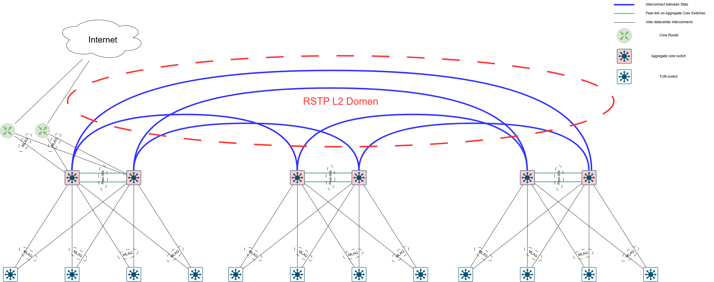

Имеем классическую архитектуру, в трафиком N-S. Терминацией вланов mlag от уровня агрегации доступа и SVI на каждую подсеть. Между Site у нас голый L2 Vlan, с STP в кольцо, что не совсем хорошо, одно плечо простаивает, резервирование есть, но пути прохождения трафика неоптимальные, быстрый переход сложен, нам будет мешать STP

Собираем эту схему, в базовом виде

Конфигурации тут ***

## Куда мы стремимся ?

Видим следующие проблемы:

1) Остутствует корректная возможность изоляции L2 - у нас влан растянутый между site - потенциальные проблемы с STP
2) Все замыкается на GW - у нас весь трафик так или иначе заворачивается на корневой роутер, крутится там и передается дальше, по хорошему, нам нужно дать возможность трафику ходить горизонтально, только при необходимости - между SITE
3) L3-трафик имеет такую зе проблему, все оседает на GW - туда он должен выходить только при ситуации - когда надо передать трафик в условный интернет.

Схема новой сети сети

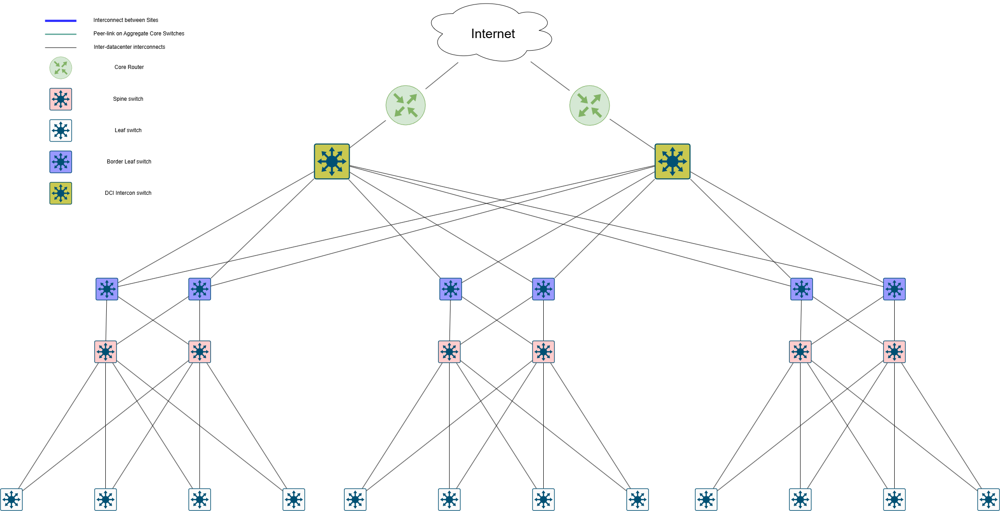

## План перехода

1) Строим новую сеть поверх старой, благо оборудование имеет и портовую емкость для создания Underlay/Overlay
2) Проверяем связность горизонтального трафика, вертикального, L2 и L3 между Site
3) Открепляем вланы от старой системы, прикрепляем их на работу новой фабрики
4) проверяем работоспособность

## Осуществляем переход


1) Простраиваем связность каждого из SITE - проверяем связность внутри каждого из DC

2) Связываем SITE - смотрим связность между ними, как по L2 так и по L3

3) Осуществляем переход

Конфигурационные файлы

**Таблица IP**

<details> 

<summary>Читать</summary>

|Device    |Port      |IPv4                               |VLAN|Link                             |Comment         |
|----------|----------|-----------------------------------|----|---------------------------------|----------------|
|Spine_1_1   |eth1      |  10.2.0.0/31                      | --  |Spine_1 eth1 – eth1 Leaf_1      |  Interconnect  |
|Spine_1_1   |eth2      |  10.2.0.2/31                      | --  |Spine_1 eth2 – eth1 Leaf_2      |  Interconnect  |
|Spine_1_1   |eth3      |  10.2.0.4/31                      | --  |Spine_1 eth3 – eth1 Leaf_3      |  Interconnect  |
|Spine_1_1   |eth4      |  10.2.0.6/31                      | --  |Spine_2 eth4 – eth1 Leaf_4      |  Interconnect  |
|Spine_1_1   |loopback0 |  10.0.0.0/32                      | --  | None                           |  Loopback      |
|Spine_2_1   |eth1      |  10.2.1.0/31                      | --  |Spine_2 eth1 – eth2 Leaf_1      |  Interconnect  |
|Spine_2_1   |eth2      |  10.2.1.2/31                      | --  |Spine_2 eth2 – eth2 Leaf_2      |  Interconnect  |
|Spine_2_1   |eth3      |  10.2.1.4/31                      | --  |Spine_2 eth3 – eth2 Leaf_3      |  Interconnect  |
|Spine_2_1   |eth4      |  10.2.1.6/31                      | --  |Spine_2 eth4 – eth2 Leaf_4      |  Interconnect  |
|Spine_2_1   |loopback0 |  10.0.0.1/32                      | --  | None                           |  Loopback      |
|----------|----------|-----------------------------------|-----|--------------------------------|----------------|
|Leaf_1_1    |eth1      |  10.2.0.1/31                      | --  |Leaf_1 eth1 – eth1 Spine_1      |  Interconnect  |
|Leaf_1_1    |eth2      |  10.2.1.1/31                      | --  |Leaf_1 eth2 – eth1 Spine_2      |  Interconnect  |
|Leaf_1_1    |eth3      |  10.100.0.1/31                      | --  |Leaf_1 eth5 – eth1 DCI      |  Interconnect  |
|Leaf_1_1    |vlanIf1000 |  192.168.100.1/24                    | --  | Virtual-IP                     |  VRF          |
|Leaf_1_1    |loopback0 |  10.0.0.32/32                     | --  | None                           |  Loopback      |
|Leaf_1_1    |loopback1 |  10.1.0.32/32                     | --  | Shared with Leaf_2             |  Loopback      |
|----------|----------|-----------------------------------|-----|--------------------------------|----------------|
|Leaf_2_1    |eth1      |  10.2.0.3/31                      | --  |Leaf_2 eth1 – eth2 Spine_1      |  Interconnect  |
|Leaf_2_1    |eth3      |  10.2.1.3/31                      | --  |Leaf_2 eth2 – eth2 Spine_2      |  Interconnect  |
|Leaf_2_1    |eth5      |  10.3.0.0/31                      | --  |Leaf_2 eth5 – eth5  Leaf_3      |  Keepalive     |
|Leaf_2_1    |eth6      |  None                             |4090 |Leaf_2 po10 – po10  Leaf_1      |  Peer-link     |
|Leaf_2_1    |eth7      |  None                             |4090 |Leaf_2 po10 – po10  Leaf_1      |  Peer-link     |
|Leaf_2_1    |vlanIf4091|  10.3.0.2/31                      |4090 | Leaf_2 po11 Leaf_3 po11        |  Peer-link     |
|Leaf_2_1    |eth8      |  None                             |903  |Leaf_2 po22  – po10 Client_1    |  Client        |
|Leaf_2_1    |loopback0 |  10.0.0.33/32                     | --  | None                           |  Loopback      |
|Leaf_2_1    |loopback1 |  10.1.0.34/32                     | --  | Shared with Leaf_3             |  Loopback      |
|----------|----------|-----------------------------------|-----|--------------------------------|----------------|
|Leaf_3_1    |eth1      |  10.2.0.5/31                      | --  |Leaf_3 eth1 – eth3 Spine_1      |  Interconnect  |
|Leaf_3_1    |eth3      |  10.2.1.5/31                      | --  |Leaf_3 eth3 – eth3 Spine_2      |  Interconnect  |
|Leaf_3_1    |eth5      |  10.3.0.1/31                      | --  |Leaf_2 eth5 – eth5  Leaf_3      |  Keepalive     |
|Leaf_3_1    |eth6      |  None                             |4090 |Leaf_2 po11 – po11  Leaf_3      |  Peer-link     |
|Leaf_3_1    |eth7      |  None                             |4090 |Leaf_2 po11 – po11  Leaf_3      |  Peer-link     |
|Leaf_3_1    |vlanIf4091|  10.3.0.3/31                      |4090 | Leaf_2 po11 Leaf_1 po11        |  Peer-link     |
|Leaf_3_1    |eth8      |  None                             | --  |Leaf_3 po22  – po10 Client_1    |  Client        |
|Leaf_3_1    |loopback0 |  10.0.0.34/32                     | --  | None                           |  Loopback      |
|Leaf_3_1    |loopback1 |  10.1.0.34/32                     | --  | Shared with Leaf_2             |  Loopback      |
|----------|----------|-----------------------------------|-----|--------------------------------|----------------|
|Spine_1_2   |eth1      |  10.12.0.0/31                      | --  |Spine_2 eth1 – eth1 Leaf_2      |  Interconnect  |
|Spine_1_2   |eth2      |  10.12.0.2/31                      | --  |Spine_2 eth2 – eth1 Leaf_2      |  Interconnect  |
|Spine_1_2   |eth3      |  10.12.0.4/31                      | --  |Spine_2 eth3 – eth1 Leaf_3      |  Interconnect  |
|Spine_1_2   |loopback0 |  10.10.0.0/32                      | --  | None                           |  Loopback      |
|----------|----------|-----------------------------------|-----|--------------------------------|----------------|
|Leaf_1_2    |eth1      |  10.12.0.1/31                      | --  |Leaf_1 eth1 – eth1 Spine_1      |  Interconnect  |
|Leaf_1_2    |eth1      |  10.100.0.3/31                      | --  |Leaf_1 eth3 – eth2 DCI      |  Interconnect  |
|Leaf_1_2    |vlanIf1001 |  192.168.101.1/24                    | --  | Virtual-IP                     |  VRF          |
|Leaf_1_2    |loopback0 |  10.10.0.32/32                     | --  | None                           |  Loopback      |
|Leaf_1_2    |loopback1 |  10.11.0.32/32                     | --  | Shared with Leaf_2             |  Loopback      |
|----------|----------|-----------------------------------|-----|--------------------------------|----------------|
|Leaf_2_2    |eth1      |  10.12.0.3/31                      | --  |Leaf_2 eth1 – eth2 Spine_1      |  Interconnect  |
|Leaf_2_2    |eth3      |  None                             | --  |Leaf_2 po20  – po10 Client_2    |  Client        |
|Leaf_2_2    |loopback0 |  10.10.0.33/32                     | --  | None                           |  Loopback      |
|Leaf_2_2    |loopback1 |  10.11.0.34/32                     | --  | Shared with Leaf_3             |  Loopback      |
|----------|----------|-----------------------------------|-----|--------------------------------|----------------|
|Leaf_3_2    |eth1      |  10.12.0.5/31                      | --  |Leaf_3 eth1 – eth1 Spine_1      |  Interconnect  |
|Leaf_3_2    |vlanIf903 |  172.16.0.1/24                    |903  | Virtual-IP                     |  VARP          |
|Leaf_3_2    |eth3      |  None                             | --  |Leaf_3 po20  – po10 Client_2    |  Client        |
|Leaf_3_2    |loopback0 |  10.10.0.34/32                     | --  | None                           |  Loopback      |
|Leaf_3_2    |loopback1 |  10.11.0.34/32                     | --  | Shared with Leaf_4             |  Loopback      |
|----------|----------|-----------------------------------|-----|--------------------------------|----------------|
|Spine_1_3   |eth1      |  10.22.0.0/31                      | --  |Spine_3 eth1 – eth1 Leaf_3      |  Interconnect  |
|Spine_1_3   |eth2      |  10.22.0.2/31                      | --  |Spine_3 eth2 – eth1 Leaf_3      |  Interconnect  |
|Spine_1_3   |eth3      |  10.22.0.4/31                      | --  |Spine_3 eth3 – eth1 Leaf_3      |  Interconnect  |
|Spine_1_3   |loopback0 |  10.20.0.0/32                      | --  | None                           |  Loopback      |
|----------|----------|-----------------------------------|-----|--------------------------------|----------------|
|Leaf_1_3    |eth1      |  10.22.0.1/31                      | --  |Leaf_1 eth1 – eth1 Spine_1      |  Interconnect  |
|Leaf_1_3    |eth3      |  10.100.0.5/31                      | --  |Leaf_1 eth3 – eth3 DCI      |  Interconnect  |
|Leaf_1_3    |vlanIf1002 |  192.168.102.1/24                    | --  | Virtual-IP                     |  VRF          |
|Leaf_1_3    |vlanIf1003 |  192.168.103.1/24                    | --  | Virtual-IP                     |  VRF          |
|Leaf_1_3    |loopback0 |  10.20.0.32/32                     | --  | None                           |  Loopback      |
|Leaf_1_3    |loopback1 |  10.21.0.32/32                     | --  | Shared with Leaf_3             |  Loopback      |
|----------|----------|-----------------------------------|-----|--------------------------------|----------------|
|Leaf_2_3    |eth1      |  10.22.0.3/31                      | --  |Leaf_2 eth1 – eth2 Spine_1      |  Interconnect  |
|Leaf_2_3    |eth3      |  None                             | --  |Leaf_2 eth3  – eth1 Client_3    |  Client        |
|Leaf_2_3    |loopback0 |  10.20.0.33/32                     | --  | None                           |  Loopback      |
|Leaf_2_3    |loopback1 |  10.21.0.33/32                     | --  | --             |  Loopback      |
|----------|----------|-----------------------------------|-----|--------------------------------|----------------|
|Leaf_3_3    |eth1      |  10.22.0.5/31                      | --  |Leaf_3 eth1 – eth3 Spine_1      |  Interconnect  |
|Leaf_2_3    |eth3      |  None                             | --  |Leaf_3 eth3  – eth1 Client_3    |  Client        |
|Leaf_3_3    |loopback0 |  10.20.0.34/32                     | --  | None                           |  Loopback      |
|Leaf_3_3    |loopback1 |  10.21.0.34/32                     | --  | Shared with Leaf_4             |  Loopback      |
|----------|----------|-----------------------------------|-----|--------------------------------|----------------|
|Client_1  |vlanIf1000 |  192.168.100.2/24                   |1000  |Client_1 po10 – po22  Leaf_2_3  |  Client        |
|Client_1  |vlanIf2000 |  192.168.200.1/24                   |2000  |Client_1 po10 – po22  Leaf_2_3  |  Client        |
|Client_2  |vlanIf1001 |  192.168.101.2/24                   |1001  |Client_1 po10 – po20  Leaf_2_3  |  Client        |
|Client_2  |vlanIf2000 |  192.168.200.2/24                   |2000  |Client_1 po10 – po20  Leaf_2_3  |  Client        |
|Client_3  |vlanIf1002 |  192.168.102.2/24                   |1002  |Client_3 eth1 – eth3  Leaf_2  |  Client        |
|Client_3  |vlanIf2000 |  192.168.200.3/24                   |2000  |Client_3 eth1 – eth3  Leaf_2  |  Client        |
|Client_4  |vlanIf1003 |  192.168.103.2/24                   |1004  |Client_4 eth1 – eth3  Leaf_3  |  Client        |
|Client_4  |vlanIf2000 |  192.168.200.4/24                   |2000  |Client_4 eth1 – eth3  Leaf_3  |  Client        |
|----------|----------|-----------------------------------|-----|--------------------------------|----------------|
|DCI-1     |eth1      |  10.100.0.0/31                    | --  |Leaf_1_1 eth5 – eth1 DCI      |  Interconnect  |
|DCI-1     |eth2      |  10.100.0.2/31                    | --  |Leaf_1_2 eth3 – eth2 DCI      |  Interconnect  |
|DCI-1     |eth3      |  10.100.0.4/31                    | --  |Leaf_1_3 eth3 – eth3 DCI      |  Interconnect  |
|DCI-1     |loopback0 |  10.101.0.99/32                       | --  | None                           |  Loopback      |

</details> 


## Выполнение работ

В отличие от схем выше, мы будем использовать только 1 Spine на Site-2 и Site-3 так же, сократим количество лифов до 3х, и будем использовать только 1 DCI-свич

Интернет покажем в самом конце, от DCI свича - просто сделаем VRF, который будет его имитировать, чтобы не создавать еще одно устройство.


Схема сети тестового стенда, для наглядности, что происходит вообще, на ней показаны как старые интерконекты так и новые, старые подпишем.
Для старой выложим только итог, что она заработала, конфиги будут поделены на две части - до и после, до будут иметь подпись OLD, новые будут иметь подпись NEW.

Схема стенда

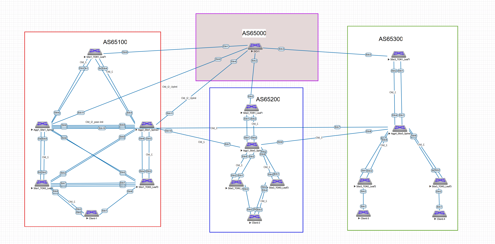

### Тут будет вся информация по старой сети, IP-планы, связность, состояние STP

Старая схема - красным выделенны участки старой сети, синим выделен основной домен STP

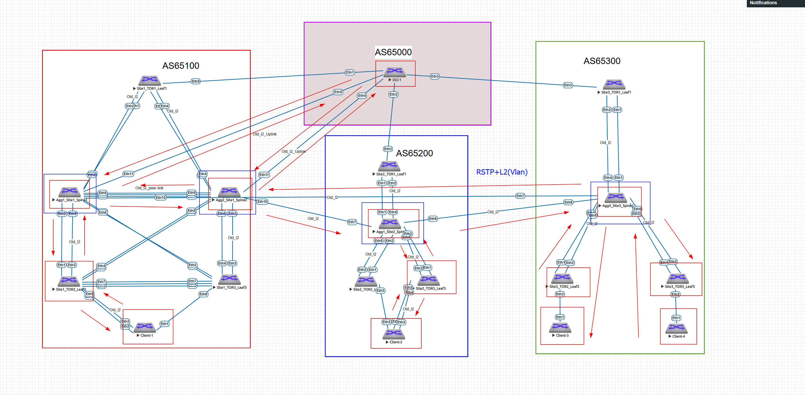

Старая сеть ЦОД ни что иное, как обычная 3х-звенчатая архитектура, с преимущественно NS трафиком. В основном кольце между Site у нас протокол RSTP, до клиентских серверов доведение L2(простой vlan в trunk) 
Центральный шлюз у нас выполняет и роль внутренней маршрутизации, так и стыков с внешними провайдерами, все клиенты получают унимкальный влан.

Минусы данной схемы, которые мы хотим победить:
1) Долгая настройка доведения - каждый валн приходится тянуть через всю сеть, по дороге вполне можно забыть его протянуть в одном месте и долго искать, где он не обьявлен. 
2) Вытекает их пункта 1 - при георезеривровании - новое кольцо в STP(если у нас вендор, отличный от Cisco с его PerVlanSTP, при проблемах в общем кольце - падает все, нужно распределять на регионы в MSTP)
3) Неоптимальный путь прохождения трафика, даже если мы настроим cost в STP - все равно у нас один линк будет часто простаивать, нужен тонкий тюнинг протокола единого дерева, для полной утилизации всех линков

Чего мы хотим добиться:

1) оптимизации прохождения трафика
2) отказ от STP
3) Более простая конфигурация распределенных l2 и l3 сервисов, чтобы выработать типовое решение схем доведений и связности, легкость и избыточность конфигурации с последющим заделом для автоматизации
4) легкость масштабирования, как внутри Site, так и между, в текущем виде придется тянуть гору вланов при каждом новом железе и молиться на корректную работу STP

Все конфигурации текущих узлов будут [тут](https://github.com/igorvoroshkevich-93/Network-course/tree/main/Project_Final_Otus/cfg/old)

покажем работоспособность текущего состояния нашего геораспределенного ЦОД

#### Проверка связности

<details> 

<summary>Читать</summary>

**Client-1 Ping**

До шлюза и соседей в других Site

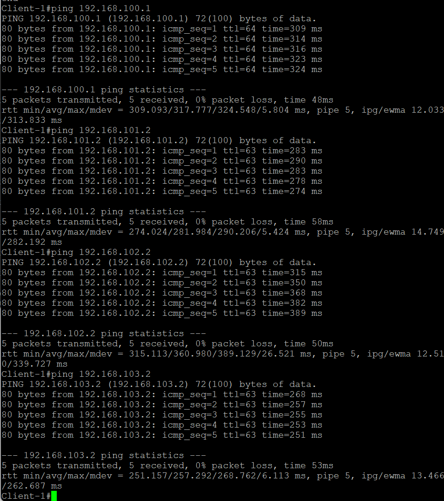

**Client-2 Ping**

До шлюза и соседей в других Site

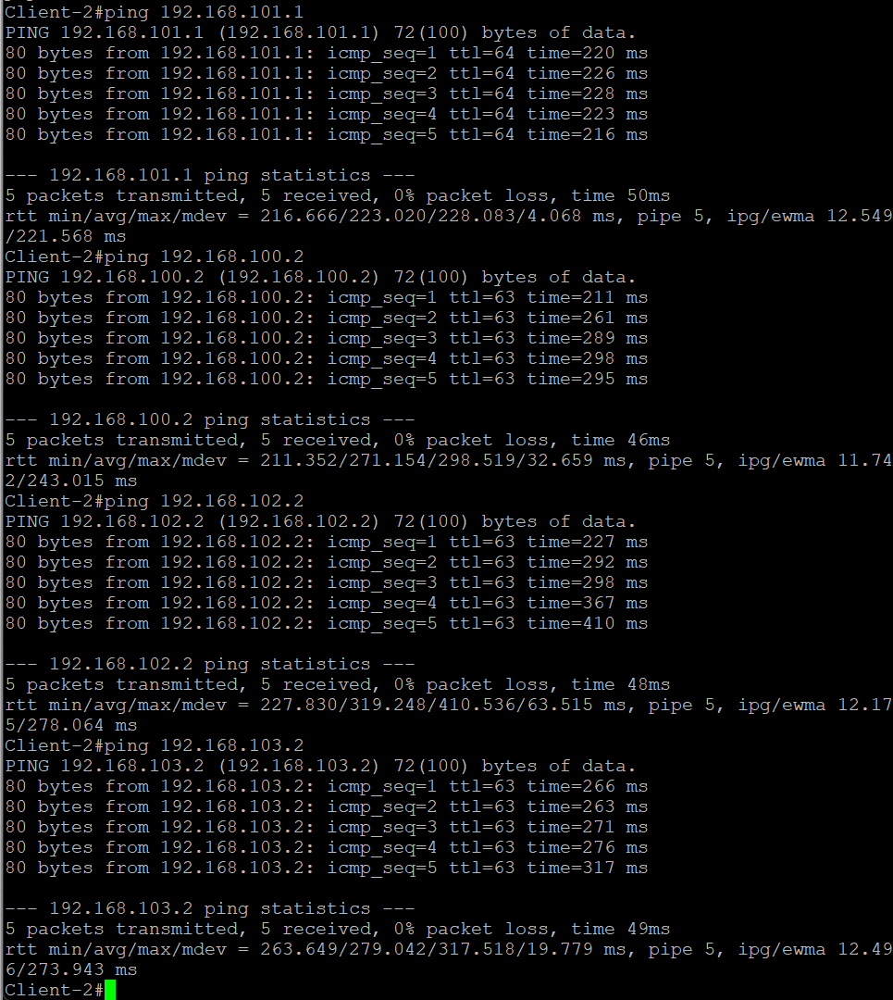

**Client-3 Ping**

в одном site с Client-4
До шлюза и соседей в других Site

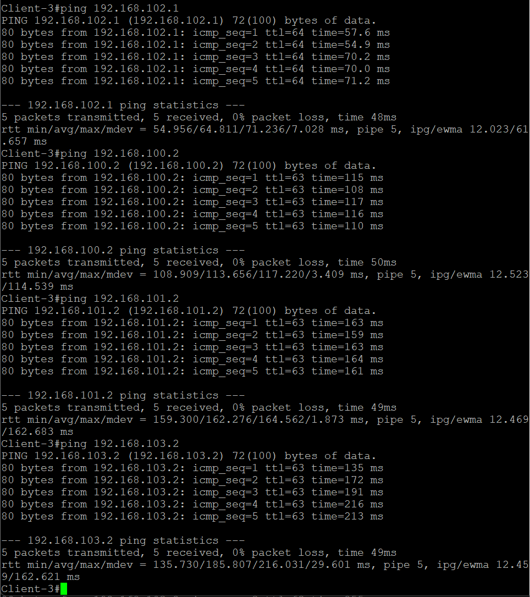

**Client-4 Ping**

в одном site с Cient-3
До шлюза и соседей в других Site

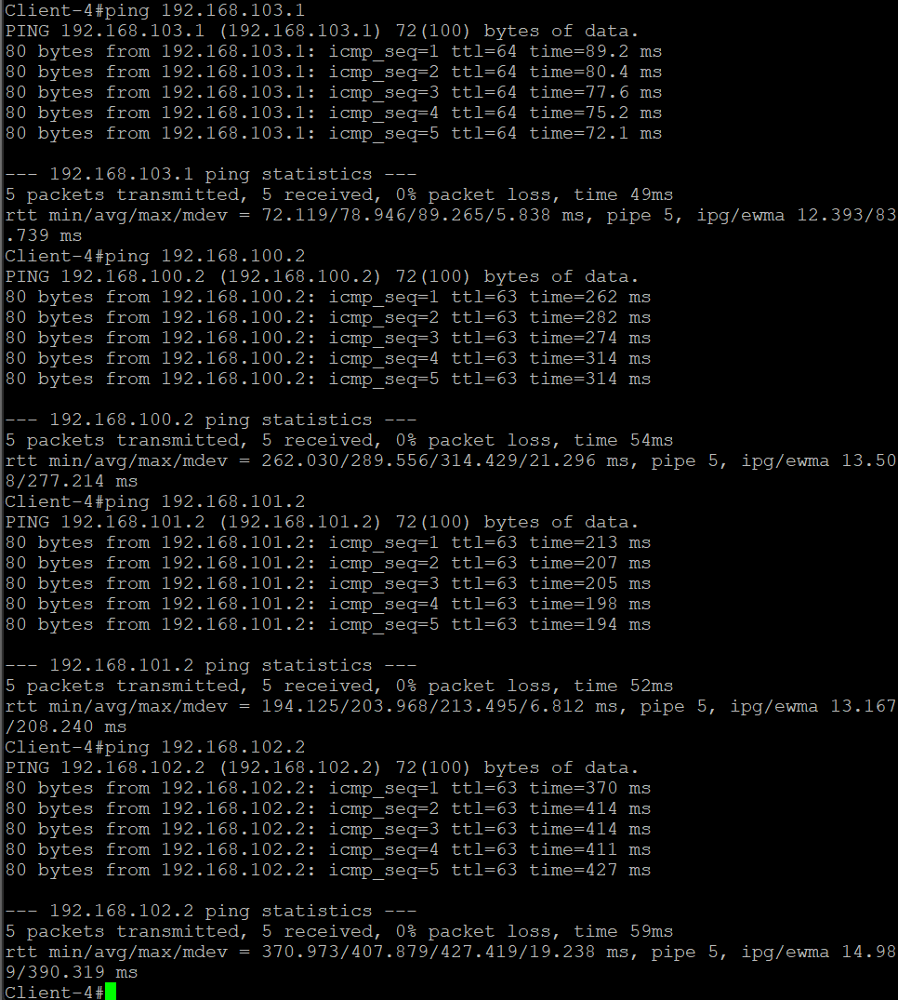

</details> 


### Строим сеть поверх старой, вся конфигурация будет отдельными файлами, показываем что получилось

Прикладываем скриншоты работы протоколов

Далее - длеаем переход по принципу - отключаем связность по l2 и l3 через старое решение и переводим его на новое - L2 цепляем к vxlan l3 погружаем в vrf Anycast gateway и разного рода Symmetric IRB, переводим клиентов с одного стыка на multihoming

по дороге показываем как переключали, проверяем связность.

## Сами работы

<details> 

<summary>Читать</summary>


### Простраиваем заранее l2Vxlan, делаем vrf(в текущем виде centralized), собираем l3-multisite

С multisite все оказалось довольно просто, для него нужно 

Построить пир с DCI(обычный для underlay и overla)
Ну и добавить следующие строки в конфигурацию BGP

```
neighbor x.x.x.x allowas-in 1 - дает возможность принять роут из своей собственной AS, нужно чтобы протянуть loopback с другого Site, по умолчанию недоступно, потому что будет петля маршрутизации. 
neighbor x.x.x.x next-hop-unchanged - так как у нас eBGP то нам нужно смоделировать работу условного route-reflector, не менять next-hop
neighbor x.x.x.x domain remote - используется для конфигурации сессий между доменами, в частности для EVPN VXLAN чтобы разделять evpn-домены разных site(изоляция)
```

Проверяем связность Anycast-Gateway между Site(с Borderleaf Site-1, этого хватит)

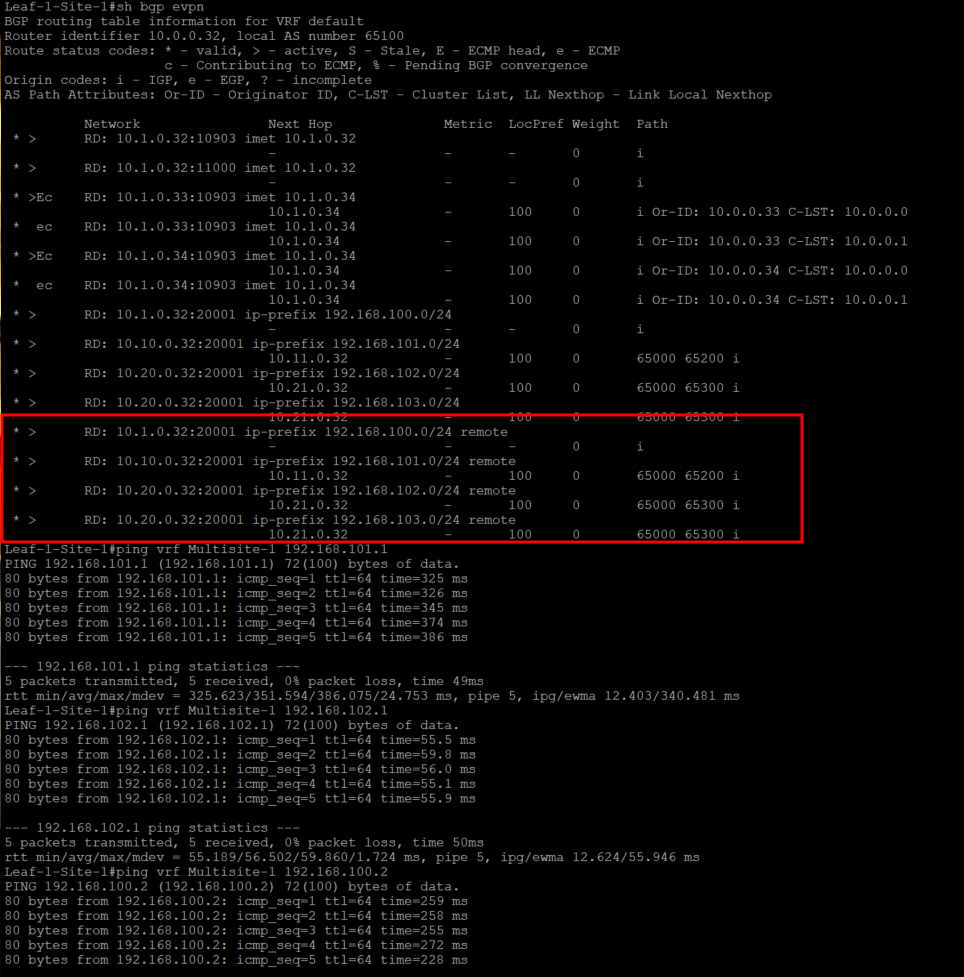


В остальном обычный l3vpn без каких либо отличий

Как же переключить после всех манипуляций?

1) Убиваем Vlan вверх от leaf чтобы разорвать старую l2-связность
2) прокидываем vxlan к borderleaf и мапим vlan к vxlan

команды следующие

```
interface X
shutdown
!

interface Vxlan1
   vxlan vlan AAA vni 1AAA
!
router bgp 65XXX
vlan AAA
      rd (loopback1):1AAA
      route-target both 65XXX:1AAA
      redistribute learned
```

Делаем и смотрим пинг между клиентами в разных Site

Пингуем всех с Client-1, более чем избыточно

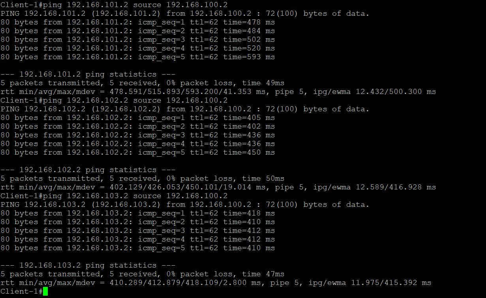

### Самое интересное - L2 между Site

Тут при построенной сессии меняется сама настройка объявления l2 на Borderleaf
От вендора к вендору подход меняется, но у аристы ситуация следующая

**Borderleaf**

```
vlan XXX
      rd evpn domain all 10.1.0.32:1XXX - вещаем свои RD между доменами и evpn 
      route-target import export evpn domain all 1XXX:65000 - меняемся метками RT как внутри evpn так и между доменами
      redistribute learned
```

**Clients-leaf**

Тут все как обычно, за исключением того, что метки RT уже у нас глобальные(т.е. между всех Site одинаковые)

```
vlan XXX
      10.1.0.32:1XXX
      route-target both 1XXX:65000
      redistribute learned
```

Делаем на всех Leaf(Border/Client и проверяем связность)

Пингуем всех с Client-1, более чем избыточно

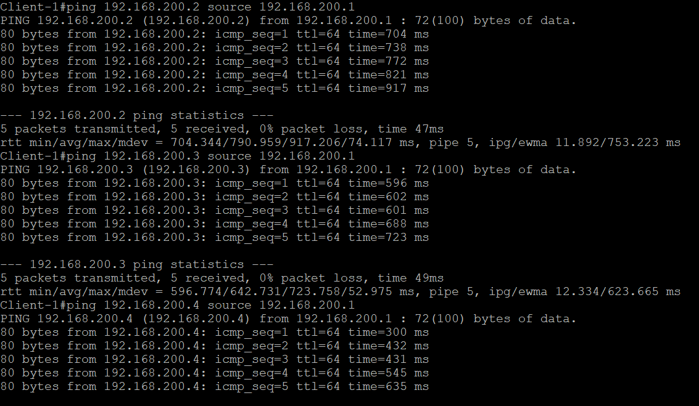

</details> 

### Ссылки!!!

Конфигурации [изначальные](https://github.com/igorvoroshkevich-93/Network-course/tree/main/Project_Final_Otus/cfg/old)

Конфигурации [финальные](https://github.com/igorvoroshkevich-93/Network-course/tree/main/Project_Final_Otus/cfg/new)

Скриншоты [тут](https://github.com/igorvoroshkevich-93/Network-course/tree/main/Project_Final_Otus/cfg/img)

Презентация [тут](https://github.com/igorvoroshkevich-93/Network-course/tree/main/Project_Final_Otus/cfg/Presentation)


